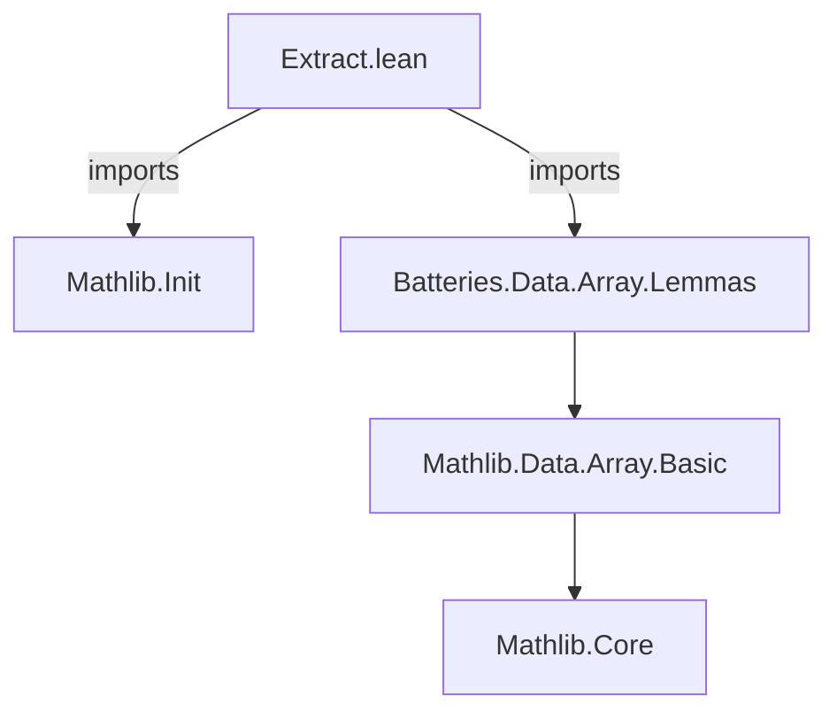
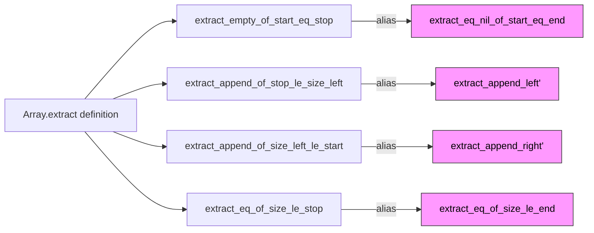

**Technical Brief: `Extract.lean`**

---

### 1. **Key Definitions & Theorems**

| Name | Type / Signature | Purpose |
|------|------------------|---------|
| `extract_eq_nil_of_start_eq_end` | `alias extract_empty_of_start_eq_stop` | Deprecated alias: states that `Array.extract` yields `[]` when start index equals stop index. |
| `extract_append_left'` | `alias extract_append_of_stop_le_size_left` | Deprecated alias: relates `extract` over concatenated arrays when the stop index of the left part is ≤ its size. |
| `extract_append_right'` | `alias extract_append_of_size_left_le_start` | Deprecated alias: relates `extract` over concatenated arrays when the size of the left part ≤ start index of the right part. |
| `extract_eq_of_size_le_end` | `alias extract_eq_of_size_le_stop` | Deprecated alias: states that `Array.extract` returns the full array when the array size ≤ stop index. |

> All four are **deprecated aliases**, introduced on `2025-11-03`, pointing to newer, more consistently named lemmas in `Mathlib.Data.Array.Basic` or related modules.

---

### 2. **Naming Conventions**

- **Prefixes**: `extract_` — all lemmas pertain to `Array.extract`.
- **Suffixes**:
  - `_eq_nil_of_start_eq_end`: describes a condition (`start = end`) leading to `[]`.
  - `_append_*`: indicates behavior under array concatenation.
  - `_le_*`: uses `≤` in preconditions (e.g., `stop ≤ size`, `size ≤ start`).
- **Deprecated aliases** use `'` (e.g., `extract_append_left'`) to distinguish from canonical names.

---

### 3. **Tactic Stack**

- **None used in this file** — the file contains only declarations and aliases; no proofs or tactic scripts appear.

---

### 4. **Proof Logic**

- **Not applicable** — this file contains no proofs, only alias declarations.
- The underlying lemmas (e.g., `extract_empty_of_start_eq_stop`) are likely proven via:
  - `rfl` or `ext` for extensionality,
  - `simp` with `Array.extract` definitional lemmas,
  - possibly `induction` on indices or arrays.

---

### 5. **Imports**

| Import | Role |
|--------|------|
| `Mathlib.Init` | Core Lean + Mathlib initialization (e.g., `Array` definition, basic type theory). |
| `Batteries.Data.Array.Lemmas` | Contains foundational `Array` lemmas, including the canonical versions of the deprecated aliases (e.g., `extract_empty_of_start_eq_stop`). |

> This module is a **thin compatibility layer**, not a source of new lemmas.

---

### 8. **Dependency & Theory Overview**

#### Mermaid Diagram: Module Dependencies

#### Mermaid Diagram: Theoretical Flow (Focus on `Array.extract`)

- **Purpose**: This file serves as a **deprecation bridge**, redirecting legacy names to standardized ones.
- **Scope**: Narrow — only `Array.extract` lemmas; no new theory development.
- **Status**: Likely part of a refactoring effort to unify naming (e.g., `end` → `stop`, consistent use of `_le_` vs `_eq_`).

--- 

**End of Brief**
