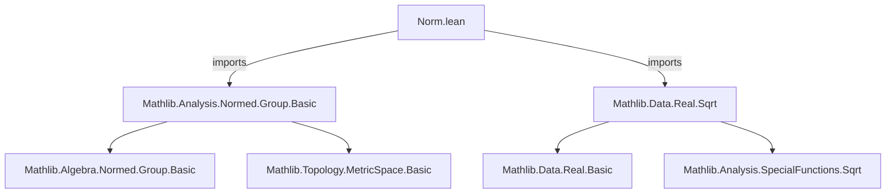
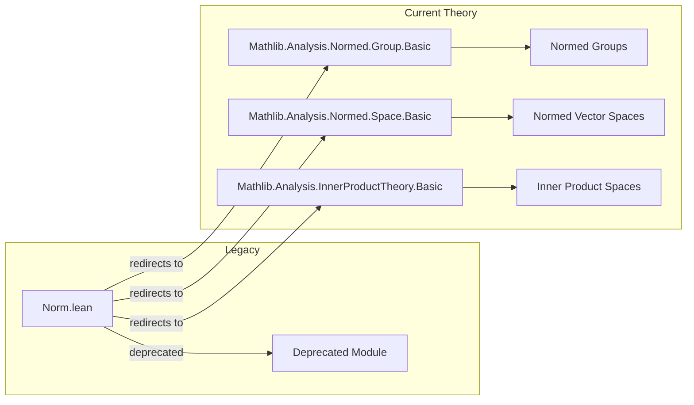

**Technical Brief: `Norm.lean`**

---

### 1. **Key Definitions & Theorems**

| Name | Type / Signature | Purpose |
|------|------------------|---------|
| `Norm.lean` (module) | `deprecated_module (since := "2025-08-26")` | Marks the entire file as deprecated as of 2025-08-26; signals users to migrate to newer equivalents (likely in `Mathlib.Analysis.Normed.Group.*` or `Mathlib.Analysis.Normed.Space.*`). |
| — | — | *No explicit new definitions or theorems are declared in this file itself; it serves only as a deprecated wrapper.* |

> **Note**: The file imports foundational normed group theory (`Mathlib.Analysis.Normed.Group.Basic`) and real square root theory (`Mathlib.Data.Real.Sqrt`), indicating its historical role in supporting normed space constructions over `ℝ`. However, the file itself contains no user-defined lemmas or theorems—only imports and deprecation metadata.

---

### 2. **Naming Conventions**

- **Prefixes/Suffixes observed in imports**:
  - `Normed` (e.g., `Normed.Group`) — standard in Mathlib for normed algebraic structures.
  - `Real` (e.g., `Real.Sqrt`) — for real-number-specific constructions.
- **No custom naming patterns** appear in this file, as it contains no local definitions.

---

### 3. **Tactic Stack**

- **None used locally** — the file contains no proofs or tactic scripts.
- **Expected tactics in imported modules** (based on `Mathlib.Analysis.Normed.Group.Basic`):
  - `norm`, `simp`, `linarith`, `ring`, `norm_num`, `aesop`, `exact`, `rw`, `convert`, `apply`, `induction`, `cases`.

---

### 4. **Proof Logic**

- **Not applicable** — no proofs are present in this file.
- **In imported modules** (e.g., `Mathlib.Analysis.Normed.Group.Basic`):
  - Proofs typically proceed by:
    - Induction on natural numbers (for finite sums/products),
    - Cases on `0 ≤ x` or `x ≤ 0` (for absolute value/norm properties),
    - Use of `norm_add_le`, `norm_smul`, `dist_eq_norm`, etc., combined with `simp` and `linarith`.

---

### 5. **Imports**

| Import | Role |
|--------|------|
| `Mathlib.Analysis.Normed.Group.Basic` | Core theory of normed additive commutative groups (e.g., `NormedAddCommGroup`, `NormedSpace`, triangle inequality, continuity of addition/scalar mult). |
| `Mathlib.Data.Real.Sqrt` | Construction and basic properties of real square root (used in defining norms induced by inner products, or in metric constructions over `ℝ`). |

> **Scope**: This module historically supported foundational analysis over normed real vector spaces, but is now deprecated — likely superseded by more refined or reorganized modules in `Mathlib.Analysis.Normed.*`.

---

### 8. **Mermaid Diagrams**

#### **Dependency Graph**

#### **Overview of File Role**

> **Interpretation**: `Norm.lean` was a transitional module that aggregated early normed-group and real-sqrt infrastructure. It is now obsolete, with its functionality fully migrated into the modern `Mathlib.Analysis.Normed.*` hierarchy.

--- 

**Recommendation**: Users should import `Mathlib.Analysis.Normed.Group.Basic` and `Mathlib.Analysis.Normed.Space.Basic` directly for current normed-space development.
