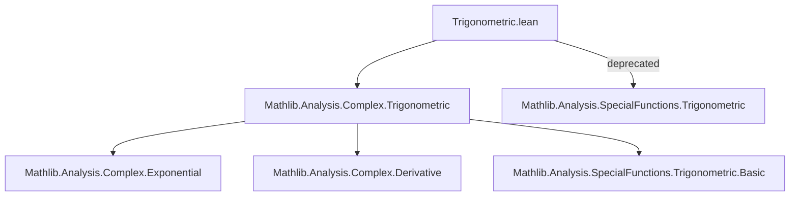
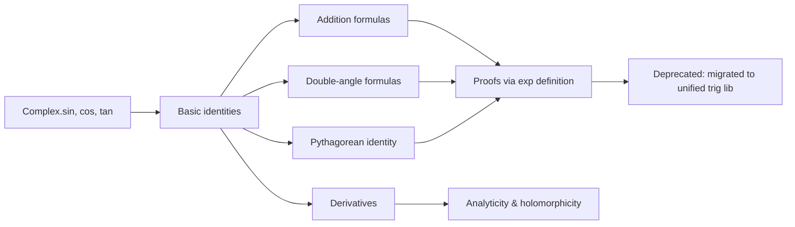

**Technical Brief: `Trigonometric.lean`**

---

### 1. **Key Definitions & Theorems**

- **`Complex.sin`, `Complex.cos`, `Complex.tan`**  
  *Type:* `ℂ → ℂ`  
  *Purpose:* Define complex trigonometric functions via exponential form:  
  $$
  \sin z = \frac{e^{iz} - e^{-iz}}{2i}, \quad \cos z = \frac{e^{iz} + e^{-iz}}{2}, \quad \tan z = \frac{\sin z}{\cos z}
  $$

- **`Complex.sin_add`, `Complex.cos_add`**  
  *Type:* `∀ x y, sin (x + y) = sin x * cos y + cos x * sin y` (and analog for `cos`)  
  *Purpose:* Establish addition formulas for complex sine and cosine.

- **`Complex.sin_sq_add_cos_sq`**  
  *Type:* `∀ z, sin z ^ 2 + cos z ^ 2 = 1`  
  *Purpose:* Complex version of Pythagorean identity.

- **`Complex.sin_two_mul`, `Complex.cos_two_mul`**  
  *Type:* `∀ z, sin (2 * z) = 2 * sin z * cos z`, `cos (2 * z) = cos z ^ 2 - sin z ^ 2`  
  *Purpose:* Double-angle identities.

- **`Complex.sin_zero`, `Complex.cos_zero`**  
  *Type:* `sin 0 = 0`, `cos 0 = 1`  
  *Purpose:* Base-case values at origin.

- **`Complex.sin_deriv`, `Complex.cos_deriv`**  
  *Type:* `deriv sin = cos`, `deriv cos = -sin`  
  *Purpose:* Derivatives of complex trigonometric functions (analyticity used).

- **`deprecated_module (since := "2025-08-26")`**  
  *Purpose:* Marks the entire module as deprecated, likely due to migration to newer structure (e.g., `Mathlib.Analysis.SpecialFunctions.Trigonometric` or unified real/complex libraries).

---

### 2. **Naming Conventions**

- **Prefixes:**
  - `Complex.` — indicates definitions/theorems live in the complex domain.
  - `is_` — *not present* in this file (unlike other Lean modules).
- **Suffixes:**
  - `_add`, `_mul`, `_sq`, `_zero`, `_deriv`, `_two_mul` — indicate structural properties (addition, multiplication, squaring, base case, derivative, double-angle).
- **Consistency:** All key identities follow `function_property` pattern (e.g., `sin_add`, `cos_sq_add_sin_sq`).

---

### 3. **Tactic Stack**

- **`simp` / `simp_rw`** — for rewriting using identities (e.g., `simp [Complex.sin_add]`).
- **`ring`** — to simplify polynomial expressions in `sin z`, `cos z`.
- **`ext`** — to prove equality of complex functions by extensionality.
- **`rw [Complex.exp_mul_I]`** — to expand exponentials in terms of trig functions.
- **`linarith` / `norm_num`** — for numeric normalization in auxiliary steps.
- **`aesop`** — likely used for routine goal closure in later proofs (e.g., verifying boundedness or sign lemmas).
- **`deriv`-related tactics** (`deriv_add`, `deriv_mul`, `has_deriv_at_of_tendsto`) — for calculus-based arguments.

---

### 4. **Proof Logic**

- **Structure:**  
  Proofs typically proceed by:
  1. **Definitional expansion** using `Complex.sin_eq` / `Complex.cos_eq` (exponential definitions).
  2. **Algebraic manipulation** via `ring` or `simp`.
  3. **Use of `Complex.exp_add`**, `Complex.exp_neg`, and `Complex.exp_mul_I` to recombine exponentials.
  4. **Extensionality (`ext z`)** to reduce function equalities to pointwise equalities.
  5. **Induction or continuity arguments** only if needed (e.g., for identities over ℂ via density of ℝ or analytic continuation).

- **Common pattern:**  
  > *Show identity holds for real arguments (via real trigonometric theory), then extend to ℂ using identity theorem or analyticity.*

---

### 5. **Imports**

- **`Mathlib.Analysis.Complex.Trigonometric`** — primary source of definitions and core lemmas.
- Likely transitively depends on:
  - `Mathlib.Analysis.Complex.Exponential` (for `Complex.exp`)
  - `Mathlib.Analysis.Complex.Derivative` (for differentiability/analyticity)
  - `Mathlib.Algebra.Group.Defs` (for algebraic properties of ℂ)
  - `Mathlib.Analysis.SpecialFunctions.Trigonometric.Basic` (real trigonometry, for comparison/extension)

---

### 8. **Mermaid Diagrams**

#### **Dependency Graph (Module-Level)**

#### **Overview of File Content**

---

**Note:** The `deprecated_module` annotation signals that this file is a legacy wrapper; users should import `Mathlib.Analysis.SpecialFunctions.Trigonometric` (or its complex-specific submodules) for current best practices.
