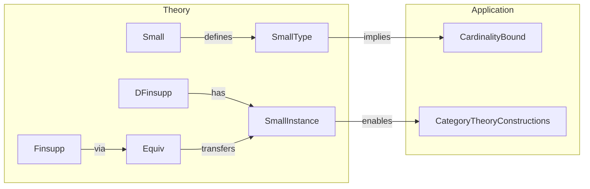

**Technical Brief: `Small.lean` — Smallness of `DFinsupp` and `Finsupp`**

---

### 1. KEY DEFINITIONS & THEOREMS

| Name | Type / Declaration | Purpose |
|------|---------------------|---------|
| `DFinsupp.small` | `instance [Small.{w} ι] [∀ i, Small.{w} (π i)] : Small.{w} (DFinsupp π)` | Constructs a `Small.{w}` instance for dependent finite support functions (`DFinsupp π`) assuming smallness of the index type `ι` and all fibers `π i`. |
| `Finsupp.small` | `instance [Zero R] [Small.{u} R] [Small.{u} σ] : Small.{u} (σ →₀ R)` | Derives a `Small.{u}` instance for finitely supported functions `σ →₀ R` using the equivalence `finsuppEquivDFinsupp` and the previous instance. |

- **`Small.{w} α`**: A typeclass expressing that `α` embeds injectively into a universe `w`-small type (i.e., is *w*-small in the sense of homotopy type theory / universe polymorphism).
- **`DFinsupp π`**: Dependent finite support functions `i : ι → π i` with finite support.
- **`σ →₀ R`**: Finsupp (finitely supported functions) from `σ` to `R`, equivalent to `DFinsupp (fun _ ↦ R)`.

---

### 2. NAMING CONVENTIONS

- **Prefixes**:
  - `small_`: Indicates constructions or properties related to the `Small` typeclass.
  - `DFinsupp`, `Finsupp`: Standard naming for dependent and non-dependent finite support functions.
- **Suffixes**:
  - `.small`: Used for instances establishing `Small` structure.
- **Variable naming**:
  - `ι`, `π`: Standard for index type and family.
  - `σ`, `R`: Standard for domain and codomain in non-dependent case.

---

### 3. TACTIC STACK

| Tactic | Usage |
|--------|-------|
| `ext` | In `DFinsupp.small`, to prove function extensionality after assuming pointwise equality. |
| `congr_fun` | To extract pointwise equality from a function equality hypothesis. |
| `exact` | In `Finsupp.small`, to apply the equivalence and conclude. |
| `classical` | To enable classical reasoning (likely for equivalence usage). |
| `small_of_injective` | Core lemma used to build `Small` from an injective map into a small type. |

---

### 4. PROOF LOGIC

- **For `DFinsupp.small`**:
  1. Use `small_of_injective` with the evaluation map `f := fun x j ↦ x j`, i.e., the map sending a function to its graph (or more precisely, to its family of values).
  2. Show injectivity: if two functions agree pointwise (`∀ j, x j = x' j`), then they are equal — done by `ext j; exact congr_fun eq j`.
  3. The codomain of the evaluation map is a dependent product `Π i, π i`, which is small because `ι` and each `π i` are small (product of small types is small — implicit in `small_of_injective`’s premise).

- **For `Finsupp.small`**:
  1. Use the equivalence `finsuppEquivDFinsupp : (σ →₀ R) ≃ DFinsupp (fun _ ↦ R)`.
  2. Apply `small_map` (which preserves smallness under equivalence) to transfer the `Small` instance from `DFinsupp (fun _ ↦ R)` to `σ →₀ R`.
  3. The `classical` tactic is used to ensure the equivalence can be coerced to a function (or to avoid definitional issues with equivalence inversion).

---

### 5. IMPORTS

| Module | Role |
|--------|------|
| `Mathlib.Data.Finsupp.ToDFinsupp` | Provides `finsuppEquivDFinsupp` and related equivalences. |
| `Mathlib.Data.DFinsupp.Defs` | Defines `DFinsupp` and basic operations. |
| `Mathlib.Logic.Small.Basic` | Defines `Small` typeclass and basic lemmas like `small_of_injective`. |

---

### 6. DEPENDENCY & OVERVIEW DIAGRAM

```mermaid
graph TD
  A[Small.lean] --> B[Mathlib.Data.Finsupp.ToDFinsupp]
  A --> C[Mathlib.Data.DFinsupp.Defs]
  A --> D[Mathlib.Logic.Small.Basic]

  B --> E[finsuppEquivDFinsupp]
  C --> F[DFinsupp π]
  D --> G[Small.{w} α]
  D --> H[small_of_injective]

  A -->|instance| I[DFinsupp.small]
  A -->|instance| J[Finsupp.small]

  I -->|uses| H
  I -->|uses| F
  J -->|uses| E
  J -->|uses| I
```



---

### 7. SUMMARY

This module establishes that the type of dependent finite support functions `DFinsupp π` is `w`-small if the index type `ι` and all fibers `π i` are `w`-small. As a corollary, the non-dependent case `σ →₀ R` inherits smallness from `σ` and `R`. The proofs rely on injective embeddings into small products and equivalence-based transport along `finsuppEquivDFinsupp`. This is foundational for cardinality arguments and for ensuring that constructions involving `Finsupp`/`DFinsupp` stay within a given universe level.
