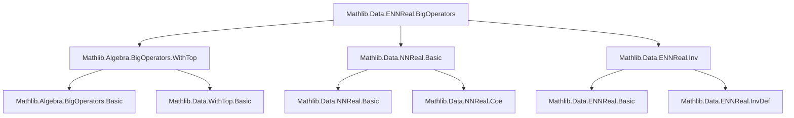
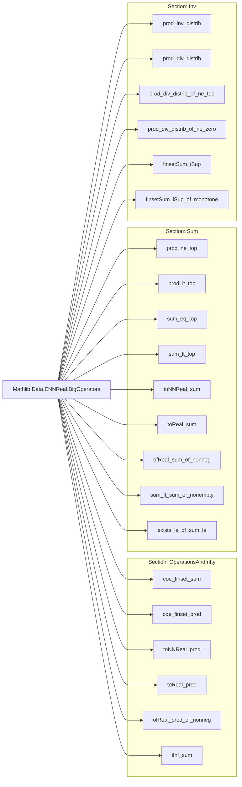

### Technical Brief: `Mathlib.Data.ENNReal.BigOperators`

---

#### **1. Key Definitions & Theorems**

| Name | Type / Signature | Purpose |
|------|------------------|---------|
| `coe_finset_sum` | `↑(∑ a ∈ s, f a) = ∑ a ∈ s, (f a : ℝ≥0∞)` | Embedding of finite sums over `ℝ≥0` into `ℝ≥0∞` commutes with summation. |
| `coe_finset_prod` | `↑(∏ a ∈ s, f a) = ∏ a ∈ s, (f a : ℝ≥0∞)` | Embedding of finite products over `ℝ≥0` into `ℝ≥0∞` commutes with multiplication. |
| `toNNReal_prod` | `(∏ i ∈ s, f i).toNNReal = ∏ i ∈ s, (f i).toNNReal` | `toNNReal` preserves finite products on `ℝ≥0∞`. |
| `toReal_prod` | `(∏ i ∈ s, f i).toReal = ∏ i ∈ s, (f i).toReal` | `toReal` preserves finite products on `ℝ≥0∞` (when defined). |
| `ofReal_prod_of_nonneg` | `ENNReal.ofReal (∏ i ∈ s, f i) = ∏ i ∈ s, ENNReal.ofReal (f i)` | `ofReal` distributes over finite products of nonnegative reals. |
| `iInf_sum` | `⨅ i, ∑ a ∈ s, f i a = ∑ a ∈ s, ⨅ i, f i a` | Interchange of infimum and finite sum under a directedness condition. |
| `prod_ne_top` | `(∀ a ∈ s, f a ≠ ∞) → ∏ a ∈ s, f a ≠ ∞` | Finite product of finite elements is finite. |
| `prod_lt_top` | `(∀ a ∈ s, f a < ∞) → ∏ a ∈ s, f a < ∞` | Finite product of bounded elements is bounded above `∞`. |
| `sum_eq_top` | `∑ x ∈ s, f x = ∞ ↔ ∃ a ∈ s, f a = ∞` | Sum is infinite iff some summand is infinite. |
| `sum_lt_top` | `∑ a ∈ s, f a < ∞ ↔ ∀ a ∈ s, f a < ∞` | Sum is finite iff all summands are finite. |
| `toNNReal_sum` | `(∀ a ∈ s, f a ≠ ∞) → toNNReal (∑ f) = ∑ toNNReal ∘ f` | `toNNReal` commutes with finite sums when no term is `∞`. |
| `toReal_sum` | `(∀ a ∈ s, f a ≠ ∞) → toReal (∑ f) = ∑ toReal ∘ f` | `toReal` commutes with finite sums when no term is `∞`. |
| `ofReal_sum_of_nonneg` | `ENNReal.ofReal (∑ f) = ∑ ENNReal.ofReal ∘ f` | `ofReal` distributes over finite sums of nonnegative reals. |
| `prod_inv_distrib` | `(∏ f)⁻¹ = ∏ f⁻¹` under pairwise `≠ 0` or `≠ ∞` condition | Inversion distributes over finite products. |
| `prod_div_distrib` | `∏ (f / g) = (∏ f) / (∏ g)` under suitable conditions | Division distributes over finite products. |
| `finsetSum_iSup` | `∑ ⨆ f = ⨆ ∑ f` under directedness condition | Interchange of finite sum and supremum. |
| `finsetSum_iSup_of_monotone` | `∑ iSup f = ⨆ ∑ f` under monotonicity | Supremum and sum commute for monotone families. |

---

#### **2. Naming Conventions**

- **Prefixes**:
  - `coe_`: embedding from `ℝ≥0` to `ℝ≥0∞`.
  - `toNNReal_`, `toReal_`: projection from `ℝ≥0∞` to `ℝ≥0` or `ℝ`.
  - `ofReal_`: embedding from `ℝ` to `ℝ≥0∞`.
  - `prod_`, `sum_`: operations over finite sets.
  - `iInf_`, `iSup_`: infimum/supremum over index types.

- **Suffixes**:
  - `_of_nonneg`: assumptions about nonnegativity.
  - `_ne_top`, `_lt_top`: finiteness/boundedness conditions.
  - `_distrib`: distributivity laws.
  - `_of_…`: special cases under additional assumptions (e.g., `of_ne_zero`, `of_monotone`).

---

#### **3. Tactic Stack**

- **Core tactics**:
  - `simp_rw`, `simp`, `rw`: rewriting using lemmas and definitions.
  - `induction`: structural induction on `Finset` (especially `Finset.cons_induction_on`).
  - `exact`, `refine`, `apply`: constructing proofs via known lemmas.
  - `gcongr`, `congr'`: congruence reasoning for inequalities.
  - `contrapose!`: contrapositive reasoning.
  - `grind`: a custom tactic (likely from Mathlib) for simplifying pairwise conditions.

- **Domain-specific automation**:
  - `map_sum`, `map_prod`: used to lift homomorphisms (`ofNNRealHom`, `toNNRealHom`, etc.) to finite sums/products.
  - `ciInf_const`, `Finset.sum_empty`, `Finset.prod_empty`: simplification of empty sums/products.

---

#### **4. Proof Logic**

- **Inductive structure**:
  - Most proofs use **Finset induction** (`Finset.cons_induction_on`) to reduce to base case (`empty`) and step (`cons`).
  - For `iInf_sum`, the induction step uses `iInf_add_iInf` (a lemma about infima of sums).
  - For `finsetSum_iSup`, the step uses `iSup_add_iSup`.

- **Logical flow**:
  - **Rewrite → Simplify → Apply known homomorphism properties**.
  - Many proofs reduce to showing equality via `coe_inj` or `toNNReal_inj`, leveraging that embeddings are injective.
  - Inequality proofs often use monotonicity or contrapositive reasoning (`sum_lt_sum_of_nonempty`, `exists_le_of_sum_le`).
  - Pairwise conditions (e.g., for `prod_inv_distrib`) are handled via `Set.Pairwise` and case analysis on `≠ 0` / `≠ ∞`.

---

#### **5. Imports**

| Module | Purpose |
|--------|---------|
| `Mathlib.Algebra.BigOperators.WithTop` | General theory of sums/products over `WithTop α`, used for `ℝ≥0∞ = WithTop ℝ≥0`. |
| `Mathlib.Data.NNReal.Basic` | Basic properties of nonnegative reals (`ℝ≥0`). |
| `Mathlib.Data.ENNReal.Inv` | Inversion and division on `ℝ≥0∞`. |

---

#### **6. Mermaid Diagrams**

##### **Dependency Graph (Module-Level)**

##### **Overview of File Structure**

---

#### **7. Theory Context**

- This file extends the general theory of big operators (`sum`, `prod`) from `WithTop α` to the concrete case of `ℝ≥0∞`.
- It connects:
  - **Algebraic structure**: `ℝ≥0` → `ℝ≥0∞` via `coe`, `ofReal`, `toNNReal`, `toReal`.
  - **Order-theoretic structure**: finiteness (`≠ ∞`, `< ∞`) and interaction with sums/products.
  - **Topological structure**: continuity of operations via `iInf_sum`, `finsetSum_iSup`.
- Central theme: **compatibility of homomorphisms with finite sums/products**, especially when dealing with `∞`.

--- 

Let me know if you'd like a formalized dependency graph or a proof sketch for a specific theorem.
