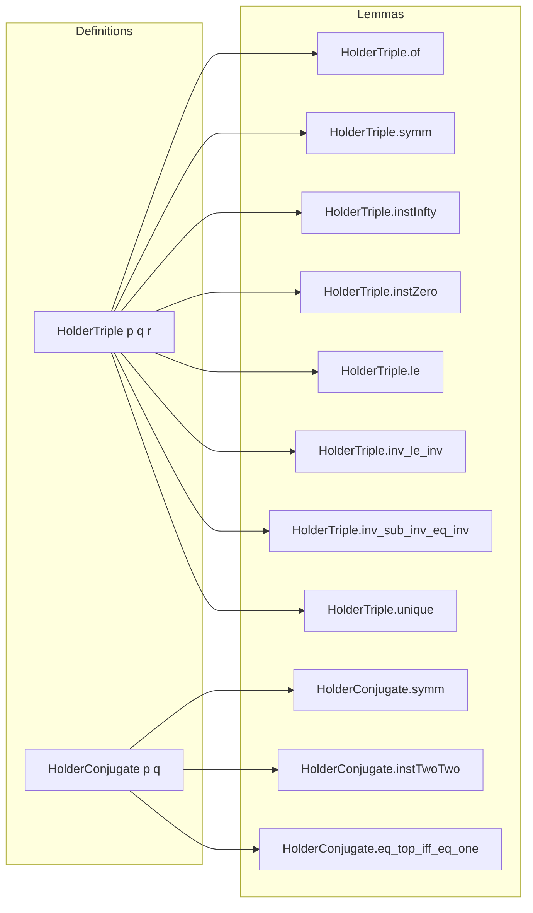
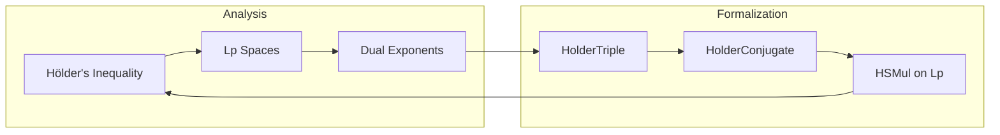

### Technical Brief: `Holder.lean`

---

#### **1. Key Definitions & Theorems**

| Name | Type | Purpose |
|------|------|---------|
| `HolderTriple p q r` | `Prop` | States that $p^{-1} + q^{-1} = r^{-1}$ in $\overline{\mathbb{R}}_{\geq 0}$ (extended nonnegative reals). Enables Hölder’s inequality context. |
| `HolderConjugate p q` | `Abbrev` | Abbreviation for `HolderTriple p q 1`, i.e., $p^{-1} + q^{-1} = 1$. |
| `holderConjugate_iff` | `↔` | Equivalence: `HolderConjugate p q ↔ p⁻¹ + q⁻¹ = 1`. |
| `HolderTriple.of` | `HolderTriple p q (p⁻¹ + q⁻¹)⁻¹` | Constructs a canonical `r` satisfying the Hölder condition. |
| `HolderTriple.symm` | Instance | Symmetry: if `HolderTriple p q r`, then `HolderTriple q p r`. |
| `HolderTriple.instInfty` | Instance | `HolderTriple p ∞ p` (since $p^{-1} + \infty^{-1} = p^{-1} + 0 = p^{-1}$). |
| `HolderTriple.instZero` | Instance | `HolderTriple p 0 0` (since $p^{-1} + 0^{-1} = p^{-1} + \infty = \infty = 0^{-1}$). |
| `HolderTriple.le` | Lemma | $r \le p$ (and symmetrically $r \le q$). |
| `HolderTriple.inv_le_inv` | Lemma | $p^{-1} \le r^{-1}$. |
| `HolderTriple.inv_sub_inv_eq_inv` | Lemma | If $r \ne 0$, then $r^{-1} - q^{-1} = p^{-1}$. |
| `HolderTriple.inv_sub_inv_eq_inv'` | Lemma | Same as above, but assumes $q \ne 0$ instead. |
| `HolderTriple.unique` | Lemma | Uniqueness of $r$ given $p, q$. |
| `HolderTriple.unique_of_ne_zero` | Lemma | Uniqueness of $q$ given $p, r \ne 0$. |
| `HolderTriple.holderConjugate_div_div` | Lemma | If $r \ne 0, \infty$, then $(p/r, q/r)$ are Hölder conjugate. |
| `HolderConjugate.symm` | Instance | Symmetry for conjugates. |
| `HolderConjugate.instTwoTwo` | Instance | $2$ and $2$ are Hölder conjugate (since $1/2 + 1/2 = 1$). |
| `HolderConjugate.instOneInfty` | Instance | $1$ and $\infty$ are Hölder conjugate. |
| `HolderConjugate.one_le` | Lemma | $1 \le p$ (and $1 \le q$). |
| `HolderConjugate.pos` | Lemma | $0 < p$ (and $0 < q$). |
| `HolderConjugate.ne_zero` | Lemma | $p \ne 0$ (and $q \ne 0$). |
| `HolderConjugate.inv_add_inv_eq_one` | Lemma | $p^{-1} + q^{-1} = 1$. |
| `HolderConjugate.one_sub_inv` | Lemma | $1 - p^{-1} = q^{-1}$. |
| `HolderConjugate.unique` | Lemma | Uniqueness of $q$ given $p$. |
| `HolderConjugate.eq_top_iff_eq_one` | Lemma | $p = \infty \iff q = 1$. |
| `HolderConjugate.ne_top_iff_ne_one` | Lemma | $p \ne \infty \iff q \ne 1$. |
| `HolderConjugate.lt_top_iff_one_lt` | Lemma | $p < \infty \iff 1 < q$. |
| `HolderConjugate.sub_one_mul_inv` | Lemma | $(p - 1) \cdot p^{-1} = q^{-1}$ when $p \ne \infty$. |

---

#### **2. Naming Conventions**

- **Prefixes**:
  - `holder`: for main definitions (`HolderTriple`, `HolderConjugate`).
  - `inv_`: for lemmas involving inverses (e.g., `inv_eq`, `inv_le_inv`, `inv_sub_inv_eq_inv`).
  - `one_`: for lemmas involving $1$ (e.g., `one_le`, `one_sub_inv`, `one_div_add_one_div`).
  - `eq_`, `ne_`, `lt_`, `le_`: standard order-theoretic comparisons.

- **Suffixes**:
  - `_iff`: for biconditional characterizations.
  - `_iff'`: variants with relaxed assumptions (e.g., `inv_sub_inv_eq_inv'`).
  - `_of`: for constructing instances from data (e.g., `of`).
  - `inst_`: for typeclass instances (e.g., `instInfty`, `instZero`, `instTwoTwo`).

---

#### **3. Tactic Stack**

Frequently used tactics in this file:

| Tactic | Usage |
|--------|-------|
| `simp` | Simplifying inverses, `inv_add_inv_eq_inv`, and `ennreal` arithmetic. |
| `rw` | Rewriting using `inv_add_inv_eq_inv`, `inv_inj`, etc. |
| `simp_all` | After `by_contra`, to discharge remaining goals. |
| `calc` | Chain of equalities/inequalities (e.g., in `inv_sub_inv_eq_inv`). |
| `all_goals` | In `instTwoTwo`, to apply `norm_num` to both sides. |
| `norm_num` | For numeric normalization (e.g., $1/2 + 1/2 = 1$). |
| `aesop` | Not used here — this file is mostly algebraic/proof-by-simp. |
| `ring` | Not used — arithmetic is handled via `simp` and `norm_num`. |

---

#### **4. Proof Logic**

- **Structure**: Most proofs are short and rely on:
  - Rewriting using `inv_add_inv_eq_inv`.
  - Applying `inv_inj`, `inv_le_inv`, and basic `ENNReal` arithmetic.
  - Case analysis on $r = 0$ or $r = \infty$ (e.g., in `inv_sub_inv_eq_inv'`).
  - Using `pos_iff_ne_zero`, `lt_iff_le_and_ne`, and order properties of $\overline{\mathbb{R}}_{\geq 0}$.

- **Typical Flow**:
  1. Unfold definitions (`HolderTriple`, `HolderConjugate`).
  2. Apply `inv_add_inv_eq_inv` or its variants.
  3. Use `simp` with `ENNReal` lemmas (e.g., `inv_inv`, `inv_le_inv`, `sub_eq_of_eq_add`).
  4. For uniqueness: apply `inv_inj` and rewrite using `inv_eq`.
  5. For inequalities: use `calc` with `inv_le_inv`, `le`, and `sub_le_iff_le_add`.

- **Induction**: Not used — this is purely algebraic/axiomatic reasoning over $\overline{\mathbb{R}}_{\geq 0}$.

---

#### **5. Imports**

- **Primary dependency**:
  ```lean
  Mathlib.Data.ENNReal.Inv
  ```
  Provides inversion and arithmetic on extended nonnegative reals.

- **Implicit dependencies** (via `Mathlib.Data.ENNReal`):
  - `Mathlib.MeasureTheory.Function.SimpleFunc`
  - `Mathlib.MeasureTheory.Integral.Basic`
  - `Mathlib.MeasureTheory.LpSpace` (for `MemLp.smul`, referenced in docstring)

---

#### **6. Mermaid Diagrams**

##### **Dependency Graph**

```mermaid
graph TD
  A[Holder.lean] --> B[Mathlib.Data.ENNReal.Inv]
  B --> C[Mathlib.Data.ENNReal.Basic]
  C --> D[Mathlib.Data.ENNReal.Arithmetic]
  C --> E[Mathlib.Data.ENNReal.Order]
  A --> F[Mathlib.MeasureTheory.LpSpace] [via docstring reference]
```

##### **Overview of File Structure**



##### **Theoretical Context**



---

### Summary

This file formalizes the *Hölder condition* $p^{-1} + q^{-1} = r^{-1}$ in the extended nonnegative reals, enabling clean reasoning about Hölder conjugate exponents and supporting heterogeneous scalar multiplication on $L^p$ spaces. The design prioritizes usability via typeclass inference (`HolderTriple`, `HolderConjugate`) and avoids over-constraining Lean’s typeclass resolution by marking `r` as `semiOutParam`. All results are elementary consequences of `ENNReal` arithmetic, but collected for convenience and reuse in analysis.
