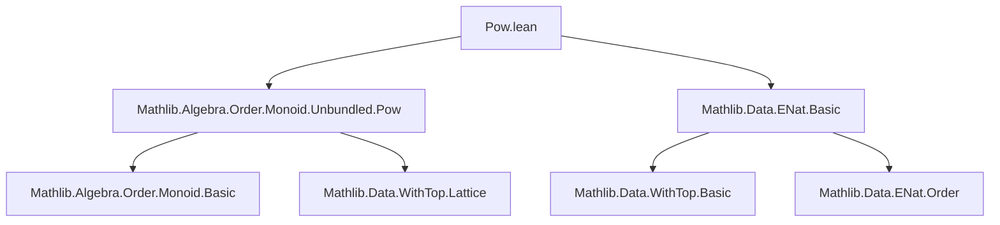

### Technical Brief: `Pow.lean` — Powers of Extended Natural Numbers (`ℕ∞`)

---

#### **1. Key Definitions & Theorems**

| Name | Type / Definition | Purpose |
|------|-------------------|---------|
| `instance : Pow ℕ∞ ℕ∞` | `pow x y = if y = ⊤ then if x = 0 then 0 else if x = 1 then 1 else ⊤ else x ^ y` | Defines exponentiation $x^y$ over extended naturals (`ℕ∞`) consistent with cardinal arithmetic: $|β|^{|α|} = |\alpha \to \beta|$. |
| `epow_natCast` | `x ^ (y : ℕ∞) = x ^ y` for `y : ℕ` | Compatibility with standard natural exponentiation. |
| `zero_epow_top` | `0 ^ ⊤ = 0` | Special case for base 0 and infinite exponent. |
| `zero_epow` | `y ≠ 0 ⇒ 0 ^ y = 0` | Generalization: any nonzero exponent gives 0 for base 0. |
| `one_epow` | `1 ^ y = 1` | Base 1 yields 1 for any exponent. |
| `top_epow_top` | `⊤ ^ ⊤ = ⊤` | Infinite base and exponent. |
| `top_epow` | `y ≠ 0 ⇒ ⊤ ^ y = ⊤` | Infinite base with nonzero exponent. |
| `epow_zero` | `x ^ 0 = 1` | Exponent 0 yields 1 (including $0^0 = 1$ by convention here). |
| `epow_one` | `x ^ 1 = x` | Exponent 1 yields base. |
| `epow_top` | `1 < x ⇒ x ^ ⊤ = ⊤` | Finite base >1 raised to ∞ gives ∞. |
| `epow_right_mono` | `x ≠ 0 ⇒ y ≤ z ⇒ x ^ y ≤ x ^ z` | Monotonicity in exponent (for nonzero base). |
| `one_le_epow` | `x ≠ 0 ⇒ 1 ≤ x ^ y` | Lower bound for powers of nonzero base. |
| `epow_left_mono` | `x ≤ z ⇒ x ^ y ≤ z ^ y` | Monotonicity in base (for any exponent). |
| `epow_eq_zero_iff` | `x ^ y = 0 ↔ x = 0 ∧ y ≠ 0` | Characterization of when a power is zero. |
| `epow_eq_one_iff` | `x ^ y = 1 ↔ x = 1 ∨ y = 0` | Characterization of when a power is one. |
| `epow_add` | `x ^ (y + z) = x ^ y * x ^ z` | Exponent addition law. |
| `mul_epow` | `(x * y) ^ z = x ^ z * y ^ z` | Distributivity over multiplication in base. |
| `epow_mul` | `x ^ (y * z) = (x ^ y) ^ z` | Associativity of exponentiation (with care for infinities). |

---

#### **2. Naming Conventions**

- **Prefix `epow_`**: Used for lemmas involving `x ^ y` over `ℕ∞`. E.g., `epow_add`, `epow_top`.
- **Suffix `_top`**: For cases involving `⊤` (infinity), e.g., `zero_epow_top`, `top_epow_top`.
- **Suffix `_natCast`**: For embedding naturals into `ℕ∞`, e.g., `epow_natCast`.
- **Suffix `_ne_zero` / `_ne.symm`**: Used in hypotheses and rewritings to handle nonzero assumptions.
- **`instHPow`, `instPow`**: Internal names for the `Pow` instance fields.

---

#### **3. Tactic Stack**

Frequent tactics used in proofs:

| Tactic | Usage |
|--------|-------|
| `induction` | Structural induction on `y`, `z : ℕ∞` (using `coe` and `top` cases). |
| `rw` / `rwa` | Rewriting using lemmas, often with assumptions like `h : y ≠ 0`. |
| `simp only [...]` | Simplification with explicit lemmas, especially for case analysis on `x < 1`, `x = 1`, `x > 1`. |
| `rcases lt_trichotomy x 1 with ...` | Case split on `x < 1`, `x = 1`, `x > 1`. |
| `exact`, `refine`, `apply` | Direct proof steps, especially in `↔` introductions. |
| `contradiction`, `rec` | Handling impossible cases (e.g., `0 = 1`). |
| `le_of_eq_of_le`, `not_lt_of_ge` | Order reasoning. |
| `pow_right_mono₀`, `pow_left_mono`, `pow_add`, `pow_mul`, `pow_eq_zero_iff'`, `pow_eq_top_iff` | Leveraging existing `Mathlib` lemmas for natural-number exponentiation. |

---

#### **4. Proof Logic**

- **Induction Strategy**: Most proofs use *induction on exponents* (`y`, `z`) with cases for finite (`coe n`) and infinite (`⊤`) values.
- **Case Analysis**: On base `x` relative to 1 (`x < 1`, `x = 1`, `x > 1`) via `lt_trichotomy`.
- **Case Splitting on Hypotheses**: E.g., `eq_or_ne y 0`, `eq_or_ne z 0`, `ne.symm` for nonzero assumptions.
- **Monotonicity Proofs**: Use induction on exponent or base, combined with `pow_right_mono₀`/`pow_left_mono` from `Mathlib`.
- **Biconditional Proofs**: Split into `→` and `←`, often using `refine ⟨fun h ↦ ?, fun h ↦ ?⟩`.
- **Cardinal Interpretation**: The definition is guided by cardinal arithmetic: $|β|^{|α|} = |\alpha \to \beta|$, ensuring consistency with known behavior (e.g., $2^{\aleph_0} = \mathfrak{c}$).

---

#### **5. Imports & Dependencies**

| Import | Role |
|--------|------|
| `Mathlib.Algebra.Order.Monoid.Unbundled.Pow` | Provides `pow` for ordered monoids, including `pow_right_mono₀`, `pow_left_mono`, `pow_add`, `pow_mul`, etc. |
| `Mathlib.Data.ENat.Basic` | Defines `ℕ∞` (`ENat`), its order, addition, multiplication, and `WithTop` structure. |

> **Note**: The module builds on `WithTop` (i.e., `ℕ∞ = WithTop ℕ`) and uses its order-theoretic and algebraic properties extensively.

---

#### **6. Mermaid Diagrams**

##### **Dependency Graph (Module-Level)**



##### **Overview of `ENat.Pow` Theory**

```mermaid
flowchart LR
  A[ENat ℕ∞] --> B[Power Operation ^]
  B --> C[Definition via WithTop]
  B --> D[Special Cases: 0^⊤, 1^⊤, ⊤^y]
  B --> E[Monotonicity: right & left]
  B --> F[Algebraic Laws: epow_add, mul_epow, epow_mul]
  B --> G[Characterizations: epow_eq_zero_iff, epow_eq_one_iff]
  C --> H[Cardinal Interpretation: |β|^{|α|}]
```

---

#### **7. Cardinal Interpretation (Motivation)**

The definition ensures:

- If `|α| = y`, `|β| = x`, then `|β^α| = x ^ y`.
- Examples:
  - $2^{\aleph_0} = \top$ (since $2 > 1$),
  - $0^{\aleph_0} = 0$ (no functions from nonempty set to empty set),
  - $1^{\aleph_0} = 1$ (only one constant function),
  - $\aleph_0^{\aleph_0} = \top$ (countable infinite sequences of naturals have continuum cardinality).

This aligns with standard cardinal arithmetic in ZFC.

--- 

Let me know if you'd like a formalization roadmap or a tactic-level proof sketch for a specific lemma (e.g., `epow_mul`).
