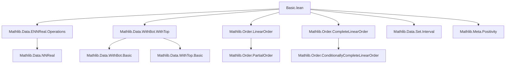

### Technical Brief: `Basic.lean` — Extended Real Numbers (`EReal`)

---

#### **1. Key Definitions & Theorems**

| Name | Type / Signature | Purpose |
|------|------------------|---------|
| `EReal` | `WithBot (WithTop ℝ)` | Type of extended reals $[-\infty, \infty]$, built as `WithBot (WithTop ℝ)` |
| `Real.toEReal` | `ℝ → EReal` | Canonical embedding of reals into `EReal` |
| `ENNReal.toEReal` | `ℝ≥0∞ → EReal` | Embedding of nonnegative extended reals into `EReal`; sends `⊤` to `⊤`, `.some x` to `x` |
| `mul` | `EReal → EReal → EReal` | Multiplication on `EReal`, with `0 * x = 0`, and sign-based rules for infinities |
| `toReal` | `EReal → ℝ` | Projection sending `⊥`, `⊤` to `0`, and reals to themselves |
| `toENNReal` | `EReal → ℝ≥0∞` | Nonnegative part: `x.toENNReal = ⊤` if `x = ⊤`, else `ENNReal.ofReal x.toReal` |
| `induction₂` | `induction principle for two EReals` | Structural induction over sign and infinity cases |
| `induction₂_symm` | Symmetric version of `induction₂` | Reduces cases when relation is symmetric |
| `coe_le_coe_iff`, `coe_lt_coe_iff`, `coe_eq_coe_iff` | `x ≤ y ↔ x ≤ y`, etc. | Coercion preserves order and equality |
| `coe_ennreal_le_coe_ennreal_iff`, etc. | Similar for `ENNReal` coercion | Embedding of `ℝ≥0∞` is strictly monotone and reflects order |
| `range_coe` / `range_coe_ennreal` | `range Real.toEReal = {⊥, ⊤}ᶜ`, `range ENNReal.toEReal = Ici 0` | Characterizes images of coercions |
| `eq_top_iff_forall_lt`, `eq_bot_iff_forall_lt` | `x = ⊤ ↔ ∀ r : ℝ, (r : EReal) < x`, etc. | Characterization of infinities via order |
| `exists_rat_btwn_of_lt` | `a < b → ∃ q : ℚ, a < q < b` | Density of ℚ in `EReal` |
| `neTopBotEquivReal` | `{⊥, ⊤}ᶜ ≃ ℝ` | Equivalence between nonzero (non-infinite) extended reals and ℝ |

---

#### **2. Naming Conventions**

- **Prefixes**:
  - `coe_`: coercion-related lemmas (e.g., `coe_mul`, `coe_add`, `coe_ennreal_*`)
  - `toReal_*`, `toENNReal_*`: projection-related lemmas
  - `induction₂_*`: induction principles
  - `bot_*`, `top_*`, `pos_*`, `neg_*`, `zero_*`: case-specific lemmas
- **Suffixes**:
  - `_iff`: characterizations of relations via coercion
  - `_ne_*`, `_lt_*`, `_le_*`: order-related lemmas
  - `_image_*`, `_preimage_*`: set-theoretic behavior of coercions
- **Aliases**:
  - `⟨_, coe_le_coe⟩`, `⟨_, coe_lt_coe⟩`: `gcongr`-friendly aliases

---

#### **3. Tactic Stack**

Frequently used tactics in proofs:

| Tactic | Usage |
|--------|-------|
| `induction` / `induction₂` | Structural induction on `EReal` or pairs |
| `cases` | Case splits on `⊥`, `⊤`, or real values |
| `rcases` / `obtain` | Trichotomy (`lt_trichotomy`) on real arguments |
| `simp` / `simp_rw` | Simplification using `@[simp]` lemmas (e.g., coercion behavior) |
| `rfl` | Reflexivity for definitional equalities (e.g., `coe_mul`) |
| `aesop` | Automated reasoning for simple goals (e.g., `exists_rat_btwn_of_lt`) |
| `lift` | Lifting `EReal` to `ℝ` or `ℝ≥0` under hypotheses excluding infinities |
| `congr_arg` | Pushing equalities through coercions |
| `rw [mul_comm, ...]` | Rewriting using algebraic properties |
| `exacts [...]` | Solving multiple subgoals in sequence (in `induction₂`) |

---

#### **4. Proof Logic**

- **Inductive structure**: Proofs over `EReal` or pairs thereof rely on:
  - **Case analysis** on whether arguments are `⊥`, `⊤`, or real.
  - **Trichotomy** on real arguments to split into `< 0`, `= 0`, `> 0`.
  - **Definitional simplification** for coercions and projections.
- **Symmetry exploitation**: `induction₂_symm` reduces case count when the predicate is symmetric.
- **Order-theoretic reasoning**: Many proofs use:
  - `StrictMono` properties (`coe_strictMono`, `coe_ennreal_strictMono`)
  - `DecidableLT` and `LinearOrder` instances
  - `DenselyOrdered` for rational approximation
- **Set-theoretic lemmas**: Image/preimage lemmas use:
  - `image_comp`, `preimage_comp`
  - `Ioo`, `Ici`, etc., with `WithBot`/`WithTop` image lemmas

---

#### **5. Imports & Dependencies**

| Import | Role |
|--------|------|
| `Mathlib.Data.ENNReal.Operations` | Provides `ENNReal`, `NNReal`, basic ops and order |
| `Mathlib.Data.Set.Ioo`, `Ici`, etc. | Interval notation and set operations |
| `Mathlib.Data.WithBot.WithTop` | Underlying construction of `EReal` |
| `Mathlib.Order.CompleteLinearOrder` | Provides `CompleteLinearOrder (WithBot (WithTop L))` |
| `Mathlib.Meta.Positivity` | Extends `positivity` tactic for `EReal` coercions |

---

#### **6. Mermaid Diagrams**

##### **Dependency Graph (Module Scope)**



##### **Overview of `EReal` Theory**

```mermaid
flowchart LR
  subgraph Construction
    R[ℝ] -->|WithTop| RT[WithTop ℝ]
    RT -->|WithBot| E[EReal]
  end

  subgraph Coercions
    R -->|Real.toEReal| E
    NN[ℝ≥0] -->|coe_ennreal| E
    ENN[ℝ≥0∞] -->|ENNReal.toEReal| E
  end

  subgraph Projections
    E -->|toReal| R
    E -->|toENNReal| ENN
  end

  subgraph Order & Algebra
    E -->|≤, < | E
    E -->|+,*| E
  end

  subgraph Applications
    E -->|density| ℚ[ℚ]
    E -->|equivalence| R[{⊥, ⊤}ᶜ ≃ ℝ]
  end
```

---

#### **7. Theory Context**

- **Purpose**: Extend real analysis to include infinities (`±∞`) while preserving algebraic and order structure.
- **Key Features**:
  - `EReal` is a `CompleteLinearOrder`, enabling sup/inf over arbitrary subsets.
  - Coercions from `ℝ` and `ℝ≥0∞` are fully compatible with order and arithmetic.
  - `toReal` and `toENNReal` provide retraction-like maps, with care taken for infinities.
  - Rational density (`exists_rat_btwn_of_lt`) supports measure-theoretic and topological arguments.
- **Use Cases**:
  - Integration theory (e.g., extended-valued measurable functions)
  - Probability (extended expectations, infinities in laws)
  - Convex analysis (extended real-valued functions)

--- 

This file serves as the foundational interface for reasoning about extended real numbers in Lean’s `Mathlib`, balancing constructive definitions with classical properties.
