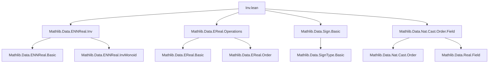

### Technical Brief: `Inv.lean` — Absolute Value, Sign, Inversion, and Division on Extended Reals (`EReal`)

---

#### **1. Key Definitions & Theorems**

| Name | Type / Signature | Purpose |
|------|------------------|---------|
| `abs : EReal → ℝ≥0∞` | `EReal → ℝ≥0∞` | Maps extended reals to nonnegative extended reals: `⊥, ⊤ ↦ ⊤`, `x : ℝ ↦ |x|` |
| `sign : EReal → SignType` | `EReal → SignType` | Sign function: `⊥ ↦ -1`, `0 ↦ 0`, `⊤ ↦ 1`, `x : ℝ ↦ sign x` |
| `inv : EReal → EReal` | `EReal → EReal` | Multiplicative inverse: `⊥⁻¹ = ⊤⁻¹ = 0`, `(x : ℝ)⁻¹ = x⁻¹` |
| `div : EReal → EReal → EReal` | `a / b := b⁻¹ * a` | Division defined via inverse |
| `instance CommMonoidWithZero EReal` | `CommMonoidWithZero EReal` | Multiplicative structure with zero, using `abs` and `sign` to characterize elements |
| `instance DivInvMonoid EReal` | `DivInvMonoid EReal` | Enables division and inverse operations |
| `sign_mul_abs : sign x * x.abs = x` | `∀ x, sign x * x.abs = x` | Fundamental decomposition of `EReal` into sign and magnitude |
| `abs_mul_sign : x.abs * sign x = x` | `∀ x, x.abs * sign x = x` | Commutative version of above |
| `sign_eq_and_abs_eq_iff_eq` | `x.abs = y.abs ∧ sign x = sign y ↔ x = y` | Uniqueness of sign-magnitude representation |
| `inv_mul_eq_one_iff` (implicit via `div_self`) | `a / a = 1` if `a ≠ ⊥, ⊤, 0` | Inverse behavior on nonzero finite reals |
| `mul_inv : (a * b)⁻¹ = a⁻¹ * b⁻¹` | `∀ a b, (a * b)⁻¹ = a⁻¹ * b⁻¹` | Inverse distributes over multiplication |
| `inv_bot`, `inv_top`, `inv_zero` | `⊥⁻¹ = ⊤⁻¹ = 0⁻¹ = 0` | Special cases for extended reals |
| `inv_neg : (-a)⁻¹ = -a⁻¹` | `∀ a, (-a)⁻¹ = -a⁻¹` | Compatibility of inverse with negation |
| `inv_inv` | `(a⁻¹)⁻¹ = a` if `a ≠ ⊥, ⊤` | Involution on finite nonzero reals |
| `div_le_div_right_of_nonneg`, `div_lt_div_right_of_pos`, etc. | Order compatibility of division | Enables reasoning about inequalities under division |

---

#### **2. Naming Conventions**

- **Prefixes**:
  - `abs_`, `sign_`, `inv_`, `div_`: for operations and their properties.
  - `coe_`: for coercion lemmas (`ℝ → EReal`, `ℝ≥0∞ → EReal`, `SignType → EReal`).
  - `mul_`, `add_`: for algebraic properties (e.g., `mul_inv`, `add_div`).
  - `pos_`, `nonneg_`, `neg_`, `nonpos_`: for positivity-related lemmas.
  - `le_`, `lt_`, `ge_`, `gt_`: for order-related lemmas.

- **Suffixes**:
  - `_right`, `_left`: indicate argument position (e.g., `div_le_div_right_of_nonneg`).
  - `_of_`: preconditions (e.g., `inv_pos_of_pos_ne_top`).
  - `_iff`, `_le_iff`, `_lt_iff`: equivalence or implication forms.
  - `_comm`, `_assoc`: algebraic properties (e.g., `mul_div_left_comm`).

- **Special**:
  - `_symm`: often used for symmetric versions (e.g., `induction₂_symm_neg`, `mul_div_left_comm`).
  - `_toReal`: for conversions to `Real` (e.g., `inv_inv`, `div_self`).

---

#### **3. Tactic Stack**

- **Core tactics**:
  - `induction x using ...` — especially `induction₂_symm_neg`, `induction₂_symm`, used to handle all cases (`⊥`, `⊤`, `ℝ`) uniformly.
  - `cases x` — for simple case splits.
  - `rw [...]` — heavy use of rewrites with lemmas (e.g., `abs_mul`, `sign_mul`, `mul_inv`).
  - `simp only [...]` — for simplification with specific lemmas, often in base cases.
  - `rwa [...]` — rewrite + assumption.
  - `congr` — for congruence closure (e.g., in `abs_def`, `inv_pos_of_pos_ne_top`).
  - `gcongr` — for guarded congruence (used in `div_le_div_right_of_nonneg`).
  - `nth_rw` — for targeted rewriting (e.g., in `le_div_iff_mul_le`).
  - `exact`, `apply`, `intro`, `rintro`, `obtain`, `refine` — standard proof scripting.
  - `push _ ∈ _ at *` — for set membership reasoning.

- **Domain-specific automation**:
  - ` positivity` tactic extensions (`evalERealInv`, `evalERealDiv`) — for automated positivity proofs.

---

#### **4. Proof Logic**

- **Structure**:
  - **Case analysis** on `x : EReal` (via `induction x` or `cases x`) is the primary proof strategy.
  - **Induction schemes** like `induction₂_symm_neg` are used for binary operations (`mul`, `div`, `abs_mul`, `sign_mul`) to reduce to canonical cases: `⊥`, `⊤`, `ℝ`.
  - **Sign-magnitude decomposition** (`x = sign x * x.abs`) is repeatedly used to reduce properties to `SignType` and `ℝ≥0∞`.
  - **Order reasoning** often uses `le_iff_sign`, `lt_iff_sign`, and monotonicity/antitonicity lemmas.
  - **Density arguments** (e.g., `exists_lt_mul_left_of_nonneg`, `exists_mul_left_lt`) are used for continuity-like reasoning in order topology.

- **Typical flow**:
  1. Decompose using `sign_mul_abs`.
  2. Reduce to cases (`⊥`, `⊤`, `ℝ`) via induction.
  3. Simplify base cases (`⊥`, `⊤`) using `simp`.
  4. For `ℝ` case, lift to `Real`, apply classical lemmas (`abs_mul`, `sign_mul`, `inv_mul`, etc.), then coerce back.
  5. Use order lemmas (`div_le_div_right_of_nonneg`, `mul_le_mul_of_nonneg_right`) to handle inequalities.

---

#### **5. Imports & Dependencies**

- **Core imports**:
  ```lean
  Mathlib.Data.ENNReal.Inv
  Mathlib.Data.EReal.Operations
  Mathlib.Data.Sign.Basic
  Mathlib.Data.Nat.Cast.Order.Field
  ```

- **Key dependencies**:
  - `ENNReal`: extended nonnegative reals (`ℝ≥0∞`) — used for `abs`.
  - `SignType`: sign type (`{-1, 0, 1}`) — used for `sign`.
  - `EReal.Operations`: basic arithmetic on `EReal` (`mul`, `add`, `neg`, `zero`, `one`, etc.).
  - `Nat.Cast.Order.Field`: coercion from `ℕ`, `ℚ`, `ℝ`, and order compatibility.

- **Related theory modules**:
  - `Mathlib.Data.EReal.Basic`: foundational definitions of `EReal`.
  - `Mathlib.Data.EReal.Arithmetic`: more arithmetic lemmas (e.g., `add`, `sub`).
  - `Mathlib.Data.EReal.Topology`: order topology and continuity.
  - `Mathlib.Data.ENNReal.Basic`, `ENNReal.Inv`: extended nonnegative reals.

---

#### **6. Mermaid Diagrams**

##### **Dependency Graph (Module-Level)**



##### **Overview of `EReal` Structure (This File)**

```mermaid
flowchart LR
  A[EReal] --> B[Abs: EReal → ℝ≥0∞]
  A --> C[Sign: EReal → SignType]
  A --> D[Inv: EReal → EReal]
  A --> E[Div: EReal × EReal → EReal]

  B --> F[Decomposition: x = sign x * |x|]
  C --> F
  D --> G[DivInvMonoid Instance]
  E --> H[Div = inv * mul]

  F --> I[CommMonoidWithZero Instance]
  G --> J[DivInvMonoid Instance]
  H --> K[Order & Positivity Lemmas]
  K --> L[Positivity Tactic Extensions]
```

---

#### **7. Summary**

This file provides the **algebraic and order-theoretic foundation** for extended real arithmetic, especially inversion and division. It leverages the **sign-magnitude decomposition** to:
- Define `CommMonoidWithZero` and `DivInvMonoid` structures,
- Prove key properties (`inv_mul`, `div_self`, `div_le_div_right_of_nonneg`, etc.),
- Support automation via `positivity` tactic extensions.

The design is **modular and reusable**, building on `ENNReal`, `SignType`, and coercion infrastructure to ensure consistency across real, extended real, and nonnegative extended real numbers.

--- 

Let me know if you'd like a formalized dependency graph (e.g., in `leanpkg` format) or a summary of missing lemmas (e.g., `inv_add`, `inv_le_inv`).
