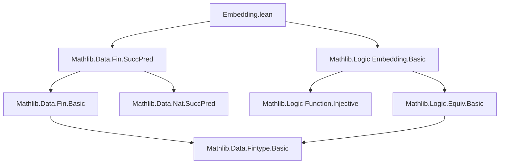

### Technical Brief: `Embedding.lean` — Embeddings of `Fin n`

---

#### **1. Key Definitions & Theorems**

| Name | Type | Purpose |
|------|------|---------|
| `valEmbedding` | `Fin n ↪ ℕ` | Coercion of `Fin n` into `ℕ` as an embedding (injective function). |
| `succEmb n` | `Fin n ↪ Fin (n + 1)` | Embedding version of `Fin.succ`, mapping each `i : Fin n` to `i.succ`. |
| `castLEEmb h` | `h : n ≤ m ⇒ Fin n ↪ Fin m` | Embedding version of `Fin.castLE`, embedding smaller `Fin n` into larger `Fin m`. |
| `castAddEmb m` | `Fin n ↪ Fin (n + m)` | Embedding version of `Fin.castAdd`, embedding `Fin n` into `Fin (n + m)` by padding on the right. |
| `castSuccEmb` | `Fin n ↪ Fin (n + 1)` | Special case of `castAddEmb` for `m = 1`. |
| `addNatEmb m` | `Fin n ↪ Fin (n + m)` | Embedding version of `Fin.addNat`, adding `m` to the *right* of `i`. Generalizes `succEmb`. |
| `natAddEmb n` | `Fin m ↪ Fin (n + m)` | Embedding version of `Fin.natAdd`, adding `n` to the *left* of `i`. |
| `succAboveEmb p` | `Fin n ↪ Fin (n + 1)` | Embedding version of `Fin.succAbove p`, inserting `p` as a “breakpoint” and embedding the rest. |
| `natAdd_castLEEmb hmn` | `Fin n ↪ Fin m` (for `n ≤ m`) | Embedding via `Fin.addNat` followed by `Fin.congr`, mapping `i` to `i + (m - n)`. |
| `nonempty_embedding_iff` | `Nonempty (Fin n ↪ Fin m) ↔ n ≤ m` | Characterizes existence of embeddings between `Fin` types by numeric inequality. |
| `equiv_iff_eq` | `Nonempty (Fin m ≃ Fin n) ↔ m = n` | Characterizes bijections between `Fin` types as equality of indices. |

---

#### **2. Naming Conventions**

- **Prefixes**:
  - `cast*Emb`: Embedding versions of `cast*` functions (`castLE`, `castAdd`, `castSucc`).
  - `*Emb`: Indicates an embedding (e.g., `succEmb`, `addNatEmb`, `natAddEmb`, `succAboveEmb`).
  - `natAdd_*Emb`, `addNat_*Emb`: Distinguish left vs. right addition in `Fin`.

- **Suffixes**:
  - `Emb`: Denotes an embedding (injective function).
  - `coe_*`: Used for coercion lemmas (e.g., `coe_succEmb`, `coe_castLEEmb`).

- **Pattern**:
  - `def name [args] : Fin n ↪ Fin m := ⟨fun, inj⟩`
  - `@[simps apply]` or `@[simps -fullyApplied apply]`: For definitional equality of coercion.

---

#### **3. Tactic Stack**

Frequently used tactics in proofs and definitions:

| Tactic | Usage |
|--------|-------|
| `simp` / `simp only` | Simplifying goals using `@[simp]` lemmas (e.g., `coe_*`, `Fin.ext_iff`). |
| `rfl` | Proving definitional equalities (e.g., `coe_castLEEmb`). |
| `induction ... with` | Structural induction on `n` (e.g., in `nonempty_embedding_iff`). |
| `rcases` / `obtain` | Destructuring existential or sum types (e.g., `exists_eq_succ_of_ne_zero`). |
| `exact` / `refine` | Constructing proofs by refinement. |
| `aesop` / `linarith` / `lia` | Linear arithmetic for inequalities (e.g., `by lia` in `natAdd_castLEEmb`). |
| `ext` + `simp` | Extensionality + simplification for set equality (e.g., `range_natAdd_castLEEmb`). |
| `convert` / `congr` | For congruence-based rewriting (implicit in `castAddEmb_apply`). |

---

#### **4. Proof Logic**

- **Inductive structure**:
  - Proofs often proceed by induction on `n` (e.g., `nonempty_embedding_iff`).
  - Base case `n = 0` uses `m.zero_le`.
  - Inductive step uses `exists_eq_succ_of_ne_zero` to reduce to `n' + 1`.

- **Embedding existence**:
  - Constructive: `n ≤ m ⇒ ⟨castLEEmb h⟩`.
  - Necessity: From `Fin n ↪ Fin m`, extract inequality via induction.

- **Set-range characterizations**:
  - Use `ext` + `simp` + `lia` to show range equals a subset defined by lower bound.

- **Congruence & composition**:
  - Embeddings composed via `.trans`.
  - `finCongr` used to transport along equalities (e.g., `n + (m - n) = m`).

---

#### **5. Imports & Dependencies**

- **Core imports**:
  ```lean
  Mathlib.Data.Fin.SuccPred
  Mathlib.Logic.Embedding.Basic
  ```

- **Implicit dependencies**:
  - `Mathlib.Data.Fintype.Basic` (used in `equivSubtype`, `Fintype.card` comments).
  - `Mathlib.Data.Nat.Basic`, `Mathlib.Data.Subtype.Basic`, `Mathlib.Logic.Function.Basic`.

- **Scope**:
  - Focuses on *embeddings* (not just functions) between finite types `Fin n`.
  - Builds toward combinatorial reasoning (e.g., counting, bijections, cardinalities).

---

#### **6. Mermaid Diagrams**

##### **Dependency Graph (Module-Level)**



##### **Overview of Theory Flow**

```mermaid
flowchart LR
  A[Fin n] -->|valEmbedding| B[ℕ]
  A -->|succEmb| C[Fin (n+1)]
  A -->|castLEEmb h| D[Fin m] 
  A -->|castAddEmb m| E[Fin (n+m)]
  A -->|addNatEmb m| E
  A -->|natAddEmb n| E
  A -->|succAboveEmb p| C
  A -->|natAdd_castLEEmb hmn| D

  C -->|equiv_iff_eq| A
  D -->|nonempty_embedding_iff| A
```

##### **Embedding Hierarchy (Conceptual)**

```mermaid
graph LR
  subgraph "Embeddings into Fin (n+m)"
    A[Fin n] -->|castAddEmb m| B[Fin (n+m)]
    A -->|addNatEmb m| B
    A -->|natAddEmb n| B
  end

  subgraph "Embeddings into Fin m (m ≥ n)"
    A -->|castLEEmb h| C[Fin m]
    A -->|natAdd_castLEEmb hmn| C
  end

  subgraph "Embeddings into Fin (n+1)"
    A -->|succEmb| D[Fin (n+1)]
    A -->|castSuccEmb| D
    A -->|succAboveEmb p| D
  end
```

---

#### **7. Summary**

This module formalizes *canonical embeddings* between `Fin n` types and into `ℕ`, emphasizing injective structure-preserving maps. It provides a foundational toolkit for reasoning about finite types in combinatorics, type theory, and formalized mathematics—especially where embeddings (not just injections) are needed for definitional or proof-relevant reasons.

The naming and structure follow Lean’s `Mathlib` conventions, with `*Emb` suffixes and `@[simps]` annotations for smooth coercion and simplification. The proofs combine induction, case analysis, and arithmetic reasoning, with heavy use of `simp`-based automation.
