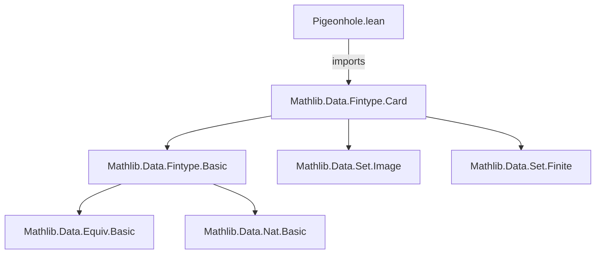
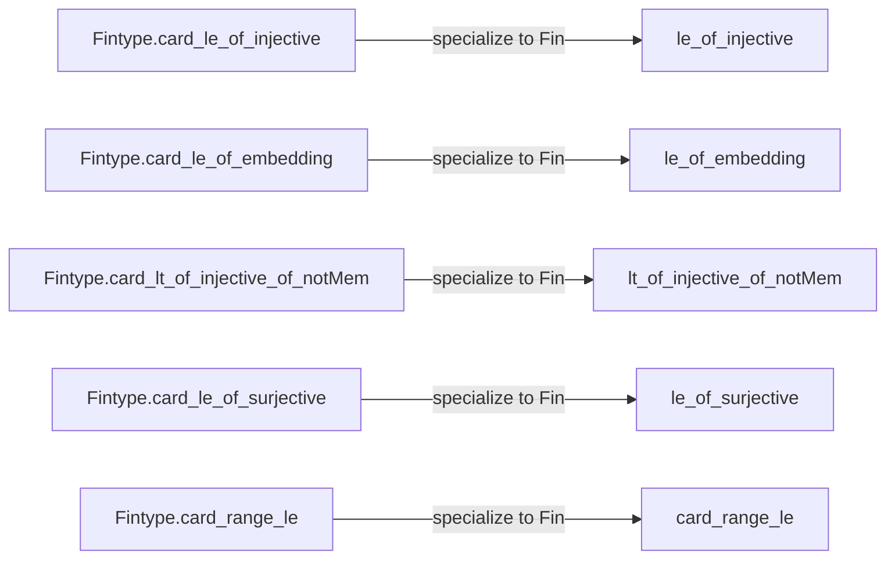
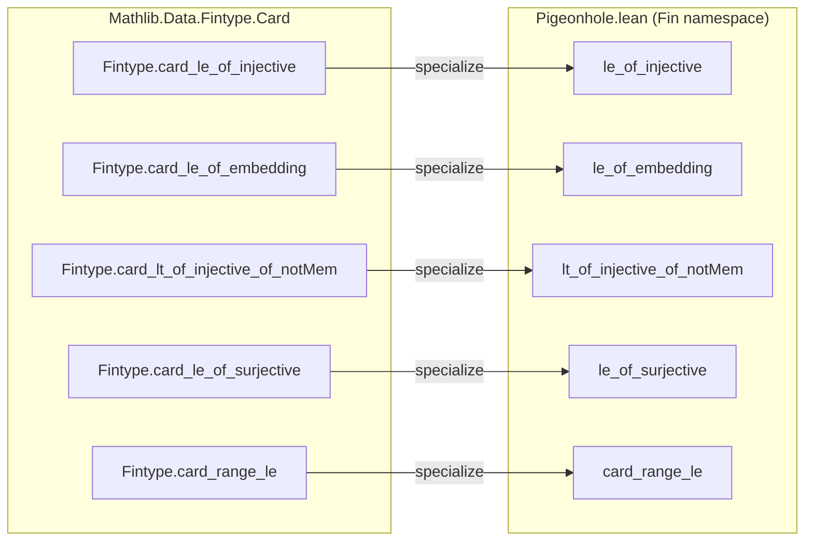

**Technical Brief: `Pigeonhole.lean` (Lean 4)**  
*Domain: Finite Types, Combinatorics, Formalized Pigeonhole Principles*

---

### 1. KEY DEFINITIONS & THEOREMS

| Name | Type | Purpose |
|------|------|---------|
| `le_of_injective` | `(f : Fin m → Fin n) → f.Injective → m ≤ n` | Injective map from `Fin m` to `Fin n` implies domain size ≤ codomain size |
| `le_of_embedding` | `(f : Fin m ↪ Fin n) → m ≤ n` | Embedding (injective with decidable image) implies same inequality; stronger hypothesis |
| `lt_of_injective_of_notMem` | `(f : Fin m → Fin n) → f.Injective → b ∉ range f → m < n` | Strict inequality when injective map misses at least one element |
| `le_of_surjective` | `(f : Fin m → Fin n) → f.Surjective → n ≤ m` | Surjective map implies codomain size ≤ domain size |
| `card_range_le` | `(f : Fin m → α) → Fintype.card (range f) ≤ m` | Image of a function from `Fin m` has cardinality ≤ `m` |

All theorems are *specializations* of general `Fintype`-based results to the concrete type `Fin n`.

---

### 2. NAMING CONVENTIONS

- **Prefixes**:  
  - `le_`, `lt_`: indicate inequality direction (`≤` vs `<`)  
  - `of_`: indicates the *hypothesis structure* (e.g., `of_injective`, `of_surjective`, `of_notMem`)  
- **Suffixes**:  
  - None prominent; naming follows Lean’s standard `card_*` and `of_*` patterns  
- **Pattern**: `le/lt_of_<condition>_<optional_refinement>`  
  - E.g., `lt_of_injective_of_notMem` = strict inequality from injectivity + missing element

---

### 3. TACTIC STACK

- **Primary tactics**:  
  - `simpa using …` — *core tactic* used in all proofs; rewrites goal using `simpa` and applies a lemma from `Fintype.Card`  
  - Implicit use of `rfl`, `exact`, `apply` via `simpa`’s internal machinery  
- **No manual induction or case analysis** — proofs are *entirely* via reduction to general `Fintype` lemmas  
- **No `aesop`, `ring`, `simp_rw`** — not needed; proofs are one-liner applications

---

### 4. PROOF LOGIC

- **Strategy**: *Leverage abstraction*  
  - Each theorem is proven by *applying* a corresponding `Fintype.card_*` lemma and simplifying (`simpa`)  
  - No constructive content is built in this file — it is a *bridge* between abstract finite type theory and concrete `Fin` arithmetic  
- **Logical flow per theorem**:  
  ```text
  Given f : Fin m → Fin n and hypothesis H,
  → use Fintype.card_* lemma (e.g., Fintype.card_le_of_injective f H)
  → apply simpa to discharge Fin-specific type class instances
  → conclude inequality on m, n
  ```

---

### 5. IMPORTS

- **Primary dependency**:  
  ```lean
  Mathlib.Data.Fintype.Card
  ```
  - Provides:  
    - `Fintype.card_le_of_injective`  
    - `Fintype.card_le_of_embedding`  
    - `Fintype.card_lt_of_injective_of_notMem`  
    - `Fintype.card_le_of_surjective`  
    - `Fintype.card_range_le`  
- **Implicit dependencies**:  
  - `Fintype`, `Set.range`, `Function.Injective`, `Function.Surjective`, `DecidableEq`, `[Fintype α]`

---

### 6. DEPENDENCY & THEORY OVERVIEW (Mermaid Diagrams)

#### A. Module Dependency Graph


#### B. Theoretical Flow (Abstraction → Specialization)


#### C. File Scope Overview


---

### 7. SUMMARY

This module provides a *lightweight, high-level interface* for pigeonhole-style reasoning over `Fin` types. It does not introduce new proofs but *repackages* general finite-type cardinality lemmas for the concrete setting of `Fin m → Fin n`. This enables concise, readable statements and proofs in combinatorial arguments involving finite intervals of naturals.

All theorems are *non-constructive* and rely on classical reasoning via `Fintype` instances. The file exemplifies Lean’s *abstraction-by-specialization* methodology: general theory → concrete utility.
