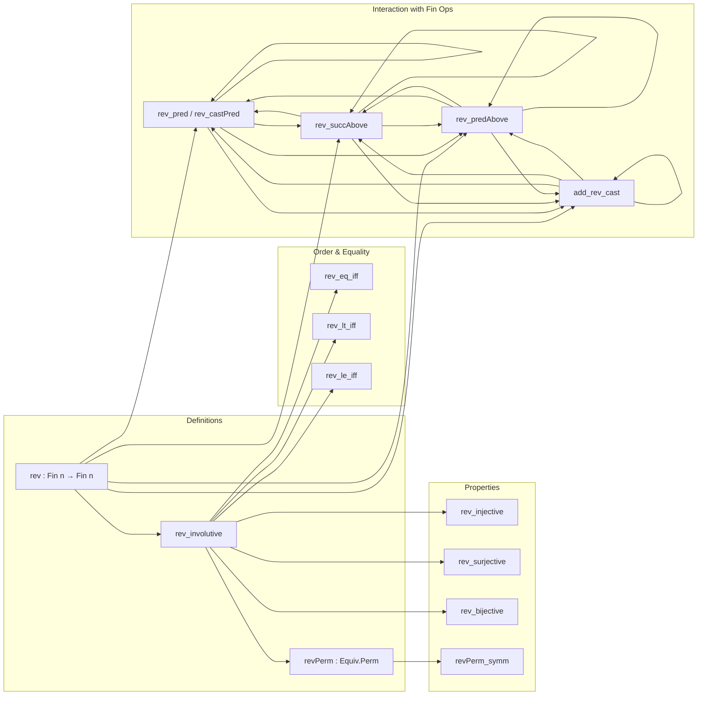

**Technical Brief: `Rev.lean` — Formalization of `Fin.rev` in Lean 4**

---

### 1. **Key Definitions & Theorems**

| Name | Type / Signature | Purpose |
|------|------------------|---------|
| `rev` | `Fin n → Fin n` | Antitone involution: $i \mapsto n - 1 - i$ |
| `rev_involutive` | `Involutive (rev : Fin n → Fin n)` | Proves `rev (rev i) = i` |
| `revPerm` | `Equiv.Perm (Fin n)` | Views `rev` as a permutation (via `Involutive.toPerm`) |
| `rev_injective` / `rev_surjective` / `rev_bijective` | `Injective rev`, `Surjective rev`, `Bijective rev` | Consequences of involutivity |
| `revPerm_symm` | `(@revPerm n).symm = revPerm` | Symmetry of the permutation: `rev` is its own inverse |
| `rev_eq_iff`, `rev_ne_iff`, `rev_lt_iff`, `rev_le_iff`, `lt_rev_iff`, `le_rev_iff` | Biconditional characterizations | Relate order/equality under `rev` |
| `val_rev_zero` | `((rev 0 : Fin n) : ℕ) = n.pred` | Value of `rev 0` in `ℕ` (requires `n ≠ 0`) |
| `rev_pred`, `rev_castPred` | `rev (pred i) = castPred (rev i)` / `rev (castPred i) = pred (rev i)` | Interaction of `rev` with predecessor operations |
| `rev_succAbove`, `rev_predAbove` | `rev (succAbove p i) = succAbove (rev p) (rev i)` / similarly for `predAbove` | `rev` commutes with `succAbove` and `predAbove` |
| `add_rev_cast`, `rev_add_cast` | `j.1 + j.rev.1 = n` | Sum of index and reversed index equals `n` |

---

### 2. **Naming Conventions**

- **Prefixes**:
  - `rev_`: core properties of `rev` (e.g., `rev_involutive`, `rev_pred`)
  - `revPerm_`: properties of the permutation version (e.g., `revPerm_symm`)
- **Suffixes**:
  - `_iff`: biconditional characterizations (`rev_eq_iff`, `rev_lt_iff`, etc.)
  - `_left` / `_right`: symmetry variants for binary operations (`succAbove_rev_left`, `succAbove_rev_right`)
- **`cast`/`pred`/`succAbove`/`predAbove`**: operations on `Fin` with index-shifting semantics; `rev_` variants describe how `rev` interacts with them.

---

### 3. **Tactic Stack**

- **Core tactics**:
  - `rw` (rewriting using lemmas like `rev_rev`, `rev_lt_rev`, etc.)
  - `simp` / `simp_rw` (especially with `@[simps!]` on `revPerm`)
  - `obtain h | h := ...` (case analysis on `≤` or `succ_le_or_le_castSucc`)
  - `subst`, `apply`, `exact`
- **Domain-specific automation**:
  - `aesop` not used (no heavy automation)
  - `ring` not used (arithmetic handled via `simp` + lemmas like `Nat.add_sub_cancel'`)
  - `linarith` not used (order reasoning via `rw` + lemmas)

---

### 4. **Proof Logic**

- **Structure**:
  - Most proofs are **direct manipulations** using:
    - `rev_rev` (involutivity)
    - Monotonicity/antitonicity lemmas (`rev_lt_rev`, `rev_le_rev`)
    - Interaction lemmas with `cast`, `pred`, `succ`, `succAbove`, `predAbove`
  - **Induction is not used** — proofs rely on case analysis and rewriting.
  - For `rev_pred`, `rev_castPred`, `rev_succAbove`, `rev_predAbove`:
    - Use `obtain h | h := ...` to split on order (`≤` vs `>`), then apply definitions and simplify.
  - Arithmetic lemmas (`add_rev_cast`) use `simp` + `Nat.add_sub_cancel'`.

---

### 5. **Imports & Dependencies**

- **Primary imports**:
  - `Mathlib.Data.Fin.SuccPred` — defines `succAbove`, `predAbove`, `castPred`, `castSucc`, `pred`, `succ`
- **Open scopes**:
  - `Fin`, `Nat`, `Function`
- **No external algebraic structures** (e.g., no `Monoid`, `Fintype` used — `assert_not_exists` confirms this).
- **Core dependencies**:
  - `Equiv.Perm`, `Involutive`, `Function`, `Fin` basic theory.

---

### 6. **Mermaid Diagrams**

#### **Dependency Graph (Module-Level)**

```mermaid
graph TD
  A[Rev.lean] --> B[Mathlib.Data.Fin.SuccPred]
  A --> C[Mathlib.Data.Fin.Basic] (implicit via Fin)
  A --> D[Mathlib.Data.Equiv.Basic] (for Equiv.Perm)
  A --> E[Mathlib.Data.Nat.Basic] (for arithmetic lemmas)
```

#### **Overview of Theory Flow**



---

### 7. **Domain Scope**

- **Core theory**: Finite types `Fin n`, their order structure, and involutive symmetries.
- **Use cases**:
  - Reversing indices in arrays or sequences indexed by `Fin n`.
  - Constructing symmetric constructions (e.g., reversing lists, matrices).
  - Formalizing combinatorial symmetries (e.g., palindromes, reflection in Coxeter groups).
- **Complements**:
  - `Mathlib.Data.Fin.List` (for reversing lists via `Fin.rev`)
  - `Mathlib.Data.Fin.Order` (for order-theoretic properties of `rev`)
  - `Mathlib.Data.Fin.VecNotation` (index arithmetic in vector notation)

--- 

This module formalizes the *reversal involution* on `Fin n` and its algebraic/order-theoretic behavior — foundational for symmetry arguments in finite combinatorics and indexed data structures.
