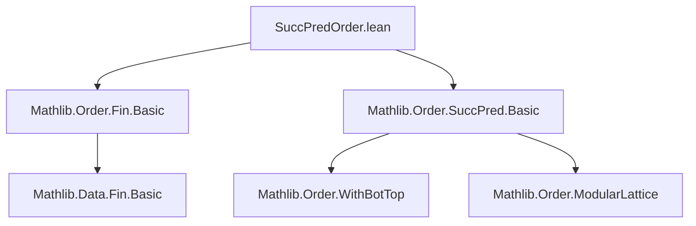
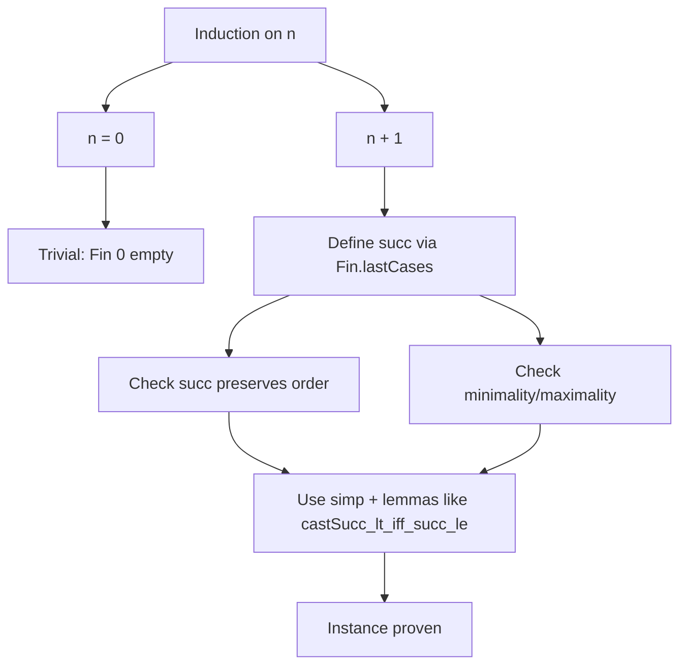

### Technical Brief: `SuccPredOrder.lean`

---

#### **1. Key Definitions & Theorems**

| Name | Type / Signature | Purpose |
|------|------------------|---------|
| `SuccOrder (Fin n)` | `∀ {n : ℕ}, SuccOrder (Fin n)` | Constructs a `SuccOrder` structure on `Fin n`, i.e., a partial order with a well-defined successor function satisfying `a < succ a` and minimality of `0` (in appropriate cases). |
| `PredOrder (Fin n)` | `∀ {n : ℕ}, PredOrder (Fin n)` | Constructs a `PredOrder` structure on `Fin n`, i.e., a partial order with a well-defined predecessor function satisfying `pred a < a` and maximality of `last` (in appropriate cases). |
| `orderSucc_eq` | `Order.succ = Fin.lastCases (Fin.last n) Fin.succ` | Identifies the abstract `Order.succ` with the concrete definition via case analysis on whether the element is the last one. |
| `orderSucc_apply` | `Order.succ i = Fin.lastCases (Fin.last n) Fin.succ i` | Applies the above equality pointwise. |
| `orderSucc_last` | `Order.succ (Fin.last n) = Fin.last n` | Shows that the successor of the maximum element in `Fin (n+1)` is itself (idempotent at top). |
| `orderSucc_castSucc` | `Order.succ i.castSucc = i.succ` | Relates `Order.succ` on embedded elements (`castSucc`) to the standard `Fin.succ`. |
| `orderPred_eq` | `Order.pred = Fin.cases 0 Fin.castSucc` | Identifies `Order.pred` with case analysis on zero vs. successor. |
| `orderPred_apply` | `Order.pred i = Fin.cases 0 Fin.castSucc i` | Pointwise version of `orderPred_eq`. |
| `orderPred_zero` | `Order.pred (0 : Fin (n+1)) = 0` | Predecessor of zero is zero (idempotent at bottom). |
| `orderPred_succ` | `Order.pred i.succ = i.castSucc` | Relates `Order.pred` on successors to `castSucc`. |

---

#### **2. Naming Conventions**

- **Prefixes**:
  - `orderSucc_`, `orderPred_`: denote lemmas about the abstract `Order.succ`/`Order.pred` in terms of concrete `Fin` operations.
- **Suffixes**:
  - `_eq`: equational identity of functions.
  - `_apply`: pointwise application of an equality.
  - `_last`, `_zero`, `_succ`, `_castSucc`: specify the case or argument pattern involved.

---

#### **3. Tactic Stack**

- **Core tactics**: `rfl`, `simp`, `obtain`, `rw`, `exact`, `intro`, `cases`
- **Specialized**:
  - `Fin.lastCases`, `Fin.cases`: case analysis on `Fin` elements (last vs. non-last / zero vs. succ).
  - `Fin.eq_castSucc_of_ne_last`, `Fin.eq_succ_of_ne_zero`: structural lemmas to decompose elements.
  - `castSucc_lt_iff_succ_le`, `le_castSucc_iff`: order-theoretic lemmas for `castSucc`.
  - `elim0`: handles empty `Fin 0` case.

---

#### **4. Proof Logic**

- **Structure**:
  - **Induction on `n`** for both `SuccOrder` and `PredOrder` instances.
    - Base case `n = 0`: trivial via `elim0`, since `Fin 0` is empty.
    - Inductive step `n + 1`:
      - For `SuccOrder`: use `SuccOrder.ofCore`, defining `succ` via `Fin.lastCases`.
      - For `PredOrder`: use `PredOrder.ofCore`, defining `pred` via `Fin.cases`.
  - **Verification steps**:
    - Prove monotonicity/compatibility with order using `simp` and order lemmas.
    - Prove totality of successor/predecessor behavior via case analysis and simplification.
  - **Lemmas**:
    - Prove equalities by `rfl` or `simp [orderSucc_apply]`, etc.
    - Use `obtain ⟨i, rfl⟩` to unpack existential equalities from `Fin` structure lemmas.

---

#### **5. Imports**

- `Mathlib.Order.Fin.Basic`: Provides foundational definitions and lemmas about `Fin`, including `Fin.last`, `Fin.succ`, `Fin.castSucc`, `Fin.cases`, `Fin.lastCases`, and equality principles like `Fin.eq_succ_of_ne_zero`.
- `Mathlib.Order.SuccPred.Basic`: Provides the typeclasses `SuccOrder`, `PredOrder`, and their constructors (`ofCore`, etc.).

---

#### **8. Mermaid Diagrams**

##### **Dependency Graph (Module-Level)**



##### **Overview of Theoretical Flow**

```mermaid
flowchart LR
  A[Fin n type] --> B[Finite linear order]
  B --> C[SuccOrder instance]
  B --> D[PredOrder instance]
  C --> E[Order.succ defined as last-cases]
  D --> F[Order.pred defined as zero-cases]
  E --> G[orderSucc_last, orderSucc_castSucc]
  F --> H[orderPred_zero, orderPred_succ]
  G & H --> I[Archimedean property (via general theory)]
```

##### **Proof Strategy Flow (for `SuccOrder` instance)**



---

This file formalizes the *canonical* successor and predecessor structure on finite types `Fin n`, crucial for reasoning about discrete intervals in order theory and formal verification. It leverages `Fin`'s inductive structure to define order-theoretic operations and proves their correctness via case analysis and simplification.
