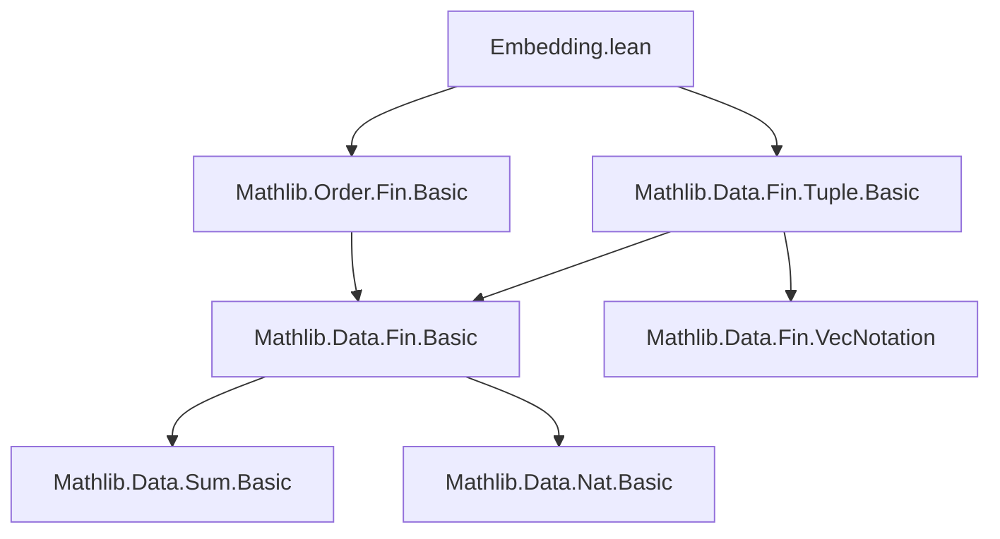

### Technical Brief: `Embedding.lean`

---

#### **1. Key Definitions & Theorems**

| Name | Type / Signature | Purpose |
|------|------------------|---------|
| `tail` | `Fin (n + 1) ↪ α → Fin n ↪ α` | Removes the first element of an embedding of length `n+1`. |
| `cons` | `Fin n ↪ α → a ∉ range x → Fin (n + 1) ↪ α` | Prepends a new element `a` (not in range) to an embedding. |
| `snoc` | `Fin n ↪ α → a ∉ range x → Fin (n + 1) ↪ α` | Appends a new element `a` (not in range) to an embedding. |
| `init` | `Fin (n + 1) ↪ α → Fin n ↪ α` | Removes the last element of an embedding of length `n+1`. |
| `append` | `Disjoint (range x) (range y) → Fin (m + n) ↪ α` | Concatenates two embeddings with disjoint ranges. |
| `twoEmbeddingEquiv` | `(Fin 2 ↪ α) ≃ {(a, b) : α × α | a ≠ b}` | Equivalence between embeddings of `Fin 2` and ordered pairs of distinct elements. |
| `embFinTwo` | `a ≠ b → Fin 2 ↪ α` | Constructs an embedding from two distinct elements. |

**Key Theorems (Simp/Norm-cast):**
- `coe_tail`: `↑(tail x) = Fin.tail x`
- `coe_cons`: `↑(cons x ha) = Fin.cons a x`
- `coe_snoc`: `↑(snoc x ha) = Fin.snoc x a`
- `coe_append`: `↑(append h) = Fin.append x y`
- `tail_cons`: `tail (cons x ha) = x`
- `init_snoc`: `init (snoc x ha) = x`
- `snoc_castSucc`: `snoc x ha (i.castSucc) = x i`
- `snoc_last`: `snoc x ha (last n) = a`
- `embFinTwo_apply_zero`, `embFinTwo_apply_one`: Explicit values of `embFinTwo`.

---

#### **2. Naming Conventions**

- **Prefixes:**
  - `tail`, `init`: Remove first/last element.
  - `cons`, `snoc`: Add element at front/end (functional programming style).
  - `append`: Concatenation of embeddings.
- **Suffixes:**
  - `_inj'`, `_inj`: Injectivity-related conditions.
  - `_iff`: Characterizations via biconditionals (e.g., `cons_injective_iff`, `snoc_injective_iff`, `append_injective_iff`).
- **Variable naming:**
  - `x`, `y`: embeddings (`Fin n ↪ α`)
  - `a`, `b`: elements of `α`
  - `ha`, `hb`, `h`: hypotheses (e.g., `a ∉ range x`, `Disjoint (range x) (range y)`, `a ≠ b`)

---

#### **3. Tactic Stack**

Frequently used tactics:
- `simp` / `simp_rw`: Simplify using definitional equalities and lemmas like `coe_tail`, `coe_cons`, etc.
- `rw`: Rewrite using `coe_*`, `tail_cons`, `init_snoc`, `snoc_*`, etc.
- `by_cases`: Split on equality of indices (`i = 0`, `j = 0`, etc.).
- `ext`: Extensionality for function equality.
- `exact`, `apply`, `intro`, `cases`: Basic proof structure.
- `aesop`: Not explicitly used here, but `by aesop` could replace some `simp + rw` sequences.
- `ring`: Not used — arithmetic handled via `Fin` lemmas.

---

#### **4. Proof Logic**

- **Inductive-style reasoning**: Proofs often rely on case analysis on indices (`i = 0`, `i = 1`) and use of `Fin` structure lemmas (`zero_eq_one_iff`, `succ_ne_self`, `eq_one_of_ne_zero`, `castSucc`, `last`).
- **Disjointness & injectivity**: Key for `append` and correctness of `cons`/`snoc`.
- **Equivalence proofs**: For `twoEmbeddingEquiv`, use constructive inverse and verify left/right inverses via case analysis on `i : Fin 2`.
- **Normalization**: `@[simp, norm_cast]` attributes ensure coercion lemmas simplify automatically.

---

#### **5. Imports**

- `Mathlib.Data.Fin.Tuple.Basic`: Provides `Fin.cons`, `Fin.snoc`, `Fin.tail`, `Fin.init`, `Fin.append`, and their injectivity criteria.
- `Mathlib.Order.Fin.Basic`: Provides order-theoretic facts about `Fin`, including `castSucc`, `last`, etc.

---

#### **6. Mermaid Diagrams**

##### **Dependency Graph (Module-Level)**



##### **Overview of Theory Flow**

```mermaid
flowchart LR
  A[Fin n ↪ α] -->|tail| B[Fin n ↪ α]
  A -->|init| B
  B -->|cons ha| A
  B -->|snoc ha| A
  A1[Fin m ↪ α] & A2[Fin n ↪ α] -->|append (disjoint)| C[Fin (m+n) ↪ α]
  D[Fin 2 ↪ α] <-->|twoEmbeddingEquiv| E[{(a,b) | a ≠ b}]
  E -->|embFinTwo| D
```

##### **Core Construction Cycle**

```mermaid
flowchart LR
  x[Fin n ↪ x] -->|cons a ∉ range x| x+[Fin (n+1) ↪ α]
  x+ -->|tail| x
  x -->|snoc a ∉ range x| x+'
  x+' -->|init| x
```

---

#### **7. Summary**

This module formalizes *constructive operations on finite embeddings* — injective functions from `Fin n` into a type `α`. It provides:
- **Incremental construction**: `cons`, `snoc`
- **Decomposition**: `tail`, `init`
- **Concatenation**: `append` under disjointness
- **Canonical encoding of 2-element embeddings**: `twoEmbeddingEquiv`, `embFinTwo`

It serves as foundational infrastructure for reasoning about finite sequences, permutations, and combinatorial constructions in dependent type theory.

--- 

*End of Technical Brief.*
