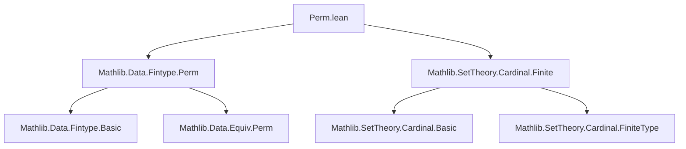

**Technical Brief: `Perm.lean` Module Metadata**

---

### 1. **Key Definitions & Theorems**

| Name | Type / Signature | Purpose |
|------|------------------|---------|
| `card_perm` | `{α : Type*} [Finite α] → Nat.card (Equiv.Perm α) = (Nat.card α)!` | Computes the cardinality of the group of permutations on a finite type `α` as the factorial of its cardinality. |

> **Note**: No user-defined definitions appear in this snippet—only a theorem leveraging existing infrastructure (`Equiv.Perm`, `Nat.card`, `Fintype.card_perm`).

---

### 2. **Naming Conventions**

- **Prefixes**: None observed in this file.
- **Suffixes**: None observed.
- **Style**: Uses standard Lean/`Mathlib` naming (`card_perm`, `Fintype.card_perm`), where:
  - `card_` → cardinality-related,
  - `perm` → permutations,
  - `Fintype.card_perm` is imported from `Mathlib.Data.Fintype.Perm`.

---

### 3. **Tactic Stack**

| Tactic | Usage Frequency | Role |
|--------|-----------------|------|
| `classical` | 1 | Enables classical reasoning (e.g., choice for finite types). |
| `rw` | 2 | Rewrites using equalities: `card_eq_fintype_card`, `Fintype.card_perm`. |

> No heavy automation (`aesop`, `ring`, `simp`) used—proof is short and structural.

---

### 4. **Proof Logic**

1. **Classical assumption** to allow use of `Fintype.ofFinite`.
2. **Rewrite** both sides of the goal using `card_eq_fintype_card`, converting `Nat.card` to `Fintype.card`.
3. **Apply** `Fintype.card_perm`, which states:  
   $$
   \text{Fintype.card}(\text{Equiv.Perm } \alpha) = (\text{Fintype.card } \alpha)!
   $$
   for finite `α`.

> **Flow**: Reduce to known `Fintype`-based lemma via definitional equivalence.

---

### 5. **Imports**

| Import | Purpose |
|--------|---------|
| `Mathlib.Data.Fintype.Perm` | Provides `Fintype.card_perm`, `Equiv.Perm` cardinality facts. |
| `Mathlib.SetTheory.Cardinal.Finite` | Supplies `Nat.card`, `Fintype.ofFinite`, and finite cardinal arithmetic. |

> **Scope**: This module is a *thin wrapper* around existing `Mathlib` facts about permutation groups on finite types.

---

### 8. **Dependency & Theory Overview**

#### Mermaid Diagram: Module Dependencies



#### Mermaid Diagram: Theoretical Flow

```mermaid
flowchart LR
  FiniteType[Finite Type α] -->|Fintype.ofFinite| FintypeStructure[Fintype α]
  FintypeStructure -->|card_eq_fintype_card| NatCard[Nat.card α = Fintype.card α]
  EquivPerm[Equiv.Perm α] -->|Fintype.card_perm| Factorial[(Fintype.card α)!]
  NatCard & Factorial -->|rw| Goal[Nat.card (Equiv.Perm α) = (Nat.card α)!]
```

#### Theory Context

- **Domain**: Finite combinatorics & algebra.
- **Role**: Bridges `Nat.card` (cardinal arithmetic) and `Fintype.card` (finite type theory) to formalize the size of symmetric groups.
- **Place in Mathlib**: Likely part of a larger effort to formalize finite group theory (e.g., symmetric groups, Cayley’s theorem, Sylow theorems).

--- 

✅ **Summary**: A minimal, high-level lemma connecting finite type cardinality to permutation group size—leveraging `Mathlib`’s `Fintype` infrastructure.
