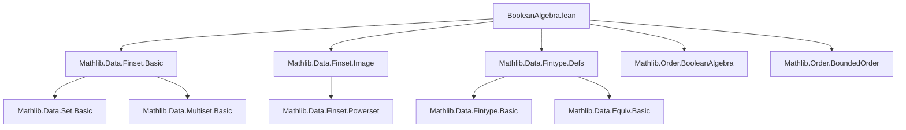
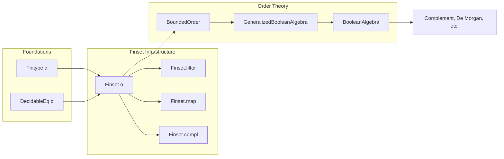
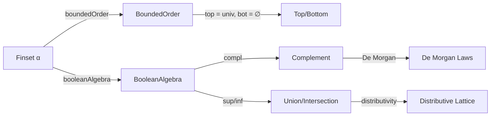

### Technical Brief: `BooleanAlgebra (Finset α)` Instance in Lean 4

---

#### **1. Key Definitions & Theorems**

| Name | Type / Signature | Purpose |
|------|------------------|---------|
| `boundedOrder` | `instance [Fintype α] : BoundedOrder (Finset α)` | Equips `Finset α` with a bounded order, where `⊤ = univ` and `⊥ = ∅`. |
| `booleanAlgebra` | `instance [DecidableEq α] [Fintype α] : BooleanAlgebra (Finset α)` | Constructs a Boolean algebra structure on `Finset α` using `GeneralizedBooleanAlgebra.toBooleanAlgebra`. |
| `top_eq_univ` | `⊤ = univ` | Identifies the top element of the bounded order with the universal set. |
| `compl_eq_univ_sdiff` | `sᶜ = univ \ s` | Defines complement as set difference from `univ`. |
| `mem_compl` | `a ∈ sᶜ ↔ a ∉ s` | Membership characterization of complement. |
| `compl_empty`, `compl_univ` | `∅ᶜ = univ`, `univᶜ = ∅` | Complements of bottom/top elements. |
| `union_compl`, `inter_compl` | `s ∪ sᶜ = univ`, `s ∩ sᶜ = ∅` | Law of excluded middle and contradiction in Boolean algebra. |
| `compl_union`, `compl_inter` | De Morgan laws: `(s ∪ t)ᶜ = sᶜ ∩ tᶜ`, `(s ∩ t)ᶜ = sᶜ ∪ tᶜ` | Standard Boolean algebra identities. |
| `codisjoint_left`, `codisjoint_right` | `Codisjoint s t ↔ ∀ a, a ∉ s → a ∈ t` | Characterization of codisjointness (i.e., disjoint complements). |
| `subset_compl_iff_disjoint_right/left` | `s ⊆ tᶜ ↔ Disjoint s t` | Connection between complement inclusion and disjointness. |
| `univ_filter_mem` | `univ.filter (· ∈ s) = s` | Filtering `univ` by membership in `s` recovers `s`. |
| `subtype_univ` | `univ.subtype p = univ` | Subtype of `univ` along a decidable predicate is `univ` when the subtype is finite. |
| `univ_map_subtype` | `univ.map (subtype p) = univ.filter p` | Mapping `univ` along subtype embedding yields filtered `univ`. |

---

#### **2. Naming Conventions**

- **Prefixes**:
  - `compl_`: Complement-related lemmas (`compl_empty`, `compl_union`, etc.)
  - `univ_`: Universal set properties (`univ_nonempty`, `univ_subset_iff`, etc.)
  - `subset_compl_`: Inclusion involving complements (`subset_compl_comm`, `subset_compl_singleton`)
  - `codisjoint_`: Codisjointness (`codisjoint_left`, `codisjoint_right`)
  - `filter_univ_`, `univ_filter_`: Interaction of `univ` with `filter`
  - `map_univ_`, `univ_map_`: Interaction of `univ` with `map`

- **Suffixes**:
  - `_iff`: Equivalences (`univ_subset_iff`, `compl_eq_empty_iff`)
  - `_eq`: Equalities (`top_eq_univ`, `compl_empty`)
  - `_singleton`: Special cases involving singletons (`singleton_ne_univ`, `compl_singleton`)

---

#### **3. Tactic Stack**

Frequent tactics used in proofs:
- `simp` / `simp only`: Simplification with `@[simp]` lemmas (e.g., `mem_compl`, `compl_insert`)
- `rw`: Rewriting using equivalences and definitions
- `ext`: Extensionality for sets/finsets (`ext a`)
- `aesop`: Automated reasoning for simple goals (e.g., `@[aesop unsafe apply]`)
- `grind`: For grind-style simplification (used in `univ_filter_mem_range`)
- `apply`, `intro`, `exact`, `contrapose!`: Basic proof scripting
- `rwa`, `apply_congr`, `congr_arg`: Advanced rewriting and congruence

---

#### **4. Proof Logic**

- **Structure**: Most proofs follow a standard pattern:
  1. **Extensionality**: Use `ext a` to reduce to element-wise reasoning.
  2. **Simplify**: Apply `simp` with `@[simp]` lemmas (e.g., `mem_compl`, `mem_insert`, `mem_erase`).
  3. **Logical manipulation**: Use classical logic (`classical`), `or_iff_not_imp_left`, `not_and`, etc.
  4. **Rewrite**: Use definitions like `compl_eq_univ_sdiff`, `sdiff_eq_inter_compl`.
  5. **Apply known lemmas**: E.g., `subset_compl_iff_disjoint_right`, `compl_le_compl_iff_le`.

- **Induction**: Not used here — finset reasoning is mostly extensional and algebraic.

- **Decidability assumptions**: Crucial for `booleanAlgebra` instance and decidability instances (`decidableCodisjoint`, `decidableIsCompl`). Enforced via `[DecidableEq α]` and `[DecidablePred p]`.

---

#### **5. Imports & Dependencies**

- **Core imports**:
  ```lean
  Mathlib.Data.Finset.Basic
  Mathlib.Data.Finset.Image
  Mathlib.Data.Fintype.Defs
  ```
- **Key dependencies**:
  - `Finset` infrastructure: `subset`, `inter`, `union`, `compl`, `filter`, `map`, `image`, `subtype`.
  - `Fintype` and `DecidableEq`: For finiteness and decidability of membership.
  - `BooleanAlgebra`, `BoundedOrder`, `GeneralizedBooleanAlgebra`: From order theory.
  - `Set` and `Multiset`: Underlying set-theoretic semantics.

---

#### **6. Mermaid Diagrams**

##### **Dependency Graph (Module-Level)**



##### **Overview of Theory Flow**



##### **Boolean Algebra Structure on `Finset α`**



---

#### **7. Summary**

This module establishes that `Finset α` forms a Boolean algebra when `α` is finite and has decidable equality. It leverages:
- The bounded order structure (`univ` as top, `∅` as bottom),
- Complement defined via set difference from `univ`,
- Standard Boolean algebra identities (De Morgan, complementarity, distributivity),
- Decidability to ensure all operations are computable.

The proofs are mostly extensional and rely heavily on `simp`-friendly lemmas and classical logic. The structure is foundational for formalizing combinatorics, measure theory, and logic over finite types in Mathlib.

--- 

Let me know if you'd like a dependency graph for specific sub-theories (e.g., `compl`, `filter`, `map`) or a proof sketch for `booleanAlgebra`.
