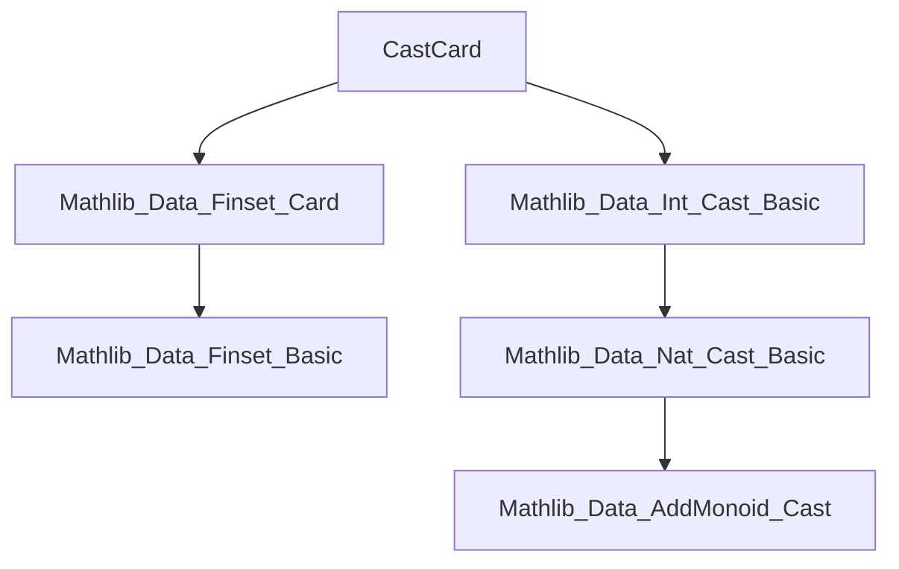

**Technical Brief: `CastCard.lean`**

---

### 1. **Key Definitions & Theorems**

| Name | Type | Purpose |
|------|------|---------|
| `cast_card_erase_of_mem` | `a ∈ s → (#(s.erase a) : R) = #s - 1` | Relates cardinality after erasing an element to subtraction in an `AddGroupWithOne R`, avoiding `ℕ`-subtraction. |
| `cast_card_inter` | `(#(s ∩ t) : R) = #s + #t - #(s ∪ t)` | Inclusion–exclusion principle for intersection, cast into `R`. |
| `cast_card_union` | `(#(s ∪ t) : R) = #s + #t - #(s ∩ t)` | Inclusion–exclusion principle for union, cast into `R`. |
| `cast_card_sdiff` | `s ⊆ t → (#(t \ s) : R) = #t - #s` | Cardinality of set difference when one set is contained in another, cast into `R`. |

All theorems involve casting finite set cardinalities (`#s : ℕ`) into an arbitrary `AddGroupWithOne R` via `Nat.cast`.

---

### 2. **Naming Conventions**

- **Prefixes**:
  - `cast_`: indicates that the result involves `Nat.cast` (embedding `ℕ` into `R`).
- **Suffixes**:
  - `_of_mem`: condition is membership (`a ∈ s`).
  - `_sdiff`: set difference (`\`).
  - `_inter`, `_union`: set intersection/union.

No `is_`, `mul_`, or `dist_` patterns observed — the file is focused on *cardinality arithmetic*.

---

### 3. **Tactic Stack**

Frequent tactics used in proofs:

- `rw`: rewriting using lemmas like `card_erase_add_one`, `card_inter_add_card_union`, etc.
- `cast_add`, `cast_one`: lemmas for `Nat.cast` preserving addition and `1`.
- `eq_sub_iff_add_eq`: to convert equations involving subtraction into additive form (avoids `ℕ` subtraction issues).
- `card_sdiff_of_subset`, `card_mono`: lemmas from `Mathlib.Data.Finset.Card`.
- `← cast_add`: reverse rewriting of `cast_add`.

No heavy automation (e.g., `aesop`, `linarith`) — proofs are mostly direct algebraic rewrites.

---

### 4. **Proof Logic**

- **Structure**: All proofs follow a uniform pattern:
  1. Use `eq_sub_iff_add_eq` to rewrite target equality into an additive form (avoiding `ℕ` subtraction).
  2. Apply known cardinality identities (e.g., `card_inter_add_card_union`).
  3. Use `cast_add` and `cast_one` to lift identities into `R`.
  4. Simplify using `cast_add`, `cast_one`, and ring-like properties of `AddGroupWithOne`.

- **Key idea**: Avoid `ℕ` subtraction by working in `AddGroupWithOne R`, where subtraction is total.

---

### 5. **Imports**

| Import | Purpose |
|--------|---------|
| `Mathlib.Data.Finset.Card` | Core cardinality lemmas: `card_erase_add_one`, `card_inter_add_card_union`, `card_union_add_card_inter`, `card_sdiff_of_subset`, `card_mono`. |
| `Mathlib.Data.Int.Cast.Basic` | Provides `AddGroupWithOne` and `Nat.cast` infrastructure. |

> Note: `Int` is *not* used directly — the import is for the typeclass `AddGroupWithOne`, which `Int` satisfies, but the file works for any such `R`.

---

### 6. **Dependency & Theory Overview**

#### **Mermaid Diagram: Module Dependencies**



#### **Mermaid Diagram: Theoretical Flow**


#### **Scope of Theory**

- **Domain**: Finite set combinatorics over arbitrary types `α` with decidable equality.
- **Target Structure**: Any `AddGroupWithOne R` (e.g., `ℤ`, `ℚ`, `ℝ`, `ℤ/nℤ`, etc.).
- **Goal**: Provide cardinality identities that avoid partial subtraction in `ℕ`, by embedding into a structure where subtraction is total.

---

### 7. **Notable Design Decisions**

- **No `@[simp]` on `cast_card_erase_of_mem`**: As noted in comment, LHS `#(s.erase a)` is not in simp normal form (depends on `a ∈ s`), so not safe for automatic simplification.
- **Use of `eq_sub_iff_add_eq`**: Avoids reasoning about `ℕ` subtraction (e.g., `m - n` undefined if `n > m`), by working in additive groups where subtraction is total.
- **Generality over `AddGroupWithOne`**: Enables reuse across many rings/groups (e.g., modular arithmetic), not just `ℤ`.

---

### 8. **Example Use Case**

```lean
example [AddGroupWithOne R] (s : Finset α) (a : α) (ha : a ∈ s) :
  (#(s.erase a) : R) = #s - 1 := by apply Finset.cast_card_erase_of_mem ha
```

This lets one reason about decrementing set size in any additive group with 1 — crucial for inductive proofs over finite sets in algebraic contexts.

--- 

✅ **End of Technical Brief**
