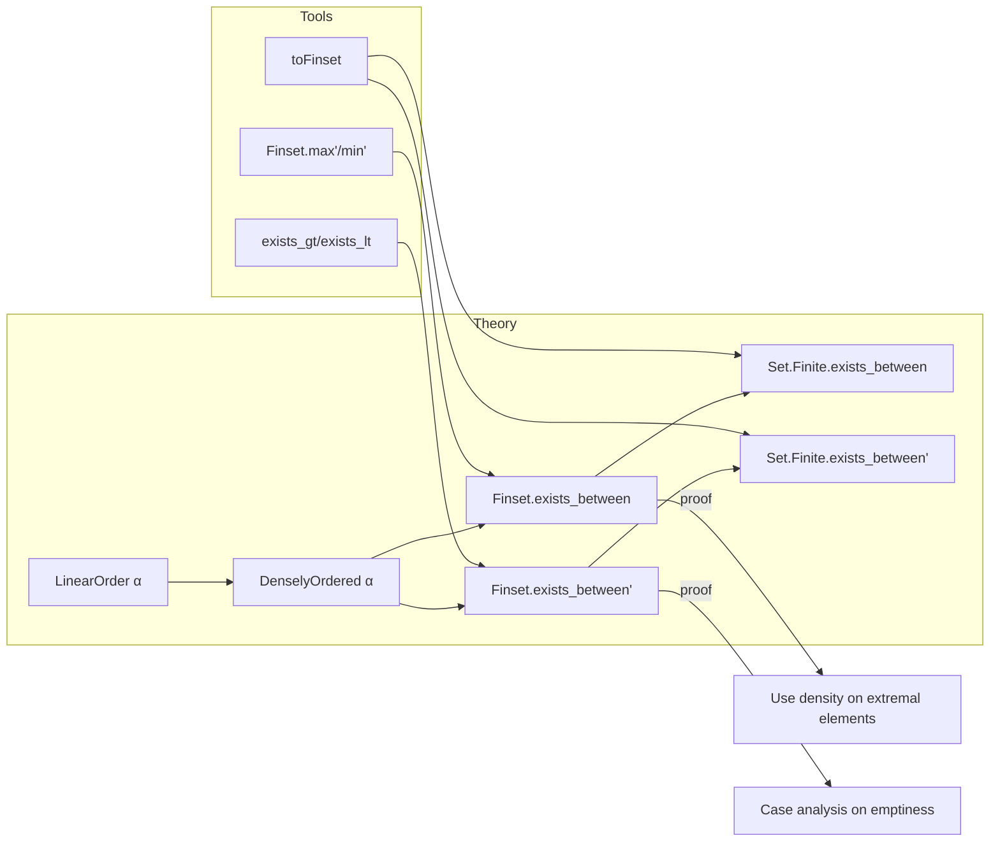

### Technical Brief: `DenselyOrdered.lean`

---

#### **1. Key Definitions & Theorems**

| Name | Type | Purpose |
|------|------|---------|
| `DenselyOrdered` | `class` | A `LinearOrder α` where for all $x < y$, there exists $z$ with $x < z < y$. (Assumed via `[DenselyOrdered α]`.) |
| `Finset.exists_between` | `∀ {s t : Finset α}, s.Nonempty → t.Nonempty → (∀ x ∈ s, ∀ y ∈ t, x < y) → ∃ b, (∀ x ∈ s, x < b) ∧ (∀ y ∈ t, b < y)` | In a dense linear order, any two *nonempty* finite sets with all elements of `s` less than all elements of `t` admit a separator `b`. |
| `Finset.exists_between'` | `∀ {s t : Finset α}, [NoMaxOrder α] → [NoMinOrder α] → [Nonempty α] → (∀ x ∈ s, ∀ y ∈ t, x < y) → ∃ b, (∀ x ∈ s, x < b) ∧ (∀ y ∈ t, b < y)` | Same as above, but relaxes nonemptiness of `s`, `t` using `NoMaxOrder`/`NoMinOrder` to handle empty cases. |
| `Set.Finite.exists_between` | `∀ {s t : Set α}, s.Finite → s.Nonempty → t.Finite → t.Nonempty → (∀ x ∈ s, ∀ y ∈ t, x < y) → ∃ b, (∀ x ∈ s, x < b) ∧ (∀ y ∈ t, b < y)` | Extends `Finset.exists_between` to *finite* sets (via `toFinset`). |
| `Set.Finite.exists_between'` | `∀ {s t : Set α}, s.Finite → t.Finite → (∀ x ∈ s, ∀ y ∈ t, x < y) → ∃ b, (∀ x ∈ s, x < b) ∧ (∀ y ∈ t, b < y)` | Finite-set version of `Finset.exists_between'`, again using `NoMaxOrder`/`NoMinOrder`. |

> **Note**: `s.max' hs` and `t.min' ht` are used to extract extremal elements from nonempty finite sets in a linear order.

---

#### **2. Naming Conventions**

- **Prefixes**:
  - `exists_between`: Indicates existence of a separating element.
  - `Finset.*` / `Set.Finite.*`: Distinguishes finite *sets* vs *finitely supported* sets.
- **Suffixes**:
  - `'` (prime): Variant that relaxes assumptions (e.g., removes `Nonempty` by using `NoMaxOrder`/`NoMinOrder`).
- **Helper terms**:
  - `hs`, `ht`: Standard for `s.Nonempty`, `t.Nonempty`.
  - `H`: Hypothesis that all elements of `s` are less than all elements of `t`.

---

#### **3. Tactic Stack**

| Tactic | Usage |
|--------|-------|
| `convert` | To reuse existing theorems (e.g., `Finset.exists_between` from `exists_between` on extremal elements). |
| `simp` / `simp_all` | Simplify goals using definitions (`max'`, `min'`, `toFinset`, etc.). |
| `by_cases` | Branch on emptiness of `s`, `t` in `Finset.exists_between'`. |
| `exact` / `let ... in` | Construct witnesses using `exists_gt`, `exists_lt`, or extremal elements. |
| `Nonempty.elim` | Handle fully empty case (`s = t = ∅`) using `Nonempty α`. |

---

#### **4. Proof Logic**

- **Core idea**: Reduce to extremal elements (`max s`, `min t`) using finiteness, then apply density on those two points.
- **For `Finset.exists_between`**:
  1. Let $a_1 = \max s$, $a_2 = \min t$ (guaranteed by `max'`, `min'` and nonemptiness).
  2. By hypothesis $a_1 < a_2$.
  3. Apply `exists_between` (from `DenselyOrdered` instance) to get $b$ with $a_1 < b < a_2$.
  4. Conclude $∀ x ∈ s, x ≤ a_1 < b$ and $∀ y ∈ t, b < a_2 ≤ y$.
- **For `Finset.exists_between'`**:
  - Cases on emptiness of `s`, `t`:
    - Both nonempty → use `Finset.exists_between`.
    - `s` nonempty, `t` empty → pick $b > \max s$ using `exists_gt`.
    - `s` empty, `t` nonempty → pick $b < \min t$ using `exists_lt`.
    - Both empty → pick any $b$ (using `Nonempty α`).
- **For `Set.Finite.*`**: Lift to `Finset` via `toFinset`, then apply corresponding `Finset.*` theorem.

---

#### **5. Imports**

| Import | Purpose |
|--------|---------|
| `Mathlib.Data.Finset.Max` | Provides `Finset.max'`, `Finset.min'`, extremal element lemmas. |
| `Mathlib.Data.Set.Finite.Basic` | Provides `Set.Finite`, `toFinset`, and basic finite set operations. |

> **No direct imports of `DenselyOrdered`** — it is assumed via typeclass `[DenselyOrdered α]`.

---

#### **6. Mermaid Diagrams**

##### **Dependency Graph (Theorems)**

```mermaid
graph TD
  A[exists_between (on α)] -->|apply to max/min| B[Finset.exists_between]
  B -->|lift via toFinset| C[Set.Finite.exists_between]
  D[NoMaxOrder + NoMinOrder] -->|handle emptiness| E[Finset.exists_between']
  C -->|same lifting| F[Set.Finite.exists_between']
  B -->|cases on emptiness| E
```

##### **Overview of File Structure**



---

#### **7. Summary**

This module formalizes a key property of dense linear orders: *finite separation*. It bridges the gap between infinitary density (for pairs) and finitary separation (for finite sets), with careful handling of edge cases via `NoMaxOrder`/`NoMinOrder`. The proofs are concise and leverage Lean’s typeclass inference and `Finset` infrastructure.

Let me know if you'd like a formalized comment block or a tactic-level trace of one proof.
