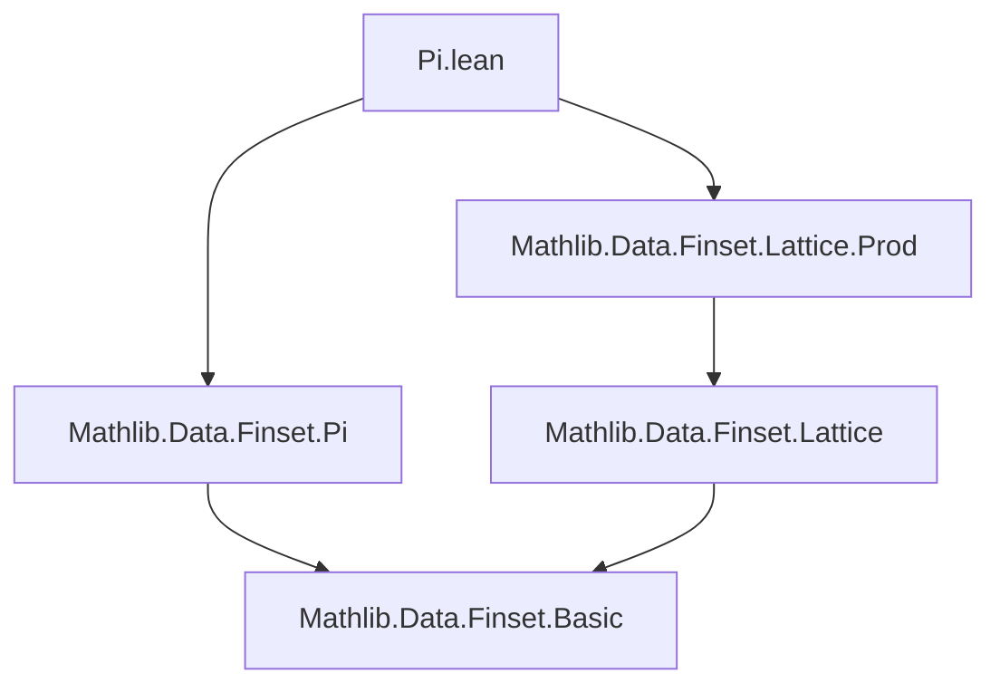

### Technical Brief: `Pi.lean` — Lattice Operations on Finsets of Functions

---

#### **1. Key Definitions & Theorems**

| Name | Type | Purpose |
|------|------|---------|
| `inf_sup` | `(s : Finset ι) → (∀ i, Finset (κ i)) → (∀ i, κ i → α) → (s.inf fun i => (t i).sup (f i)) = (s.pi t).sup fun g => s.attach.inf fun i => f _ (g _ i.2)` | Relates a pointwise infimum of suprema to a supremum over the dependent product (`pi`) of functions, with a refinement using `attach` (i.e., indexing over proof-carrying elements). |
| `sup_inf` | `(s : Finset ι) → (∀ i, Finset (κ i)) → (∀ i, κ i → α) → (s.sup fun i => (t i).inf (f i)) = (s.pi t).inf fun g => s.attach.sup fun i => f _ (g _ i.2)` | Dual of `inf_sup`, obtained by applying `inf_sup` to the opposite lattice `αᵒᵈ`. |

- **`s.inf`, `s.sup`**: Infimum/supremum over a finset using lattice operations.
- **`s.pi t`**: Dependent product of finsets: $\prod_{i \in s} t(i)$, i.e., functions $g$ such that $g(i) \in t(i)$ for all $i \in s$.
- **`s.attach`**: Finset of pairs $(i, h)$ where $i \in s$ and $h : i \in s$; used to reason about elements with explicit membership proofs.

---

#### **2. Naming Conventions**

- **`inf_`, `sup_`**: Prefixes for lattice operations over finsets.
- **`_sup`, `_inf`**: Suffixes for theorems about interaction of `inf`/`sup` with other constructs.
- **`aux`**: Local auxiliary lemma name (used to avoid shadowing by internal `this` in `simpa`).
- **`hji`**: Local hypothesis name for equality $j = i$ in a `if`-case analysis.

---

#### **3. Tactic Stack**

- **`induction s using Finset.induction`**: Structural induction on `Finset`.
- **`simp` / `simpa`**: Simplification using rewrite rules and local hypotheses.
- **`rw`**: Rewriting using equalities (e.g., `inf_insert`, `ih`, `attach_insert`, `sup_inf_sup`).
- **`refine` / `exact`**: Goal-directed proof construction.
- **`obtain`**: Destructuring existential or disjunctive hypotheses (e.g., `rfl | hj`).
- **`cast_eq`, `dif_pos`, `dif_neg`**: Simplification of `cast` and `if` expressions.
- **`ne_of_mem_of_not_mem`**: Proving inequality from membership/non-membership.

---

#### **4. Proof Logic**

- **Inductive structure**: Induction on `s : Finset ι` using `Finset.induction` (empty + insert).
- **Base case (`empty`)**: Immediate by `simp`.
- **Inductive step (`insert i s`)**:
  1. Expand using `inf_insert` / `sup_inf_sup`.
  2. Apply induction hypothesis (`ih`) to reduce to a comparison over `s`.
  3. Use `eq_of_forall_ge_iff` to reduce equality to mutual inequality.
  4. Prove both directions via functional extensionality and case analysis on membership of $i$.
  5. Handle `if`-cases using `cast`, `dif_pos`, `dif_neg`, and `aux` to ensure $j \ne i$ in the inductive part.
- **Duality**: `sup_inf` is derived by applying `inf_sup` to the opposite lattice `αᵒᵈ`.

---

#### **5. Imports**

- `Mathlib.Data.Finset.Lattice.Prod`: Provides lattice-theoretic infrastructure for products of finsets.
- `Mathlib.Data.Finset.Pi`: Defines `pi` for dependent products over finsets.

These imports define the foundational operations (`pi`, `inf`, `sup`) used in the theorems.

---

#### **8. Mermaid Diagrams**

##### **Dependency Graph (Module-Level)**



##### **Overview of Theoretical Flow**

```mermaid
graph LR
  A[Finset ι] --> B[pi t : Finset (∀ i, κ i)]
  A --> C[inf/sup over s]
  B --> D[sup/inf over g : pi t]
  C --> D
  style D fill:#f9f,stroke:#333
  style C fill:#bbf,stroke:#333
```

- **Input**: A finset `s : Finset ι`, family of finsets `t : ι → Finset (κ i)`, and family of functions `f : ι → κ i → α`.
- **Output**: Equality between:
  - **Left**: `inf`/`sup` over `s` of `sup`/`inf` over each `t i`.
  - **Right**: `sup`/`inf` over the dependent product `s.pi t`, refined via `s.attach`.

This reflects a *distributivity law* of lattice operations over dependent products, formalizing the set-theoretic identity:
$$
\bigwedge_{i \in s} \bigvee_{x_i \in t_i} f_i(x_i)
\;=\;
\bigvee_{g \in \prod_{i \in s} t_i} \bigwedge_{i \in s} f_i(g(i))
$$
in a distributive lattice.

--- 

Let me know if you'd like a formalized summary in Lean or a diagram of the proof term structure.
