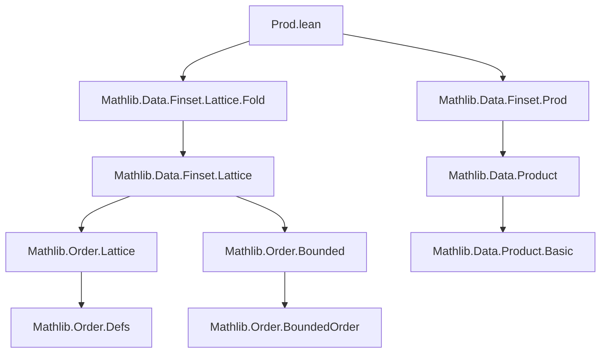

### Technical Brief: `Prod.lean` — Lattice Operations on Finsets of Products

---

#### **1. Key Definitions & Theorems**

| Name | Type / Signature | Purpose |
|------|------------------|---------|
| `sup_product_left` | `(s : Finset β) (t : Finset γ) (f : β × γ → α) → (s ×ˢ t).sup f = s.sup (fun i ↦ t.sup (fun i' ↦ f ⟨i, i'⟩))` | Expresses sup over product as iterated sup (left-first). |
| `sup_product_right` | Same as above, but right-first: `t.sup (fun i' ↦ s.sup (fun i ↦ f ⟨i, i'⟩))` | Symmetric version of `sup_product_left`. |
| `sup_prodMap` | `[SemilatticeSup α] [SemilatticeSup β] [OrderBot α] [OrderBot β] → s.Nonempty → t.Nonempty → (sup (s ×ˢ t) (Prod.map f g) = (sup s f, sup t g))` | Computes sup over product of maps as pair of sups. |
| `inf_product_left` / `inf_product_right` | Duals of `sup_product_*`, using `αᵒᵈ`. | Express inf over product as iterated inf. |
| `inf_prodMap` | Dual of `sup_prodMap`. | Computes inf over product of maps as pair of infs. |
| `sup_inf_sup` | `[DistribLattice α] [OrderBot α] → s.sup f ⊓ t.sup g = (s ×ˢ t).sup (fun i ↦ f i.1 ⊓ g i.2)` | Distributivity of `⊔` over `⊓` via product. |
| `inf_sup_inf` | Dual of `sup_inf_sup`. | Distributivity of `⊓` over `⊔` via product. |
| `sup'_product_left` / `right` | Versions for `sup'` (nonempty-sup), using `h : (s ×ˢ t).Nonempty`. | Generalizes `sup_product_*` to `sup'`. |
| `sup'_prodMap` | `sup' (s ×ˢ t) h (Prod.map f g) = (sup' s h.fst f, sup' t h.snd g)` | Nonempty-sup over product of maps = pair of nonempty-sup. |
| `inf'_prodMap` | Dual of `sup'_prodMap`. | Nonempty-inf over product of maps = pair of nonempty-inf. |
| `sup'_inf_sup'` / `inf'_sup_inf'` | Distributive laws for `sup'`/`inf'`. | Analogues of `sup_inf_sup`/`inf_sup_inf` for `sup'`/`inf'`. |

> **Note**: `sup'` and `inf'` are *nonempty*-indexed sup/inf (i.e., require a proof of nonemptiness), while `sup`/`inf` assume `Bot`/`Top` to handle empty sets.

---

#### **2. Naming Conventions**

- **Prefixes**:
  - `sup_`, `inf_`: basic lattice operations.
  - `sup'_`, `inf'_`: nonempty-indexed versions.
  - `prodMap`: when `Prod.map f g` is used as the function argument.
  - `product_*`: when product set `s ×ˢ t` is the domain.

- **Suffixes**:
  - `_left`, `_right`: order of iteration (left-first vs right-first).
  - `_distrib_*`: distributivity lemmas (`sup_inf_distrib_*`, `inf_sup_distrib_*`).
  - `_*_sup'` / `_*_inf'`: mix of `sup`/`inf` with `sup'`/`inf'`.

- **Dualization pattern**:
  - Lemmas for `inf`/`inf'` are often defined as `@lemma αᵒᵈ _ _ ...`, i.e., dualized via `OrderDual`.

---

#### **3. Tactic Stack**

- **Core tactics**:
  - `simp`, `simp_rw`: heavily used for rewriting with `sup`, `inf`, `sup'`, `inf'`, and product lemmas.
  - `eq_of_forall_ge_iff`: standard for proving equality in lattices via universal quantification over bounds.
  - `obtain ⟨a, ha⟩ := hs`: destruct nonemptiness proofs.
  - `exact`, `intro`, `cases`, `swap`: standard proof scripting.
  - `rw [Finset.sup_comm]`: symmetry/commutativity rewrites.

- **Domain-specific simplifiers**:
  - `Finset.sup_le_iff`, `Finset.sup'_le_iff`, `Finset.inf_le_iff`, etc.
  - `Prod.forall`, `Prod.le_def`, `mem_product`, `Prod.map`, `forall_swap`.

---

#### **4. Proof Logic**

- **General pattern**:
  1. **Reduction to universal quantification**: Use `eq_of_forall_ge_iff` to reduce equality of sup/inf to bounding conditions.
  2. **Swap quantifiers**: Apply `forall_swap` or `Finset.sup_comm` to reorder nested sup/inf.
  3. **Simplify with product structure**: Use `mem_product`, `Prod.forall`, and `Prod.map` to decompose product domain.
  4. **Duality via `OrderDual`**: For inf versions, lift to dual lattice (`αᵒᵈ`) and reuse sup lemmas.

- **Inductive/structural reasoning**:
  - No explicit induction; relies on *abstract lattice properties* and *finite set folding* semantics.
  - Nonemptiness assumptions (`hs`, `ht`, `h`) are used to justify `sup'`/`inf'` and avoid `Bot`/`Top`.

---

#### **5. Imports & Dependencies**

- **Core imports**:
  ```lean
  Mathlib.Data.Finset.Lattice.Fold
  Mathlib.Data.Finset.Prod
  ```

- **Key dependencies**:
  - `Mathlib.Data.Finset.Basic` (via `Finset`)
  - `Mathlib.Data.Finset.Lattice` (via `sup`, `inf`, `sup'`, `inf'`)
  - `Mathlib.Data.Product` (`Prod.map`, `Prod.forall`, `Prod.le_def`)
  - `Mathlib.Order.Lattice` (`SemilatticeSup`, `SemilatticeInf`, `DistribLattice`)
  - `Mathlib.Order.Bounded` (`OrderBot`, `OrderTop`)
  - `Mathlib.Data.OrderDual.Basic` (`OrderDual`, `αᵒᵈ`)

---

#### **8. Mermaid Diagrams**

##### **Dependency Graph (Module-Level)**



##### **Overview of Theory Flow**

```mermaid
flowchart LR
  subgraph LatticeTheory
    A[SemilatticeSup] --> B[Finset.sup]
    A --> C[Finset.sup']
    D[SemilatticeInf] --> E[Finset.inf]
    D --> F[Finset.inf']
    G[DistribLattice] --> H[sup_inf_sup]
    G --> I[inf_sup_inf]
  end

  subgraph ProductConstructions
    J[Finset ×ˢ Finset] --> K[Finset.product]
    L[Prod.map] --> M[Finset.sup (Prod.map f g)]
    L --> N[Finset.inf (Prod.map f g)]
  end

  subgraph IteratedFolds
    B --> O[Iterated sup over s then t]
    E --> P[Iterated inf over s then t]
  end

  LatticeTheory --> ProductConstructions
  ProductConstructions --> IteratedFolds
```

##### **Proof Strategy Flow (Example: `sup_prodMap`)**

```mermaid
flowchart TD
  Start[Goal: sup (s ×ˢ t) (Prod.map f g) = (sup s f, sup t g)] --> Use_eq_of_forall_ge_iff
  Use_eq_of_forall_ge_iff --> Simplify[Use simp with sup_le_iff, Prod.forall, mem_product]
  Simplify --> Decompose[Decompose bound condition into i ∈ s, j ∈ t]
  Decompose --> Split[Split into two bounds: f i ≤ a, g j ≤ b]
  Split --> Construct[Construct pair of functions i ↦ f i, j ↦ g j]
  Construct --> End[Equality holds]
```

---

### Summary

This file formalizes how **lattice operations (sup/inf)** interact with **finite product sets** and **product maps**, especially in the context of **distributive lattices**. It leverages:
- **Iterated folding** over product domains,
- **Duality via `OrderDual`** to avoid duplication,
- **Nonempty-indexed variants (`sup'`, `inf'`)** for cases without `Bot`/`Top`.

The structure is highly symmetric and systematic, with naming and proof patterns optimized for reuse and dualization.
