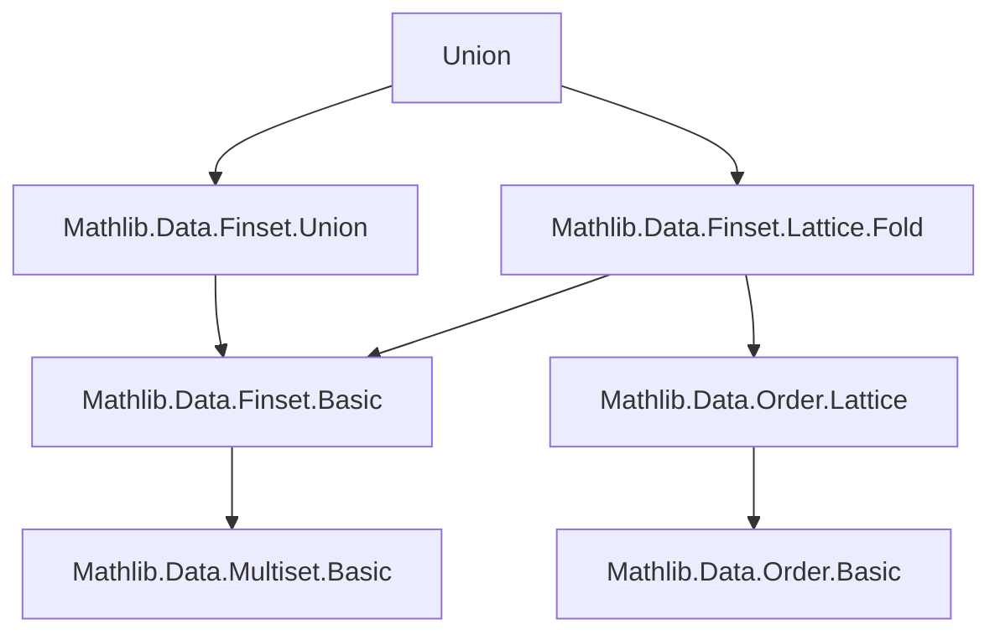
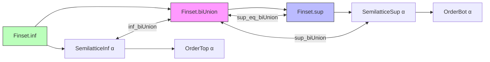

**Technical Brief: `Union.lean` (Mathlib)**  
*Domain: Formalized Set Theory & Lattice Theory in Lean 4 (Mathlib)*  
*Author: Mario Carneiro*  
*License: Apache 2.0*

---

### 1. **Key Definitions & Theorems**

| Name | Type / Signature | Purpose |
|------|------------------|---------|
| `sup_biUnion` | `[SemilatticeSup α] [OrderBot α] → (s : Finset γ) (t : γ → Finset β) → (s.biUnion t).sup f = s.sup (λ x => (t x).sup f)` | Relates `sup` over a union of finite sets (`biUnion`) to iterated `sup`. |
| `inf_biUnion` | `[SemilatticeInf α] [OrderTop α] → same as above` | Dual of `sup_biUnion` for infima, via order dual. |
| `sup'_biUnion` | `[SemilatticeSup α] → nonempty assumptions → (s.biUnion t).sup' f = s.sup' (λ b _ => (t b).sup' f)` | Analogous to `sup_biUnion`, but for *nonempty* supremum (`sup'`). |
| `inf'_biUnion` | `[SemilatticeInf α] → same structure` | Dual of `sup'_biUnion`. |
| `sup_eq_biUnion` | `[DecidableEq β] → s.sup t = s.biUnion t` | Shows `sup` and `biUnion` coincide on finite sets (key motivation for the file). |

> **Note**: `sup` is the lattice-theoretic supremum over a finite set of elements (here, `f : β → α`), while `biUnion` is the union of a family of finite sets indexed by a finite set.

---

### 2. **Naming Conventions**

- **Prefixes**:
  - `sup_`, `inf_`, `sup'_`, `inf'_`: denote lattice-theoretic operations (supremum/infimum, with/without nonemptiness).
  - `biUnion`: standard for *bounded* union over a finite index set.
- **Suffixes**:
  - `'` (prime): indicates *nonempty* version (e.g., `sup'` vs `sup`).
- **Dualization pattern**:
  - Theorems for infima are derived by applying the corresponding supremum theorem to the *order dual* (`αᵒᵈ`), e.g., `inf_biUnion := sup_biUnion (α := αᵒᵈ)`.

---

### 3. **Tactic Stack**

| Tactic | Usage Frequency | Role |
|--------|-----------------|------|
| `simp` | Very High | Simplifies using `@[simp]` lemmas, especially `forall_swap`, `mem_sup`, `mem_biUnion`. |
| `ext` | Medium | Extensionality for set equality (proving `A = B` by `x ∈ A ↔ x ∈ B`). |
| `rw` | Medium | Rewriting using equalities (e.g., `mem_sup`, `mem_biUnion`). |
| `eq_of_forall_ge_iff` | High (core proof pattern) | Proves equality in a poset by showing mutual ≥ (i.e., `a = b ↔ ∀ c, c ≥ a ↔ c ≥ b`). |
| `@[simp, grind =]` | Attribute | Marks lemmas for automatic simplification and grinding (used in `grind` tactic). |

---

### 4. **Proof Logic**

- **General Strategy**:
  1. Use `eq_of_forall_ge_iff` to reduce equality in a lattice to pointwise comparison.
  2. Apply `simp` with `forall_swap` to rearrange quantifiers over `biUnion`/`sup`.
  3. For infima, reuse supremum proofs via `order_dual` (no new proof needed).
  4. For `sup'`/`inf'`, carry nonemptiness hypotheses explicitly and apply dualization similarly.

- **Typical Flow**:
  ```lean
  theorem ... := eq_of_forall_ge_iff fun c => by
    simp [*, forall_swap]
  ```

- **Key Insight**: The lattice operations `sup`/`inf` over finite sets commute with `biUnion` because membership in a union is equivalent to existence over the index set — a logical equivalence mirrored in the lattice order.

---

### 5. **Imports & Dependencies**

| Module | Role |
|--------|------|
| `Mathlib.Data.Finset.Lattice.Fold` | Provides `sup`, `inf`, `sup'`, `inf'` definitions and basic lattice properties over finite sets. |
| `Mathlib.Data.Finset.Union` | Defines `biUnion`, basic union lemmas, and decidability assumptions (`DecidableEq`). |
| `Function`, `Multiset`, `OrderDual` | Supporting modules: `order_dual` enables dualization; `Function` for `forall_swap`. |

---

### 6. **Mermaid Diagrams**

#### **Dependency Graph (Module-Level)**



#### **Theoretical Overview (File-Level)**



> **Interpretation**:  
> - `biUnion` and `sup` are *equivalent* on finite sets (`sup_eq_biUnion`).  
> - `sup_biUnion`/`inf_biUnion` show `biUnion` *distributes* over `sup`/`inf`.  
> - Dualization (`αᵒᵈ`) eliminates redundancy for infima.

---

### 7. **TODO & Future Work**

- **Primary Goal**: Replace `Finset.biUnion` with `Finset.sup` for uniformity and to reduce API surface.
- **Implication**: All uses of `biUnion` should be rewritten as `sup` when the index set is finite and the codomain is a semilattice.

--- 

*End of Brief*
