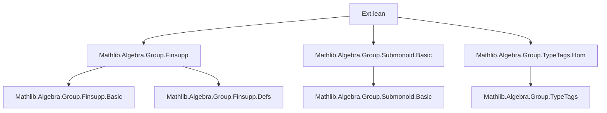
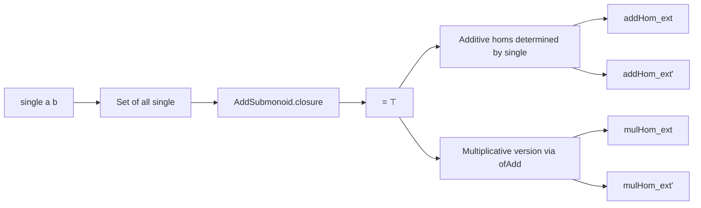
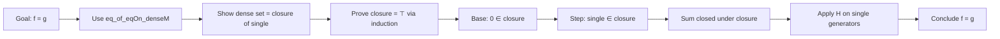

**Technical Brief: `Ext.lean` — Extensionality Principles for Maps on `Finsupp`**

---

### 1. **Key Definitions & Theorems**

| Name | Type / Signature | Purpose |
|------|------------------|---------|
| `add_closure_setOf_eq_single` | `AddSubmonoid.closure { f : α →₀ M | ∃ a b, f = single a b } = ⊤` | Shows that the additive submonoid generated by all `single` functions equals the entire `Finsupp` type (`⊤`). |
| `addHom_ext` | `∀ f g : (α →₀ M) →+ N, (∀ x y, f (single x y) = g (single x y)) → f = g` | Extensionality for additive homomorphisms: equality on all `single` implies equality everywhere. |
| `addHom_ext'` | `∀ f g : (α →₀ M) →+ N, (∀ x, f ∘ singleAddHom x = g ∘ singleAddHom x) → f = g` | A variant of `addHom_ext` using composition with `singleAddHom`, enabling the `ext` tactic to specialize to `single x 1` when `M = ℕ` or `ℤ`. |
| `mulHom_ext` | `∀ f g : Multiplicative (α →₀ M) →* N, (∀ x y, f (ofAdd (single x y)) = g (ofAdd (single x y))) → f = g` | Multiplicative extensionality: equality on all `ofAdd ∘ single` implies equality for monoid homs. |
| `mulHom_ext'` | `∀ f g : Multiplicative (α →₀ M) →* N, (∀ x, f ∘ toMultiplicative ∘ singleAddHom x = g ∘ toMultiplicative ∘ singleAddHom x) → f = g` | Multiplicative variant using composition, analogous to `addHom_ext'`. |

---

### 2. **Naming Conventions**

- **Prefixes**:
  - `add_` / `mul_`: Distinguishes additive vs multiplicative contexts.
  - `ext` / `ext'`: Base extensionality lemma (`ext`) vs a more convenient variant (`ext'`) for tactic use.
- **Suffixes**:
  - `_hom`: Denotes homomorphism types (`addHom`, `mulHom`).
  - `_closure`, `_ofAdd`, `_toMultiplicative`: Standard type-conversion or construction suffixes.
- **Functional style**:
  - `comp` (i.e., `f.comp g`) used in `ext'` lemmas to emphasize precomposition.

---

### 3. **Tactic Stack**

- `ext`: Used implicitly via `@[ext]` attributes; `ext` tactic can apply `addHom_ext'` or `mulHom_ext'` after `ext`.
- `simp`: Implicitly via `@[simp]` on `add_closure_setOf_eq_single`.
- `intro`, `apply`, `refine`, `rw`, `apply_congr`, `DFunLike.congr_fun`: Used in proofs to reduce to `single` arguments.
- `top_unique`, `Finsupp.induction`: Core proof automation for closure arguments.
- `AddMonoidHom.eq_of_eqOn_denseM`: Key lemma for additive hom extensionality.

---

### 4. **Proof Logic**

- **Structure of proofs**:
  1. **Base case**: Show that the set of `single` functions generates the whole space (`add_closure_setOf_eq_single`), via induction on `Finsupp` elements.
  2. **Extensionality**:
     - For additive case: Use `eq_of_eqOn_denseM` with the dense set = image of `single`, and verify equality on generators.
     - For multiplicative case: Translate to additive via `toAdditiveRight`, apply additive extensionality, then convert back.
  3. **Variant (`ext'`)**: Use `DFunLike.congr_fun` to convert pointwise equality of compositions into equality on `single` arguments.

- **Induction principle used**: `Finsupp.induction`, which is the standard induction on finite support functions (zero case + single + finite sum).

---

### 5. **Imports**

| Module | Role |
|--------|------|
| `Mathlib.Algebra.Group.Finsupp` | Core `Finsupp` definitions, `single`, `addHom`, etc. |
| `Mathlib.Algebra.Group.Submonoid.Basic` | `AddSubmonoid.closure`, `AddSubmonoid.mem_closure` etc. |
| `Mathlib.Algebra.Group.TypeTags.Hom` | Type tags for homs (e.g., `Multiplicative`, `Additive`), conversion lemmas like `toAdditiveRight`, `toMultiplicative`. |

---

### 6. **Mermaid Diagrams**

#### **Dependency Graph (Module-Level)**

#### **Overview of Theory Flow**

#### **Proof Strategy Flow (for `addHom_ext`)**

---

### 7. **Notes on Design & Usage**

- **Why separate `ext` and `ext'`?**  
  `ext'` allows tactic-based specialization: e.g., for `M = ℕ`, `ext` tactic can reduce to checking `f (single x 1) = g (single x 1)` via `singleAddHom x = single x • 1`.

- **Multiplicative case**: Uses `Multiplicative (α →₀ M)` to avoid duplicating `Finsupp` definitions; leverages `ofAdd` to embed additive structure.

- **No dependency on submonoids in `Finsupp` core**: This file was extracted to avoid circular dependencies when defining `Finsupp` itself.

--- 

Let me know if you'd like a formalized dependency graph in `leanpkg` format or a visualization of `singleAddHom` and related homs.
