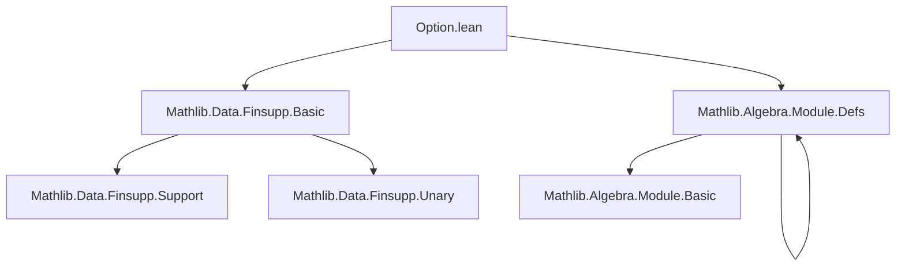

### Technical Brief: `Option.lean` — Finsupp with `Option` Domain

---

#### **1. Key Definitions & Theorems**

| Name | Type / Signature | Purpose |
|------|------------------|---------|
| `some` | `def some (f : Option α →₀ M) : α →₀ M` | Restricts a finitely supported function on `Option α` to one on `α` via precomposition with `Option.some`. |
| `optionElim` | `def optionElim (y : M) (f : α →₀ M) : Option α →₀ M` | Extends a finitely supported function on `α` to `Option α`, assigning `y` to `none`. |
| `optionEquiv` | `def optionEquiv [Zero M] : (Option α →₀ M) ≃ M × (α →₀ M)` | Establishes a bijection between `Option α →₀ M` and pairs `(m, f)` where `m ∈ M`, `f : α →₀ M`. |
| `some_apply` | `∀ f a, f.some a = f (Option.some a)` | Describes action of `some` on points. |
| `optionElim_apply_none` / `some` | `f.optionElim y none = y`, `f.optionElim y (Option.some x) = f x` | Evaluation rules for `optionElim`. |
| `optionElim_apply_eq_elim` | `f.optionElim y a = a.elim y f` | Connects `optionElim` with `Option.elim`. |
| `some_optionElim` / `optionElim_some` | `(f.optionElim y).some = f`, `f.some.optionElim (f none) = f` | Unit/counit laws for the equivalence. |
| `eq_option_embedding_update_none_iff` | `n = (embDomain .some m).update none i ↔ n none = i ∧ n.some = m` | Characterizes when a function equals an embedding + update at `none`. |
| `prod_option_index` | `f.prod b = b none (f none) * f.some.prod (λ a => b (Option.some a) _)` | Factorization of product over `Option α` into `none` part and `some` part. |
| `sum_option_index_smul` | `f.sum (λ o r => r • b o) = f none • b none + f.some.sum (λ a r => r • b (Option.some a))` | Factorization of weighted sum over `Option α`. |
| `optionElim_ne_zero_iff` | `f.optionElim y ≠ 0 ↔ f ≠ 0 ∨ y ≠ 0` | Characterizes when the extension is nonzero. |

---

#### **2. Naming Conventions**

- **Prefixes**:
  - `some_`: operations involving restriction to the `some` part (e.g., `some_apply`, `some_zero`, `some_single_some`).
  - `optionElim_`: operations involving extension via `optionElim` (e.g., `optionElim_apply_none`, `optionElim_zero`).
  - `embDomain_some_`: lemmas about embedding via `Embedding.some`.
- **Suffixes**:
  - `_some`, `_none`: indicate behavior on `Option.some` or `none`.
- **Equivalence naming**:
  - `optionEquiv`: standard for bijective correspondence.

---

#### **3. Tactic Stack**

Frequently used tactics in proofs:

| Tactic | Usage |
|--------|-------|
| `ext` | Extensionality for functions/finsupp equality. |
| `simp` | Simplification using `@[simp]` lemmas (e.g., `some_apply`, `single_apply`, `embDomain_apply_*`). |
| `cases` | Case analysis on `Option` values (`| none | some x`) or hypotheses. |
| `rw` | Rewriting using equivalences or lemmas (e.g., `optionElim_apply_eq_elim`). |
| `induction` | Structural induction on `f : Option α →₀ M` (via `induction_linear`). |
| `simp only [...]` | Targeted simplification with explicit lemmas. |
| `contrapose!` | Logical contrapositive + simplification for nonzero proofs. |
| `exact` / ` rfl` | Direct proof steps for definitional equalities. |

---

#### **4. Proof Logic**

- **Structure**: Proofs follow a *computational + structural* pattern:
  1. **Extensionality**: `ext` to reduce to pointwise equality.
  2. **Simplification**: `simp` using `@[simp]` lemmas (especially `some_apply`, `optionElim_apply_*`, `single_apply`, `embDomain_*`).
  3. **Case analysis**: On `a : Option α` (`none` vs `some x`) to handle domain structure.
  4. **Induction**: For general properties over `Finsupp`, using `induction_linear` (base: zero, step: add, atom: `single`).
  5. **Equivalence reasoning**: Leveraging `optionEquiv` and its `apply_eq_iff_eq_symm_apply` to translate between elementwise and pair-based reasoning.

- **Key logical flow**:
  - To prove `P f`, induct on `f`.
  - To prove equality of `Option α →₀ M`, extend to `ext a` and simplify using `some_apply`, `optionElim_*`.
  - To prove equivalence, show `left_inv`/`right_inv` via case analysis and `simp`.

---

#### **5. Imports & Dependencies**

| Module | Role |
|--------|------|
| `Mathlib.Data.Finsupp.Basic` | Core `Finsupp` definitions: `single`, `embDomain`, `update`, `prod`, `sum`, `induction_linear`. |
| `Mathlib.Algebra.Module.Defs` | Provides `AddCommMonoid`, `Semiring`, `Module`, `smul`, etc., needed for `sum_option_index_smul`. |
| `Finset`, `Function` | Used for domain support and embedding operations. |

---

#### **6. Theory Overview & Dependency Diagram**

##### **Conceptual Overview**

This file formalizes the *universal property* of `Option` in the category of finitely supported functions:
- A function on `Option α` is uniquely determined by:
  - Its value at `none` (an element of `M`)
  - Its restriction to `α` (a function `α →₀ M`)
- This yields the equivalence `(Option α →₀ M) ≃ M × (α →₀ M)`.

It mirrors the `Fin`-based constructions (`cons`, `tail`) but for the `Option` type, enabling modular reasoning about functions with optional base cases.

##### **Mermaid Diagrams**

**Dependency Graph (Module Level)**



**Conceptual Flow (Theory Level)**

```mermaid
graph LR
  A[Option α →₀ M] -->|value at none| B[M]
  A -->|restriction to α| C[α →₀ M]
  B & C -->|pairing| D[M × (α →₀ M)]
  D -->|inverse| A
  A -->|prod/sum factorization| E[Algebraic Properties]
```

---

#### **7. Summary**

This file provides a clean, computationally effective API for reasoning about finitely supported functions over `Option α`. It establishes:
- A *canonical decomposition* of `Option α →₀ M` into a base value and a function on `α`.
- A suite of `@[simp]` lemmas enabling automatic simplification in proofs.
- Factorization lemmas for `prod` and `sum`, crucial for homomorphism and module-theoretic arguments.

It serves as a foundational building block for more complex constructions involving optional indices (e.g., inductive families, tree structures, or recursive data with base cases).
