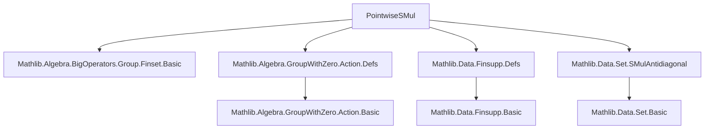

**Technical Brief: `PointwiseSMul.lean` (Lean 4 Formalization)**  
*Domain: Algebra / Functional Analysis / Formalized Mathematics*  
*Author: Scott Carnahan (2025)*  
*License: Apache 2.0*

---

### 1. KEY DEFINITIONS & THEOREMS

| Name | Type / Signature | Purpose |
|------|------------------|---------|
| `vaddAntidiagonal` | `[VAdd G P] → [IsLeftCancelVAdd G P] → [Zero R] → [Zero V] → (f : G →₀ R) → (x : P → V) → (p : P) → Finset (G × P)` | Constructs the finite set of pairs `(g, p')` such that `g +ᵥ p' = p`, `f g ≠ 0`, and `x p' ≠ 0`. Analogous to the *antidiagonal* in convolution. |
| `mem_vaddAntidiagonal_iff` | `gh ∈ vaddAntidiagonal f x p ↔ f gh.1 ≠ 0 ∧ x gh.2 ≠ 0 ∧ gh.1 +ᵥ gh.2 = p` | Characterizes membership in `vaddAntidiagonal`. |
| `mem_vaddAntidiagonal_of_addGroup` | `gh ∈ vaddAntidiagonal f x p ↔ f gh.1 ≠ 0 ∧ x gh.2 ≠ 0 ∧ gh.2 = -gh.1 +ᵥ p` | Simplified membership when `G` is an additive group and acts on `P`. |
| `SMul (G →₀ R) (P → V)` | Instance defining scalar multiplication | Defines a convolution-type action of finitely supported functions `G →₀ R` on functions `P → V`. |
| `smul_eq` | `(f • x) p = ∑ G ∈ f.vaddAntidiagonal x p, f G.1 • x G.2` | Explicit formula for the convolution action. |
| `smul_apply_addAction` | `(f • x) p = ∑ i ∈ f.support, f i • x (-i +ᵥ p)` | Simplified convolution formula when `G` is an additive group acting on `P`. |
| `finite_vaddAntidiagonal` | `Set.Finite (Set.vaddAntidiagonal ...)` | Proves finiteness of the underlying set before converting to `Finset`. |

---

### 2. NAMING CONVENTIONS

- **Prefixes**:
  - `vaddAntidiagonal`: Combines *vector addition* (`vadd`) and *antidiagonal* (pairs summing to a point).
  - `finite_`: Prefix for lemmas constructing finite sets (used before `.toFinset`).
- **Suffixes**:
  - `_iff`: Biconditional characterizations.
  - `_of_`: Specialized version under additional assumptions (e.g., `addGroup`, `addAction`).
- **Structure**:
  - `smul_`, `mem_`, `finite_`, `vadd_` reflect standard algebraic and set-theoretic operations.

---

### 3. TACTIC STACK

| Tactic | Usage Frequency | Role |
|--------|-----------------|------|
| `simp` / `simp_rw` | High | Simplifying membership, definitions, and hypotheses. |
| `rw` | High | Rewriting using lemmas like `mem_vaddAntidiagonal_iff`. |
| `exact` / `intro` / `rcases` | Medium | Standard intro/proof structure. |
| `Finset.sum_of_injOn` | Medium | Used in `smul_apply_addAction` to reindex sums via injectivity. |
| `have` / `rcases` / `cases` | Medium | Splitting disjunctions/conjunctions (e.g., `or_iff_not_imp_left`). |
| `refine` | Low | Used in `finite_vaddAntidiagonal` to construct finite sets via injections. |
| `aesop` | Not used | Not needed — proofs are constructive and rely on algebraic properties. |

---

### 4. PROOF LOGIC

- **Structure**:
  1. **Finiteness proof** (`finite_vaddAntidiagonal`):  
     - Uses `Set.Finite.of_injOn` to embed the antidiagonal into `f.support × P`.  
     - Injectivity of `Prod.fst` on the antidiagonal follows from *left-cancellativity* of `VAdd`.
  2. **Membership lemmas**:  
     - Directly from definitions (`simp [vaddAntidiagonal]`), with group action simplifications via `eq_neg_vadd_iff`.
  3. **Convolution formula** (`smul_apply_addAction`):  
     - Redefines sum over `vaddAntidiagonal` as sum over `f.support`.  
     - Uses `Finset.sum_of_injOn` to show that the map `i ↦ (i, -i +ᵥ p)` is injective on `f.support`.  
     - Handles zero terms via `smul_zero` and `zero_smul`.

- **Logical Flow**:
  - *Assumptions*: `VAdd`, `IsLeftCancelVAdd`, `Zero`, `AddCommMonoid`, `SMulWithZero`.
  - *Goal*: Define and verify a convolution action.
  - *Method*: Construct finite support-aware antidiagonal → define sum → simplify using group structure.

---

### 5. IMPORTS (Core Dependencies)

| Module | Role |
|--------|------|
| `Mathlib.Algebra.BigOperators.Group.Finset.Basic` | Summation over finite sets, especially additive monoids. |
| `Mathlib.Algebra.GroupWithZero.Action.Defs` | Definitions of `VAdd`, `AddAction`, `IsLeftCancelVAdd`, `Zero`. |
| `Mathlib.Data.Finsupp.Defs` | Finitely supported functions (`G →₀ R`). |
| `Mathlib.Data.Set.SMulAntidiagonal` | Related antidiagonal constructions for sets (analogous to `vaddAntidiagonal`). |

---

### 6. DEPENDENCY & THEORY OVERVIEW (Mermaid Diagrams)

#### A. Module Dependency Graph



#### B. Theoretical Flow (This File)

```mermaid
flowchart LR
  A[Vector Addition VAdd] --> B[Left-Cancelative VAdd]
  B --> C[Finite Support Functions G →₀ R]
  C --> D[vaddAntidiagonal: finite pairs (g, p') with g +ᵥ p' = p]
  D --> E[Convolution Action • : (G →₀ R) × (P → V) → (P → V)]
  E --> F[Explicit Sum Formula]
  F --> G[Group Action Simplification]
```

#### C. Conceptual Diagram: Convolution Action

```
      f : G →₀ R          x : P → V
          \               /
           \             /
            \           /
             vaddAntidiagonal(f, x, p)
                = { (g, p') | g +ᵥ p' = p, f g ≠ 0, x p' ≠ 0 }

                    ↓
        (f • x)(p) = Σ_{(g, p') ∈ antidiag} f g • x p'
```

When `G` is a group acting on `P`, this simplifies to:
```
(f • x)(p) = Σ_{g ∈ support(f)} f g • x(-g +ᵥ p)
```
— the standard convolution over a torsor or group action.

---

### 7. SUMMARY

This file formalizes a **convolution-type scalar multiplication** of finitely supported functions, generalizing the usual convolution on group algebras to the setting of *vector-valued functions on a space with a left-cancellative vector addition*. It leverages:
- `vaddAntidiagonal` to encode the support of convolution,
- `IsLeftCancelVAdd` to ensure finiteness and uniqueness of decomposition,
- `SMulWithZero` to handle zero terms in the sum.

It serves as a foundational step toward formalizing **groupoid convolution algebras**, **twisted group algebras**, or **sheaf-theoretic convolution** in dependent type theory.

--- 

Let me know if you'd like a formalization roadmap for extending this to *groupoid actions* or *bimodules*.
