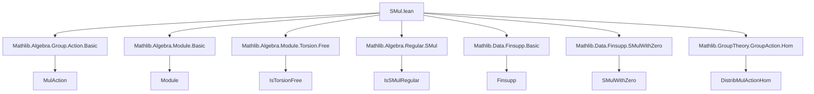
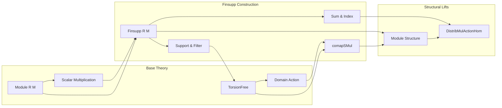

### Technical Brief: `SMul.lean` — Scalar Multiplication on `Finsupp`

---

#### **1. Key Definitions & Theorems**

| Name | Type / Signature | Purpose |
|------|------------------|---------|
| `single_smul` | `single a r b • f a = single a (r • f b) b` | Simplifies scalar multiplication applied to a `single` function at a point. |
| `comapSMul` | `SMul G (α →₀ M)` | Defines scalar multiplication on `Finsupp` via domain action: $g • f = \texttt{mapDomain}(g • \cdot)\, f$. |
| `comapSMul_def` | $g • f = \texttt{mapDomain}(g • \cdot)\, f$ | Definitional equality for `comapSMul`. |
| `comapSMul_single` | $g • \texttt{single}\, a\, b = \texttt{single}\, (g • a)\, b$ | Action of `comapSMul` on `single`. |
| `comapMulAction` | `MulAction G (α →₀ M)` | Proves `comapSMul` respects monoid action (identity & multiplication). |
| `comapDistribMulAction` | `DistribMulAction G (α →₀ M)` | Proves distributivity of action over addition and zero. |
| `comapSMul_apply` | $(g • f)\, a = f(g^{-1} • a)$ | When $G$ is a group, action is precomposition with $g^{-1}$. |
| `IsSMulRegular.finsupp` | `IsSMulRegular M k → IsSMulRegular (α →₀ M) k` | Regularity of scalar multiplication lifts to `Finsupp`. |
| `faithfulSMul` | `[Nonempty α] → FaithfulSMul R M → FaithfulSMul R (α →₀ M)` | Faithfulness of scalar multiplication lifts to `Finsupp`. |
| `distribMulAction` | `DistribMulAction R (α →₀ M)` | Lifts `DistribMulAction` on $M$ to `Finsupp`. |
| `module` | `Module R (α →₀ M)` | Lifts module structure to `Finsupp`. |
| `support_smul_eq` | $(b • g).support = g.support$ (under torsion-free domain & nonzero scalar) | Support is preserved under nonzero scalar multiplication. |
| `filter_smul` | $(b • v).filter\, p = b • v.filter\, p$ | Filtering commutes with scalar multiplication. |
| `mapDomain_smul` | $\texttt{mapDomain}\, f\, (b • v) = b • \texttt{mapDomain}\, f\, v$ | `mapDomain` commutes with scalar multiplication. |
| `smul_single'` | $c • \texttt{single}\, a\, b = \texttt{single}\, a\, (c * b)$ | Scalar multiplication on `single` acts on coefficient. |
| `smul_single_one` | $b • \texttt{single}\, a\, 1 = \texttt{single}\, a\, b$ | Special case of `smul_single'` with unit. |
| `comapDomain_smul` / `comapDomain_smul_of_injective` | Commutation of `comapDomain` with scalar multiplication under injectivity. |
| `sum_smul_index` / `sum_smul_index'` | $(b • g).sum\, h = g.sum\, (\lambda i a, h\, i\, (b * a))$ | Scalar multiplication commutes with `sum` over index. |
| `sum_smul_index_addMonoidHom` | Same as above for bundled additive homs. |
| `moduleIsTorsionFree` | `Module.IsTorsionFree R (ι →₀ M)` | Torsion-freeness lifts to `Finsupp`. |
| `DistribMulActionHom.single` | $M →+[R] α →₀ M$ | `single` as a `DistribMulActionSemiHom`. |
| `distribMulActionHom_ext` / `distribMulActionHom_ext'` | Extensionality lemmas for `DistribMulActionHom`. |

---

#### **2. Naming Conventions**

- **Prefixes**:
  - `comap*`: Domain-based action (pullback along group/monoid action).
  - `smul_*`: Scalar multiplication on `Finsupp`.
  - `mapDomain_*`: Domain mapping operations.
  - `filter_*`, `support_*`: Support/filter interaction with scalar ops.
  - `sum_*`: Interaction with `Finsupp.sum`.

- **Suffixes**:
  - `_def`: Definitional lemmas.
  - `_eq`: Equality lemmas (often simplification).
  - `_apply`: Pointwise evaluation lemmas.
  - `_index`: For `sum`-based lemmas.
  - `_hom`, `_single`: Homomorphism versions.

- **Notable patterns**:
  - `single` used as a building block for extensionality (`ext` lemmas).
  - `smul` vs `•` notation: `smul_*` for definitions, `•` in theorems.

---

#### **3. Tactic Stack**

| Tactic | Usage Frequency | Purpose |
|--------|-----------------|---------|
| `simp` | Very High | Simplification of `single`, `mapDomain`, `smul`, `filter`, `support`. |
| `ext` | High | Extensionality for functions and `Finsupp`. |
| `rw` | High | Rewriting using definitions and lemmas. |
| `conv` | Medium | Convolution-style rewriting (e.g., `conv_lhs => rw [...]`). |
| `exact` / `apply` | Medium | Direct proof steps. |
| `by_cases` | Medium | Splitting on equality (e.g., `a = b`). |
| `rfl` | Medium | Reflexivity for definitional equalities. |
| `simp only [...]` | High | Targeted simplification (e.g., with `filter_eq_indicator`). |
| `aesop` | Not present | — |
| `ring` / `abel` | Not present | — |

---

#### **4. Proof Logic**

- **Induction**: Not used directly (no explicit `induction` tactic).
- **Extensionality**: Core strategy: prove equality of functions by evaluating at arbitrary points (`ext i`), or using `DistribMulActionHom.ext`.
- **Case analysis**: On equality (`a = b`) or decidability (`DecidablePred p`).
- **Lifting structure**: Most theorems lift algebraic properties (regularity, faithfulness, torsion-freeness, module structure) from $M$ to `α →₀ M`.
- **Homomorphism verification**: For `MulAction`, `DistribMulAction`, `Module`, `DistribMulActionHom`, proofs verify axioms pointwise using `ext`.
- **Support reasoning**: Uses `Finset.ext` and properties of `support` under scalar multiplication (especially under torsion-free assumptions).

---

#### **5. Imports**

| Module | Role |
|--------|------|
| `Mathlib.Algebra.Group.Action.Basic` | Group/monoid actions, `MulAction`, `DistribMulAction`. |
| `Mathlib.Algebra.Module.Basic` | Module theory, `Module`, `DistribMulAction`. |
| `Mathlib.Algebra.Module.Torsion.Free` | Torsion-free modules, `Module.IsTorsionFree`. |
| `Mathlib.Algebra.Regular.SMul` | Regular elements, `IsSMulRegular`, `FaithfulSMul`. |
| `Mathlib.Data.Finsupp.Basic` | Core `Finsupp` definitions (`single`, `mapDomain`, `support`, `sum`). |
| `Mathlib.Data.Finsupp.SMulWithZero` | Scalar multiplication with zero. |
| `Mathlib.GroupTheory.GroupAction.Hom` | Homomorphisms for group actions. |

---

#### **6. Mermaid Diagrams**

##### **Dependency Graph (Top-Level)**

##### **Overview of Theory Flow**

---

#### **7. Summary**

This file formalizes how scalar multiplication interacts with `Finsupp`, especially when a monoid/group acts on the domain. It constructs:
- A `SMul`, `MulAction`, `DistribMulAction`, and `Module` structure on `α →₀ M`,
- Proves preservation of regularity, faithfulness, and torsion-freeness,
- Establishes key lemmas about `single`, `support`, `filter`, `mapDomain`, and `sum`,
- Provides extensionality principles for homomorphisms out of `Finsupp`.

The proofs rely heavily on pointwise reasoning, simplification, and structural lifting — typical of Lean’s algebraic library design.

--- 

Let me know if you'd like a formalized dependency graph in `.lean` format or a visualization of the `comapSMul` construction pipeline.
