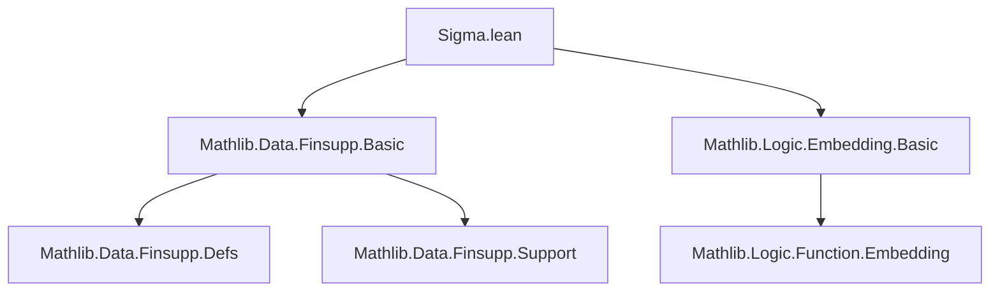
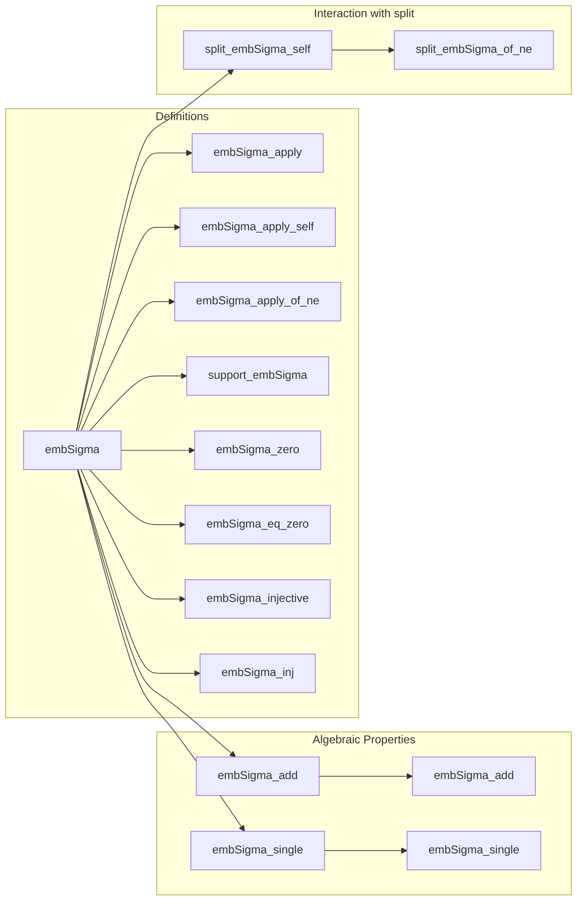

**Technical Brief: `Sigma.lean` — Embedding Finsupp into Sigma-Summands**

---

### 1. **Key Definitions & Theorems**

| Name | Type / Signature | Purpose |
|------|------------------|---------|
| `embSigma` | `{k : κ} → (ι k →₀ M) → (Σ k, ι k) →₀ M` | Embeds a finitely supported function on fiber `ι k` into the `k`-th summand of the sigma-type domain. |
| `embSigma_apply` | `[DecidableEq κ] → embSigma f ⟨k', i⟩ = if k' = k then f i else 0` | Computes pointwise values of `embSigma f`. |
| `embSigma_apply_self` | `embSigma f ⟨k, i⟩ = f i` | Special case of `embSigma_apply` when index lies in the correct summand. |
| `embSigma_apply_of_ne` | `k' ≠ k ⇒ embSigma f ⟨k', i⟩ = 0` | Values outside the `k`-th summand vanish. |
| `support_embSigma` | `(embSigma f).support = f.support.map (sigmaMk k)` | Describes support of embedded function as image under embedding. |
| `embSigma_zero` | `embSigma 0 = 0` | Embedding preserves zero. |
| `embSigma_eq_zero` | `embSigma f = 0 ↔ f = 0` | Embedding is injective at level of equality. |
| `embSigma_injective` | `Injective embSigma` | `embSigma` is injective as a function. |
| `embSigma_inj` | `embSigma f = embSigma g ↔ f = g` | Equational form of injectivity. |
| `embSigma_add` | `[AddMonoid M] ⇒ embSigma (f + g) = embSigma f + embSigma g` | `embSigma` preserves addition (i.e., is additive). |
| `embSigma_single` | `embSigma (single i m) = single ⟨k, i⟩ m` | `embSigma` commutes with `single`. |
| `split_embSigma_self` | `split (embSigma f) k = f` | `split` recovers original function at correct index. |
| `split_embSigma_of_ne` | `k' ≠ k ⇒ split (embSigma f) k' = 0` | `split` yields zero at other indices. |

---

### 2. **Naming Conventions**

- **Prefixes**:
  - `embSigma_`: All functions/theorems related to embedding into sigma-domain.
  - `split_`: Related to projection (inverse operation).
- **Suffixes**:
  - `_apply`: Pointwise evaluation.
  - `_self`: Identity when index matches embedding site.
  - `_of_ne`: Behavior when index differs.
  - `_zero`, `_eq_zero`, `_inj`, `_inj`: Properties about zero, equality, injectivity.
  - `_single`: Interaction with `single` function.

---

### 3. **Tactic Stack**

Frequently used tactics in proofs:
- `simp` / `simp only`: Simplify using lemmas, especially `embSigma_apply`, `embSigma_apply_self`, `embSigma_apply_of_ne`, `split_apply`.
- `rw`: Rewrite using equalities like `embSigma`, `embDomain_apply_self`, `embDomain_notin_range`.
- `split_ifs`: Handle `if`-expressions in `embSigma_apply`.
- `subst`: Eliminate equality hypotheses (e.g., `k' = k`).
- `grind`: Custom tactic (likely from `grind` attribute), used for routine simplification and decision procedures.
- `ext`: Extensionality to prove function equality.
- `rcases`: Unpack sigma pairs (`⟨k, i⟩`).
- `congr_fun`, `congrArg`: For reasoning about function equality and application.
- `classical`: Enable classical logic when needed (e.g., in `embSigma_single`).

---

### 4. **Proof Logic**

- **Structure**: Most proofs follow a pattern:
  1. **Extensionality**: Prove equality of functions by `ext ⟨k', i⟩`.
  2. **Case split on `k' = k`** using `by_cases` or `split_ifs`.
  3. **Simplify** using:
     - `embSigma_apply_self` when `k' = k`,
     - `embSigma_apply_of_ne` or `embDomain_notin_range` when `k' ≠ k`.
  4. For support-related lemmas: use `simp [embSigma]` and properties of `embDomain`.
  5. For injectivity: apply `congr_fun` to equality of embeddings at `⟨k, i⟩`.
  6. For `embSigma_single`: use `classical` + `grind` to reduce to definition of `single`.

- **Induction**: Not used — all arguments are pointwise or rely on structural properties of `finsupp` and embeddings.

---

### 5. **Imports**

- `Mathlib.Data.Finsupp.Basic`: Core definitions of `finsupp`, `single`, `support`, `embDomain`, `split`.
- `Mathlib.Logic.Embedding.Basic`: Provides `Function.Embedding.sigmaMk`, used to define the embedding.

---

### 6. **Mermaid Diagrams**

#### **Dependency Graph (Module-Level)**



#### **Theoretical Overview (Sigma.lean)**



#### **Conceptual Flow**

```
Finsupp (ι k →₀ M)
       │
       │ embSigma (embedding via sigmaMk k)
       ▼
Finsupp ((Σ k, ι k) →₀ M)
       │
       │ split at k
       ▼
Finsupp (ι k →₀ M)   (left inverse)
```

---

### 7. **Summary**

This module formalizes the canonical embedding of a finitely supported function on a fiber `ι k` into the corresponding summand of the sigma-type domain `(Σ k, ι k)`. It leverages `embDomain` and `sigmaMk`, and establishes key properties: pointwise behavior, support, injectivity, additivity, and interaction with `split`. The file is a specialized but foundational piece for reasoning about dependent sums in the context of finitely supported functions — useful for constructing and decomposing functions over indexed families.

--- 

Let me know if you'd like a bundled version (e.g., as an additive map or linear map) or a generalization to `embDomain` for arbitrary embeddings.
