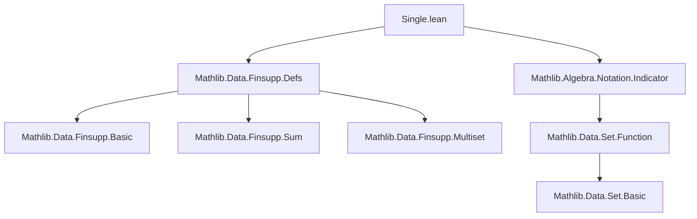

**Technical Brief: `Single.lean` — Finitely Supported Functions on One Point**

---

### 1. KEY DEFINITIONS & THEOREMS

| Name | Type / Signature | Purpose |
|------|------------------|---------|
| `single` | `def single (a : α) (b : M) : α →₀ M` | Constructs the finitely supported function nonzero only at `a`, with value `b`. |
| `update` | `def update (f : α →₀ M) (a : α) (b : M) : α →₀ M` | Updates the value of `f` at point `a` to `b`. If `b = 0`, removes `a` from support. |
| `erase` | `def erase (a : α) (f : α →₀ M) : α →₀ M` | Sets value at `a` to `0`; effectively removes `a` from support if present. |
| `single_apply` | `single a b a' = if a = a' then b else 0` | Evaluates `single a b` at arbitrary point `a'`. |
| `single_eq_same` | `(single a b) a = b` | Value of `single a b` at its support point. |
| `single_eq_of_ne` | `a' ≠ a → (single a b) a' = 0` | Value of `single a b` away from its support point. |
| `support_single_ne_zero` | `b ≠ 0 → (single a b).support = {a}` | Support of `single a b` is singleton iff `b ≠ 0`. |
| `eq_single_iff` | `f = single a b ↔ f.support ⊆ {a} ∧ f a = b` | Characterization of when a `Finsupp` is a `single`. |
| `single_eq_single_iff` | `single a₁ b₁ = single a₂ b₂ ↔ (a₁ = a₂ ∧ b₁ = b₂) ∨ (b₁ = 0 ∧ b₂ = 0)` | Equality criterion for `single`s. |
| `single_injective` | `Function.Injective (single a : M → α →₀ M)` | Injectivity in the value argument. |
| `single_left_injective` | `b ≠ 0 → Function.Injective (fun a ↦ single a b)` | Injectivity in the domain point argument (requires nonzero value). |
| `update_apply` | `(f.update a b) i = if i = a then b else f i` | Evaluation of `update`. |
| `support_update` | `support (f.update a b) = if b = 0 then f.support.erase a else insert a f.support` | Support behavior under `update`. |
| `erase_apply` | `(f.erase a) a' = if a' = a then 0 else f a'` | Evaluation of `erase`. |
| `mapRange_single` | `mapRange f hf (single a b) = single a (f b)` | `mapRange` commutes with `single`. |
| `embDomain_single` | `embDomain f (single a m) = single (f a) m` | Embedding domain commutes with `single`. |
| `zipWith_single_single` | `zipWith f hf (single a m) (single a n) = single a (f m n)` | `zipWith` of two `single`s at same point. |

---

### 2. NAMING CONVENTIONS

- **Prefixes**:
  - `single_`: operations involving `single`.
  - `update_`, `erase_`: operations involving `update`/`erase`.
  - `mapRange_`, `embDomain_`, `zipWith_`: operations involving higher-order functions on `Finsupp`.
- **Suffixes**:
  - `_apply`: evaluation lemmas.
  - `_eq_same`, `_eq_of_ne`: value at support / outside support.
  - `_ne_zero`, `_eq_zero`: zero/nonzero behavior.
  - `_subset`, `_disjoint`, `_mem_support`: support-related properties.
  - `_iff`: biconditional characterizations.
  - `_inj`, `_injective`: injectivity statements.
- **Pattern**: `single_left_injective`, `single_injective` — distinguishes injectivity in first vs second argument.

---

### 3. TACTIC STACK

- **Core tactics**:
  - `grind`: heavily used (custom tactic for simplification + decidability handling).
  - `simp`, `simp_rw`, `rwa`, `rw`: for rewriting using lemmas and definitions.
  - `classical`: to enable classical logic (e.g., decidability of equality).
  - `grind =`, `norm_cast`, `simp`: attribute annotations for `simp`-friendly lemmas.
- **Support reasoning**:
  - `Finset.mem_singleton`, `Finset.mem_insert`, `Finset.mem_erase`, `Finset.disjoint_singleton`.
- **Equality proofs**:
  - `ext`, `DFunLike.ext_iff`, `coe_injective`, `funext`.
- **Decidability**:
  - `Classical.decEq`, `Decidable`, `if_pos`, `if_neg`, `split_ifs`.

---

### 4. PROOF LOGIC

- **Induction**: Not used (no structural recursion on `α`, `M`, or `f`).
- **Case analysis**:
  - On `a = a'` or `b = 0` (e.g., in `single_eq_single_iff`, `update_apply`, `erase_apply`).
  - On membership in support (`a ∈ f.support` / `a ∉ f.support`).
- **Extensionality**:
  - `ext` + `simp` for function equality (via `DFunLike.ext_iff`).
- **Equational reasoning**:
  - Rewriting via `single_eq_same`, `single_eq_of_ne`, `update_apply`, `erase_apply`.
- **Set-theoretic support reasoning**:
  - Use of `Finset` lemmas: `mem_singleton`, `insert_erase`, `disjoint_singleton`, `card_eq_one`, etc.
- **Classical reasoning**:
  - `classical` used to enable decidability and classical logic (e.g., `if b = 0 then ... else ...`).

---

### 5. IMPORTS & DEPENDENCIES

| Module | Role |
|--------|------|
| `Mathlib.Algebra.Notation.Indicator` | Provides `Set.indicator`, used in `single_eq_set_indicator`. |
| `Mathlib.Data.Finsupp.Defs` | Core definitions of `Finsupp`, `support`, `DFunLike`, etc. |
| `Finset`, `Function`, `Pi`, `DFunLike`, `Set` | Implicit via `open Finset Function` and typeclass context. |
| Classical logic & decidability assumptions | Required for `if ... then ... else ...` in definitions and proofs. |

---

### 6. MERMAID DIAGRAMS

#### Dependency Graph (Module-Level)



#### Overview of `Single.lean` Theory

```mermaid
graph LR
  A[Finsupp] --> B[single]
  A --> C[update]
  A --> D[erase]
  A --> E[mapRange]
  A --> F[embDomain]
  A --> G[zipWith]

  B --> H[support = {a}]
  B --> I[injective in b / a]
  B --> J[equality criteria]

  C --> K[support = insert / erase]
  C --> L[commutativity, idempotence]

  D --> M[support = erase]
  D --> N[erase = update ... 0]

  E --> O[commutes with single]
  F --> P[embDomain single = single]
  G --> Q[zipWith single single = single]
```

---

### 7. SUMMARY

This file formalizes the foundational theory of **pointwise modifications** of finitely supported functions (`Finsupp`). It introduces three core operations (`single`, `update`, `erase`) and proves their algebraic and support-theoretic properties. The proofs rely heavily on decidability of equality and classical logic, with extensive use of `grind` and `simp` for automation. The theory is foundational for later developments in `Finsupp`, including algebraic structures (`add_monoid_hom`, `linear_map`), integration/sums, and multilinear extensions.

--- 

Let me know if you'd like a formalized dependency graph for the entire `Mathlib.Data.Finsupp` hierarchy.
