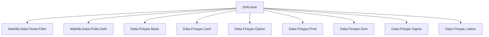

**Technical Brief: `Defs.lean` — Finite Types in Lean 4 (Mathlib)**  
*Based on source file `Defs.lean` from Mathlib’s `Data.Fintype` module*

---

### 1. **Key Definitions & Theorems**

| Name | Type / Signature | Purpose |
|------|------------------|---------|
| `Fintype α` | `class Fintype (α : Type*) where elems : Finset α; complete : ∀ x, x ∈ elems` | Typeclass asserting that `α` is finite; provides a canonical finset `elems` covering all elements. |
| `Finset.univ` | `def univ : Finset α := @Fintype.elems α _` | The universal finset of a fintype: contains all elements of `α`. |
| `mem_univ` | `∀ x, x ∈ univ` | Every element of `α` belongs to `univ`. |
| `eq_univ_iff_forall` | `s = univ ↔ ∀ x, x ∈ s` | Characterizes `univ` as the unique finset containing all elements. |
| `coe_univ` | `↑(univ : Finset α) = (Set.univ : Set α)` | Relates `univ` (finset) to `Set.univ` (set). |
| `nodup_map_univ_iff_injective` | `(Multiset.map f univ.val).Nodup ↔ Function.Injective f` | Connects injectivity of `f` to uniqueness of its image over `univ`. |
| `Fintype.subtype` | `(s : Finset α) → (∀ x, x ∈ s ↔ p x) → Fintype {x // p x}` | Constructs a fintype on a subtype defined by a decidable predicate represented by a finset. |
| `Fintype.ofFinset` | `(s : Finset α) → (∀ x, x ∈ s ↔ x ∈ p) → Fintype p` | Lifts a finset to a fintype on a subset `p ⊆ α`. |
| `Bool.fintype`, `Ordering.fintype`, etc. | `instance` | Concrete fintype instances for basic types. |
| `decidablePiFintype`, `decidableForallFintype`, `decidableExistsFintype` | `instance` | Enables decidability of quantifications over fintypes. |
| `decidableInjectiveFintype`, `decidableSurjectiveFintype`, `decidableBijectiveFintype` | `instance` | Decidability of function properties over fintypes. |
| `subsingleton (α : Type*)` | `instance : Subsingleton (Fintype α)` | Uniqueness of fintype structure: at most one fintype instance per type. |

---

### 2. **Naming Conventions**

- **Prefixes**:
  - `is_` / `decidable_`: e.g., `decidableForallFintype`, `decidableInjectiveFintype` — indicates decidability.
  - `coe_`: e.g., `coe_univ`, `coe_eq_univ` — relates coercion to sets.
  - `mem_`: e.g., `mem_univ`, `mem_filter_univ` — membership in finset.
  - `nodup_`: e.g., `nodup_map_univ_iff_injective` — relates to multiplicity-free lists/multisets.

- **Suffixes**:
  - `_fintype`: e.g., `decidableExistsFintype`, `subsingleton_fintype` — indicates dependency on `Fintype α`.
  - `_univ`: e.g., `mem_univ`, `subset_univ` — refers to `univ`.

- **Other patterns**:
  - `of_`, `subtype`: e.g., `ofFinset`, `subtype` — construction from data.

---

### 3. **Tactic Stack**

Frequently used tactics in proofs and instances:

| Tactic | Usage |
|--------|-------|
| `simp` | Simplification of membership, equality, and quantifiers over `univ`. |
| `rw` / `congr` | Rewriting using extensionality or functional extensionality. |
| `cases` | Case analysis on `Bool`, `Ordering`, or subtype elements. |
| `decidable_of_iff` | Converts decidability of a proposition to an equivalent one. |
| `ext` | Extensionality for sets/funext. |
| `infer_instance` | Automatic inference of decidability/subsingleton instances. |
| `unfold` | Unfolding definitions like `Surjective`, `Bijective`. |
| `multiset` lemmas (e.g., `Multiset.nodup_map_iff_inj_on`) | Used via `simp` or `rw`. |

---

### 4. **Proof Logic**

- **Structure of proofs**:
  - **Induction/Case analysis** on finite types (e.g., `Bool`, `Ordering`) is common.
  - **Equivalence-based reasoning**: many results use `decidable_of_iff` to reduce decidability to a known decidable statement (e.g., `∀ a ∈ univ, p a`).
  - **Extensionality**: `Finset.ext_iff`, `funext_iff`, `Set.ext` used to prove equality of sets/funsets.
  - **Subsingleton reasoning**: uniqueness of `Fintype` instances via `subsingleton` instance and `congr; simp`.

- **Typical flow**:
  1. Introduce `Fintype α` instance.
  2. Use `mem_univ` to know all elements are in `univ`.
  3. Reduce universal/existential quantifiers over `α` to `univ`.
  4. Apply decidability instances or `decidable_of_iff`.

---

### 5. **Imports**

| Import | Purpose |
|--------|---------|
| `Mathlib.Data.Finset.Filter` | Provides `Finset.filter`, used in `elabFinsetBuilderSetOf`. |
| `Mathlib.Data.Finite.Defs` | Defines `Finite` (not `Fintype`), used for dualities like `OrderDual.finite`. |

---

### 6. **Mermaid Diagrams**

#### **Dependency Graph (High-Level)**



#### **Overview of `Defs.lean`**

```mermaid
flowchart LR
  A[Fintype α] --> B[elems : Finset α]
  A --> C[complete : ∀ x, x ∈ elems]
  B --> D[univ : Finset α]
  D --> E[mem_univ : x ∈ univ]
  D --> F[coe_univ : ↑univ = Set.univ]
  D --> G[filter_univ : {x | p x} = univ.filter p]
  A --> H[decidable instances]
  A --> I[subtype / ofFinset constructions]
  A --> J[Bool, Ordering, dual, lex instances]
```

---

### 7. **Related Theory Files**

- `Data.Fintype.Basic`: elementary lemmas, `Fintype` operations.
- `Data.Fintype.Card`: cardinality, equivalence with `Fin (Fintype.card α)`, pigeonhole principles.
- `Data.Fintype.Option/Prod/Sum/Sigma`: closure properties of `Fintype`.
- `Data.Fintype.Lattice`: `Infinite` instances for `ℕ`, `ℤ`, `List`, `Multiset`.

---

### 8. **Notes on Elaboration & Notation**

- **Set-builder notation** `{x | p x}` is elaborated to `Finset.filter p univ` when expected type is `Finset`.
- **Delaborator** `delabFinsetFilter` pretty-prints filters over `univ` as `{x | p x}` or `{x ≠ a | p x}` when applicable.
- **Performance**: custom `Decidable` instances (e.g., for `Injective`) avoid expensive re-derivations.

--- 

Let me know if you'd like a formalized summary in Lean or a dependency graph for the entire `Fintype` module hierarchy.
