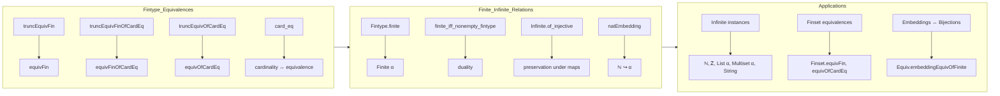

### Technical Brief: `EquivFin.lean`

---

#### **1. Key Definitions & Theorems**

| Name | Type | Purpose |
|------|------|---------|
| `truncEquivFin` | `[DecidableEq α] [Fintype α] → Trunc (α ≃ Fin (card α))` | Constructs a *computable* equivalence between a fintype `α` and `Fin (card α)`, using `Trunc` to hide non-uniqueness. |
| `equivFin` | `[Fintype α] → α ≃ Fin (card α)` | Noncomputable version of `truncEquivFin`, using `Classical.choice`. |
| `truncFinBijection` | `[Fintype α] → Trunc ({ f : Fin (card α) → α // Bijective f })` | Provides a *computable* bijection (as a function + proof), again wrapped in `Trunc`. |
| `truncEquivFinOfCardEq` | `[DecidableEq α] {n : ℕ} (h : card α = n) → Trunc (α ≃ Fin n)` | Equivalence to `Fin n` when `card α = n`. |
| `equivFinOfCardEq` | `{n : ℕ} (h : card α = n) → α ≃ Fin n` | Noncomputable version of `truncEquivFinOfCardEq`. |
| `truncEquivOfCardEq` | `[DecidableEq α] [DecidableEq β] (h : card α = card β) → Trunc (α ≃ β)` | Equivalence between two fintypes of equal cardinality (computable). |
| `equivOfCardEq` | `(h : card α = card β) → α ≃ β` | Noncomputable version of `truncEquivOfCardEq`. |
| `card_eq` | `card α = card β ↔ Nonempty (α ≃ β)` | Fundamental characterization: two fintypes are equivalent iff their cardinalities match. |
| `Fintype.finite` | `[Fintype α] → Finite α` | Shows every fintype is finite (via `equivFin`). |
| `finite_iff_nonempty_fintype` | `Finite α ↔ Nonempty (Fintype α)` | Equivalence between `Finite` and existence of a `Fintype` structure. |
| `Fintype.ofFinite` | `[Finite α] → Fintype α` | Noncomputable conversion from `Finite` to `Fintype`. |
| `Infinite.of_injective`, `Infinite.of_surjective` | `[Infinite β] (f : α → β) (hf : Injective f) → Infinite α` | Infinite-ness is preserved under injective/surjective maps. |
| `Infinite.natEmbedding` | `[Infinite α] → ℕ ↪ α` | Canonical embedding of `ℕ` into any infinite type. |
| `Finset.equivFin`, `Finset.equivFinOfCardEq`, `Finset.equivOfCardEq` | `s ≃ Fin #s`, etc. | Extend equivalences to finsets. |
| `Equiv.ofLeftInverseOfCardLE`, `Equiv.ofRightInverseOfCardLE` | Construct equivalences from one-sided inverses + cardinal bounds. |
| `Function.Embedding.equivOfFiniteSelfEmbedding` | `[Finite α] (e : α ↪ α) → α ≃ α` | Promote self-embeddings on finite types to equivalences. |
| `fintypeOrInfinite` | `Fintype α ⊕' Infinite α` | Classical dichotomy: every type is either finite or infinite. |
| `Infinite.exists_subset_card_eq`, `Infinite.exists_superset_card_eq` | For any `n`, there exists a finset of size `n` in an infinite type. |

---

#### **2. Naming Conventions**

- **Prefixes**:
  - `trunc*`: computable constructions wrapped in `Trunc`.
  - `equiv*`: noncomputable equivalences (often derived from `trunc*` via `Classical.choice`).
  - `of*`: constructions from assumptions (e.g., `ofFinite`, `of_injective`).
  - `card_*`: cardinality-based properties (`card_eq`, `card_le_one_iff`, `one_lt_card_iff`).
- **Suffixes**:
  - `_iff`: characterizations as biconditionals (`card_eq`, `card_le_one_iff`).
  - `_of_*`: specialization or derivation from a condition (`equivFinOfCardEq`, `ofFinite`).
- **Pattern**: `truncXxx` → `Xxx` (noncomputable), `truncXxxOfYyy` → `XxxOfYyy`.

---

#### **3. Tactic Stack**

Frequently used tactics in proofs:
- `rw`, `simp`, `simp_rw`: for rewriting and simplification (especially with `card`, `Finset`, `equiv` lemmas).
- `exact`, `refine`, `apply`: for direct proof construction.
- `cases`, `induction`: especially on natural numbers or `Finset`.
- `classical`: to enable classical choice for noncomputable definitions.
- `aesop`, `linarith`: for arithmetic reasoning (`Nat`, `Finset.card` inequalities).
- `ext`: extensionality for functions/relations.
- `convert`, `congr'`: for congruence-based unification.
- `have`, `suffices`: for intermediate claims.
- `apply_fun`, `funext`: for function extensionality.

---

#### **4. Proof Logic**

- **Inductive/Case Analysis**: Proofs often proceed by induction on `n : ℕ` (e.g., `card_le_one_iff`, `exists_superset_card_eq`).
- **Equivalence Chaining**: Many proofs use `card_eq`, `card_le_of_injective`, `card_le_of_surjective`, and `card_of_bijective` to relate cardinalities and function properties.
- **Trunc Elimination**: Computable constructions (`trunc*`) are eliminated via `.out` or `.some` after introducing `Classical.decEq`.
- **Contrapositive Reasoning**: Common for infinite/finiteness dichotomies (e.g., `Infinite.of_not_fintype`, `not_injective_infinite_finite`).
- **Embedding ↔ Equivalence**: On finite types, embeddings `α ↪ α` ↔ bijections `α ≃ α` (via `equivOfFiniteSelfEmbedding`).
- **Cardinality Bounds**: Key lemmas like `card_le_of_injective`, `card_lt_of_surjective_not_injective` drive many arguments.

---

#### **5. Imports**

- `Mathlib.Data.Fintype.Card`: Cardinality of fintypes.
- `Mathlib.Data.List.NodupEquivFin`: Equivalence between nodup lists and `Fin n`.

---

#### **6. Mermaid Diagrams**

##### **Dependency Graph (Core Concepts)**

```mermaid
graph TD
  A[Fintype α] -->|card| B[Natural Number]
  A -->|truncEquivFin| C[Trunc (α ≃ Fin (card α))]
  C -->|Classical.choice| D[α ≃ Fin (card α)]
  D -->|trans| E[α ≃ Fin n] 
  A -->|equivFin| D
  A -->|finite| F[Finite α]
  F -->|finite_iff_nonempty_fintype| A
  G[Infinite α] -->|of_injective| H[Infinite β]
  G -->|natEmbedding| I[ℕ ↪ α]
  I -->|range| J[Finset α]
  J -->|card_map| K[#range = n]
```

##### **Overview of File Structure**



--- 

This file forms a foundational bridge between *finite combinatorics* (via `Fintype`, `Finset`) and *infinite set theory* (via `Infinite`, `Finite`), with heavy use of equivalence reasoning and cardinal arithmetic.
