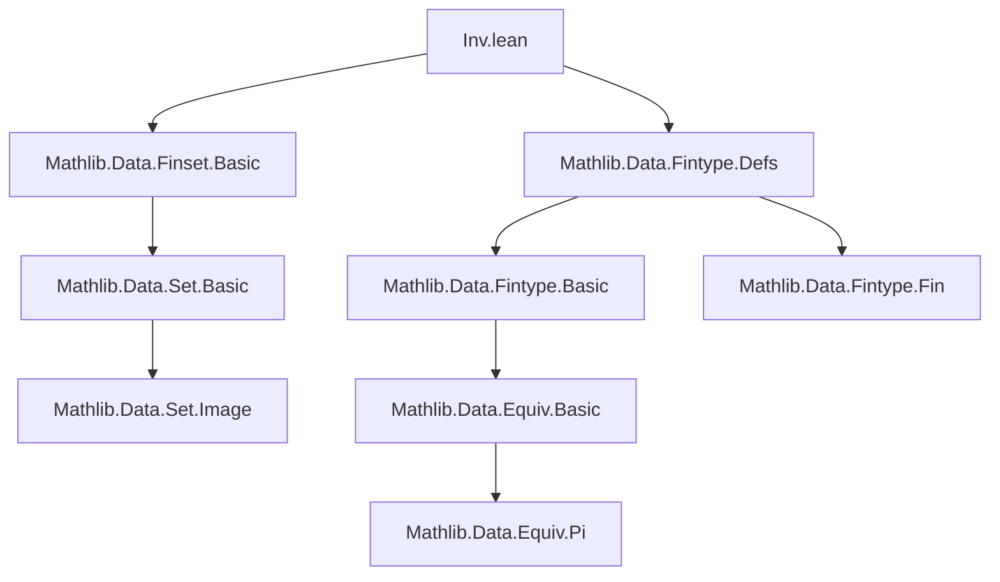
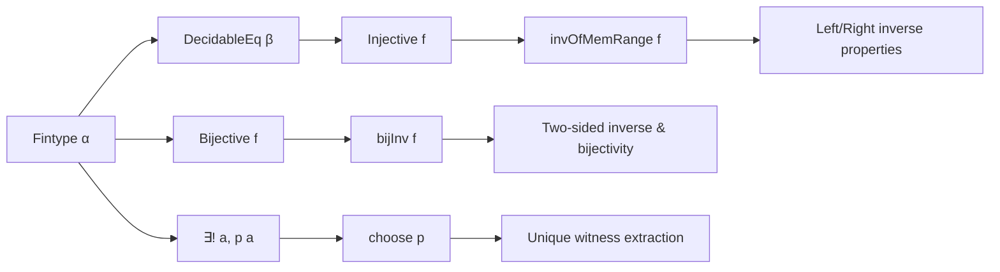

### Technical Brief: Computable Inverses for Injective/Surjective Functions on Finite Types

---

#### **1. Key Definitions & Theorems**

| Name | Type | Purpose |
|------|------|---------|
| `Function.Injective.invOfMemRange` | `Set.range f → α` | Computes the inverse of an injective function `f : α → β` on its range, using `Finset.choose` over `Finset.univ`. Requires `Fintype α`, `DecidableEq β`. |
| `Function.Injective.left_inv_of_invOfMemRange` | `f (hf.invOfMemRange b) = b` | Left-inverse property: applying `f` to the computed inverse yields the original element in the range. |
| `Function.Injective.right_inv_of_invOfMemRange` | `hf.invOfMemRange ⟨f a, ...⟩ = a` | Right-inverse property: inverse recovers the original input when applied to `f a`. |
| `Function.Embedding.invOfMemRange` | `↥(Set.range f) → α` | Specialization of `invOfMemRange` for embeddings (`α ↪ β`). Uses `f.injective.invOfMemRange`. |
| `Fintype.chooseX` | `∃! a, p a → { a // p a }` | Extracts the unique witness as a subtype element, using `Finset.choose`. |
| `Fintype.choose` | `∃! a, p a → α` | Extracts the unique witness as an element of `α`. |
| `Fintype.bijInv` | `Bijective f → β → α` | Computes the two-sided inverse of a bijective function `f`, using `Fintype.choose`. |
| `Fintype.leftInverse_bijInv` / `rightInverse_bijInv` | `LeftInverse (bijInv ...) f` / `RightInverse ... f` | Prove `bijInv f_bij` is a two-sided inverse of `f`. |
| `Fintype.bijective_bijInv` | `Bijective (bijInv f_bij)` | Shows the inverse is itself bijective. |

---

#### **2. Naming Conventions**

- **Prefixes**:
  - `invOfMemRange`: indicates inverse defined *only on the range* of the function.
  - `choose`: used for extracting unique witnesses from `∃!` proofs via finite search.
  - `bijInv`: bijection inverse.
- **Suffixes**:
  - `_spec`: properties of `choose` (e.g., membership and uniqueness).
  - `_X`: subtype version (`chooseX` returns a dependent pair).
- **Typeclass constraints**:
  - `[Fintype α]`, `[DecidableEq β]` appear consistently — essential for decidability and finite search.

---

#### **3. Tactic Stack**

Frequent tactics used in proofs:
- `simp` / `simp_rw`: simplification with lemmas like `invFun_eq`, `choose_spec`, `Subtype.ext_iff`.
- `apply hf` / `apply f.injective`: use injectivity to reduce equality goals.
- `ext`: extensionality for function equality.
- `rw [Subtype.ext_iff]`: for subtype equality reasoning.
- `by simp`: in many `@[simp]` lemmas and short proofs.
- `simpa`: used in `chooseX` and subtype lemmas to discharge `∃!` conditions.

No heavy automation (e.g., `linarith`, `ring`, `aesop`) — proofs are mostly direct and rely on definitional properties.

---

#### **4. Proof Logic**

- **Induction**: Not used — all proofs are direct constructions.
- **Core strategy**:
  1. Use `Finset.choose_spec` to get existence/uniqueness of the witness.
  2. Apply injectivity (or bijectivity) to prove inverse properties.
  3. Use `ext` + `simp` to equate functions (e.g., `invFun_restrict`).
- **Computational flavor**:
  - All inverses are defined via `Finset.choose`, which performs exhaustive search over `α`.
  - Complexity: $O(|\alpha|)$ per evaluation.

---

#### **5. Imports & Dependencies**

- **Core imports**:
  ```lean
  Mathlib.Data.Finset.Basic
  Mathlib.Data.Fintype.Defs
  ```
- **Implicit dependencies**:
  - `Function` (for `invFun`, `Injective`, `Bijective`, `LeftInverse`, etc.)
  - `Finset` (for `choose`, `univ`, `choose_spec`, `choose_property`)
  - `Subtype` (for `choose_subtype_eq`)
  - `Equiv` (for `Equiv.ofInjective`, though not directly used)

---

#### **6. Mermaid Diagrams**

##### **Dependency Graph (Module-Level)**



##### **Theoretical Overview (Conceptual Flow)**



##### **Relationship to Standard Theory**

```mermaid
flowchart LR
  A[Classical invFun f] -->|noncomputable| B[invFun f]
  C[Constructive invOfMemRange f] -->|computable| D[invOfMemRange f]
  B -->|when f injective & b ∈ range f| D
  D -->|via Equiv.ofInjective| E[(Equiv.ofInjective f hf).symm]
```

> **Note**: `invOfMemRange` is the *computable realization* of the inverse from `Equiv.ofInjective`, avoiding choice or noncomputable definitions.

---

#### **7. Computational Notes**

- **Performance**: `invOfMemRange` and `bijInv` are *not* intended for performance-critical code — they use linear search over `α`.
- **Use case**: Formal verification where *computational correctness* (e.g., extraction to executable code) matters more than speed.
- **Alternative**: For specific structures (e.g., `Fin n`), explicit inverses (e.g., via `Fin.rev`, `Fin.add_left_cancel`) are preferred.

--- 

Let me know if you'd like a formalized dependency graph (e.g., `.dot` format) or a comparison with `Equiv.ofInjective`/`Equiv.ofSurjective`.
