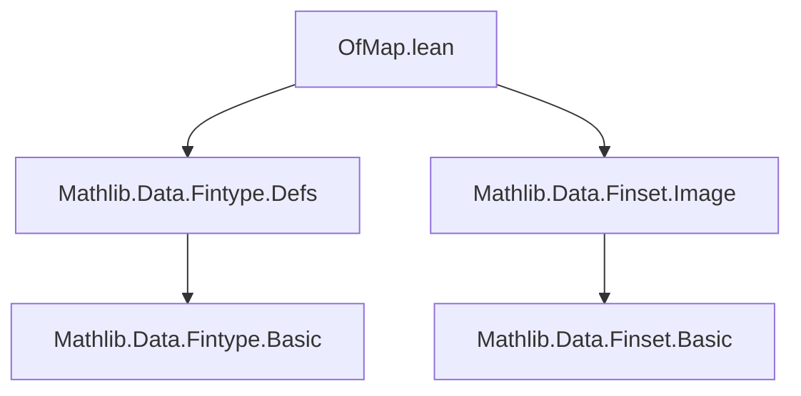
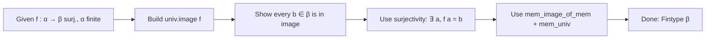

### Technical Brief: `OfMap.lean` — Fintype Constructors via Maps

---

#### **1. Key Definitions & Theorems**

| Name | Type | Purpose |
|------|------|---------|
| `ofMultiset` | `[DecidableEq α] → Multiset α → (∀ x, x ∈ s) → Fintype α` | Constructs a `Fintype` from a multiset covering all elements. |
| `ofList` | `[DecidableEq α] → List α → (∀ x, x ∈ l) → Fintype α` | Same as `ofMultiset`, but using a list. |
| `ofBijective` | `[Fintype α] → (f : α → β) → Bijective f → Fintype β` | Transfers finiteness along a bijection. |
| `ofSurjective` | `[DecidableEq β] [Fintype α] → (f : α → β) → Surjective f → Fintype β` | Transfers finiteness along a surjection (constructive). |
| `ofInjective` | `[Fintype β] → (f : α → β) → Injective f → Fintype α` | Pulls back finiteness along an injection (noncomputable, uses choice). |
| `ofEquiv` | `[Fintype α] → (α ≃ β) → Fintype β` | Special case of `ofBijective` for equivalences. |
| `ofSubsingleton` | `α → Subsingleton α → Fintype α` | Constructs `Fintype` for a subsingleton with a witness. |
| `univ_ofSubsingleton` | `@univ _ (ofSubsingleton a) = {a}` | Describes `univ` for the singleton fintype. |
| `ofIsEmpty` | `[IsEmpty α] → Fintype α` | Constructs `Fintype` for an empty type. |
| `univ_ofIsEmpty` | `@univ α Fintype.ofIsEmpty = ∅` | Describes `univ` for the empty fintype. |

---

#### **2. Naming Conventions**

- **Prefixes**:
  - `of_`: Indicates a constructor that *derives* a `Fintype` instance from structural or functional data.
- **Suffixes**:
  - `ofSubsingleton`, `ofIsEmpty`, `ofMultiset`, `ofList`: Reflect the source of finiteness evidence.
- **Function names**:
  - `invFun`, `mem_univ`, `mem_image_of_mem`, `mem_map_of_mem`: Standard library helpers used in proofs.

---

#### **3. Tactic Stack**

Frequently used tactics in proofs within this file:

| Tactic | Role |
|--------|------|
| `simpa` | Simplifies goals using assumptions (`H`) and rewrites. |
| `rw` / `e ▸ _` | Rewrites using equality evidence `e`. |
| `let ⟨_, e⟩ := H b` | Destructures existential proofs (e.g., surjectivity). |
| `mem_univ _` | Standard lemma: any element is in `univ`. |
| `mem_image_of_mem`, `mem_map_of_mem` | Lemmas to show membership in image/map. |
| `isEmptyElim` | Eliminates goals from an empty type. |
| `Subsingleton.elim _ _` | Eliminates equality in subsingleton types. |
| `Classical.dec`, `Classical.inhabited_of_nonempty` | Used in `ofInjective` for classical choice. |

No heavy automation (e.g., `aesop`, `ring`, `linarith`) is used—proofs are mostly direct term-mode + `simpa`.

---

#### **4. Proof Logic**

- **General pattern**:  
  For constructions like `ofBijective`, `ofSurjective`, `ofInjective`, the logic follows:
  1. **Construct a candidate finite set**:
     - `univ.map f` (for bijection),
     - `univ.image f` (for surjection),
     - or via inverse function + surjectivity (for injection).
  2. **Show it covers all elements**:
     - Use surjectivity/injectivity/bijectivity to get preimages or uniqueness.
     - Apply membership lemmas (`mem_map_of_mem`, `mem_image_of_mem`) to lift from `univ`.
- **Noncomputability**:  
  `ofInjective` uses classical choice (`Classical.dec`, `Classical.inhabited_of_nonempty`) to define `invFun`, and is thus noncomputable.
- **Edge cases**:
  - `ofSubsingleton`: Uses `Finset.mem_singleton` and `Subsingleton.elim`.
  - `ofIsEmpty`: Uses `isEmptyElim` to handle vacuous quantification.

---

#### **5. Imports & Dependencies**

| Import | Purpose |
|--------|---------|
| `Mathlib.Data.Fintype.Defs` | Core definitions: `Fintype`, `univ`, `mem_univ`, etc. |
| `Mathlib.Data.Finset.Image` | Lemmas about image of sets under functions (`mem_image_of_mem`, etc.). |

No other external dependencies are used—this is a self-contained module for basic `Fintype` construction principles.

---

#### **6. Mermaid Diagrams**

##### **Dependency Graph (Module Level)**



##### **Theoretical Flow Overview**

```mermaid
graph TD
  Fintype[Type α with Fintype α]
  Bijective[Bijective f : α → β]
  Surjective[Surjective f : α → β]
  Injective[Injective f : α → β]
  Equiv[Equiv α β]
  Subsingleton[Subsingleton α + witness]
  IsEmpty[IsEmpty α]

  Fintype -- ofBijective --> Fintype[β]
  Fintype -- ofSurjective --> Fintype[β]
  Fintype[β] -- ofInjective --> Fintype[α]
  Fintype -- ofEquiv --> Fintype[β]
  witness -- ofSubsingleton --> Fintype[α]
  -- ofIsEmpty is standalone
  IsEmpty -- ofIsEmpty --> Fintype[α]
```

##### **Proof Strategy Flowchart (e.g., `ofSurjective`)**



---

#### **7. Summary**

This module formalizes foundational transfer principles for finiteness across types via maps. It distinguishes between:
- **Constructive** transfers (`ofMultiset`, `ofList`, `ofBijective`, `ofSurjective`),
- **Classical** transfers (`ofInjective`),
- **Special cases** (`ofSubsingleton`, `ofIsEmpty`).

It is a core building block for reasoning about finite types in dependent type theory, especially in contexts like combinatorics, group actions, and cardinality arguments.

--- 

Let me know if you'd like a formalized dependency graph for the entire `Mathlib.Data.Fintype` hierarchy.
