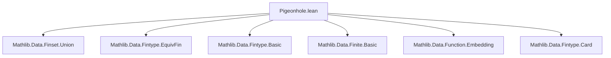
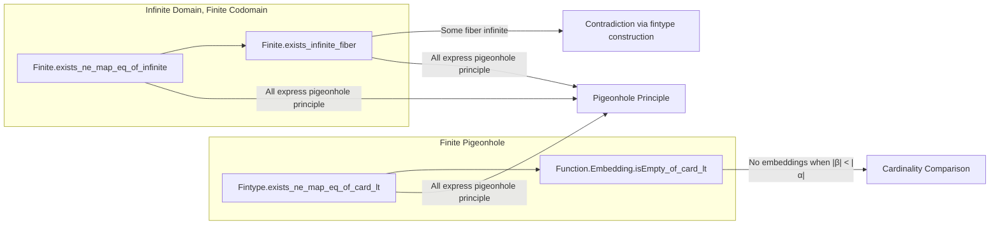

**Technical Brief: Pigeonhole Principles in Finite Types (Lean 4)**  
*Based on `Pigeonhole.lean` from Mathlib*

---

### 1. **Key Definitions & Theorems**

| Name | Type | Purpose |
|------|------|---------|
| `Fintype.exists_ne_map_eq_of_card_lt` | `(f : α → β) → [Fintype α] → [Fintype β] → Fintype.card β < Fintype.card α → ∃ x y, x ≠ y ∧ f x = f y` | Weak pigeonhole principle for finite types: if more pigeons than holes, some two pigeons share a hole. |
| `Function.Embedding.isEmpty_of_card_lt` | `[Fintype α] → [Fintype β] → Fintype.card β < Fintype.card α → IsEmpty (α ↪ β)` | No embeddings exist when codomain is strictly smaller than domain — equivalent to pigeonhole principle. |
| `Finite.exists_ne_map_eq_of_infinite` | `[Infinite α] → [Finite β] → (f : α → β) → ∃ x y, x ≠ y ∧ f x = f y` | Weak pigeonhole for infinite domain, finite codomain: two distinct inputs map to same output. |
| `Finite.exists_infinite_fiber` | `[Infinite α] → [Finite β] → (f : α → β) → ∃ y, Infinite (f ⁻¹' {y})` | Strong pigeonhole: at least one fiber (preimage) is infinite. |

---

### 2. **Naming Conventions**

- **Prefixes**:
  - `exists_...`: Existential statements (e.g., `exists_ne_map_eq`, `exists_infinite_fiber`)
  - `isEmpty_of_...`: Proving emptiness of a type (e.g., `isEmpty_of_card_lt`)
- **Suffixes**:
  - `_of_card_lt`: Condition on cardinalities
  - `_of_infinite`: Domain infinite, codomain finite
  - `_of_maps_to`: Used in intermediate lemmas (e.g., `Finset.exists_ne_map_eq_of_card_lt_of_maps_to`)
- **Notation**:
  - `f ⁻¹' {y}`: Preimage (fiber) of singleton `{y}`
  - `α ↪ β`: Type of embeddings (injective functions)

---

### 3. **Tactic Stack**

| Tactic | Usage Frequency | Role |
|--------|------------------|------|
| `simpa` | High | Simplify using assumptions, especially in `exists_ne_map_eq_of_infinite` |
| `by_contra!` | Medium | Negate goal to derive contradiction (used in `exists_infinite_fiber`) |
| `cases` | Medium | Eliminate `nonempty_fintype β` to get a fintype structure |
| `simp` | High | Simplify set expressions (e.g., `biUnion`, `mem_univ`) |
| `aesop` / `ring` / `linarith` | Not present | Not used in this file — proof is mostly structural |
| `let` / `have` | High | Local definitions and intermediate claims |

---

### 4. **Proof Logic**

- **Weak finite pigeonhole** (`exists_ne_map_eq_of_card_lt`):  
  Reduces to `Finset.exists_ne_map_eq_of_card_lt_of_maps_to`, using `mem_univ` to satisfy the `maps_to` condition.

- **Embedding emptiness** (`isEmpty_of_card_lt`):  
  Suppose an embedding `f : α ↪ β` exists. Apply weak pigeonhole to get `x ≠ y` with `f x = f y`, contradicting injectivity.

- **Infinite domain, finite codomain (weak)**:  
  Uses `not_injective_infinite_finite`, i.e., a function from an infinite type to a finite type cannot be injective.

- **Strong pigeonhole** (`exists_infinite_fiber`):  
  - Assume no infinite fiber (i.e., all fibers finite).
  - Since codomain is finite, take fintype structure on `β`.
  - Construct a fintype structure on `α` as a finite union of finite sets (fibers), contradicting `Infinite α`.

---

### 5. **Imports & Dependencies**

| Module | Role |
|--------|------|
| `Mathlib.Data.Finset.Union` | Provides `biUnion`, used in constructing finite union of fibers |
| `Mathlib.Data.Fintype.EquivFin` | Enables `Fintype.ofFinite`, used to derive fintype from finite type in classical context |
| `Function` | Provides `Injective`, `Function.comp`, etc. |
| `Finset` | Provides `univ`, `mem_univ`, `toFinset`, etc. |

---

### 6. **Mermaid Diagrams**

#### **Dependency Graph (File-Level)**

#### **Theoretical Overview**

---

### 7. **Notes**

- All proofs are constructive where possible, except `exists_infinite_fiber`, which uses classical logic (`classical` mode).
- The file focuses on *existence* of collisions or infinite fibers — not counting or measuring multiplicities.
- Stronger quantitative versions (e.g., average fiber size ≥ `|α| / |β|`) are in other modules like `Data.Fintype.CardEmbedding`.

--- 

*End of Technical Brief.*
