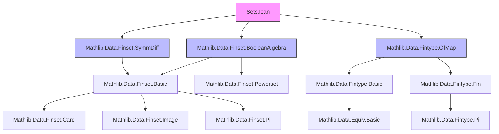
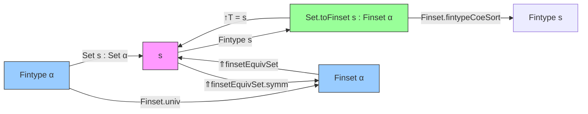

### Technical Brief: `Sets.lean` (Mathlib)

---

#### **1. Key Definitions & Theorems**

| Name | Type / Signature | Purpose |
|------|------------------|---------|
| `Set.toFinset` | `def toFinset (s : Set α) [Fintype s] : Finset α` | Converts a subset `s` of a finite type `α` into a `Finset α`, using the embedding of `s` into `α`. |
| `mem_toFinset` | `theorem mem_toFinset {s : Set α} [Fintype s] {a : α} : a ∈ s.toFinset ↔ a ∈ s` | Membership equivalence: element `a` is in `s` iff it's in `toFinset s`. |
| `coe_toFinset` | `theorem coe_toFinset (s : Set α) [Fintype s] : (↑s.toFinset : Set α) = s` | The coercion of `s.toFinset` back to a `Set α` equals `s`. |
| `toFinset_inj` | `theorem toFinset_inj {s t : Set α} [Fintype s] [Fintype t] : s.toFinset = t.toFinset ↔ s = t` | Injectivity of `toFinset`. |
| `toFinset_subset_toFinset` | `theorem toFinset_subset_toFinset [Fintype s] [Fintype t] : s.toFinset ⊆ t.toFinset ↔ s ⊆ t` | Subset preservation under `toFinset`. |
| `toFinset_ssubset_toFinset` | `theorem toFinset_ssubset_toFinset [Fintype s] [Fintype t] : s.toFinset ⊂ t.toFinset ↔ s ⊂ t` | Strict subset preservation. |
| `toFinset_inter`, `toFinset_union`, `toFinset_diff`, `toFinset_symmDiff`, `toFinset_compl` | `theorem ...` | `toFinset` commutes with standard set operations (under appropriate fintype assumptions). |
| `toFinset_empty`, `toFinset_univ`, `toFinset_singleton`, `toFinset_insert` | `theorem ...` | Behavior of `toFinset` on basic sets. |
| `Finset.fintypeCoeSort` | `instance Finset.fintypeCoeSort {α : Type u} (s : Finset α) : Fintype s` | A `Finset α` is a finite type via the subtype embedding. |
| `Fintype.finsetEquivSet` | `noncomputable def finsetEquivSet : Finset α ≃ Set α` | Equivalence between `Finset α` and `Set α` when `α` is finite. |
| `Fintype.finsetOrderIsoSet` | `noncomputable def finsetOrderIsoSet : Finset α ≃o Set α` | Order isomorphism (subset lattice) between `Finset α` and `Set α`. |
| `Set.decidableMemOfFintype` | `def decidableMemOfFintype [DecidableEq α] (s : Set α) [Fintype s] (a) : Decidable (a ∈ s)` | Decidability of membership in a finite set (local instance only). |
| `Set.toFinset_ofFinset` | `theorem toFinset_ofFinset {p : Set α} (s : Finset α) (H : ∀ x, x ∈ s ↔ x ∈ p)` | When a set is defined by a `Finset`, `toFinset` recovers it. |
| `finset%` syntax | `elab "finset% " t:term : term` | Syntax extension to automatically insert `Set.toFinset` when needed. |

---

#### **2. Naming Conventions**

- **Prefixes**:
  - `toFinset_`: for definitions/theorems about converting `Set` → `Finset`.
  - `coe_`: for coercion-related lemmas (e.g., `coe_toFinset`, `coe_inj`).
  - `mem_`: for membership characterizations (e.g., `mem_toFinset`, `mem_image_univ_iff_mem_range`).
  - `fintype_`: for `Fintype`-related constructions (e.g., `fintypeCoeSort`, `setFintype`).
- **Suffixes**:
  - `_inj`: injectivity lemmas.
  - `_subset_`, `_ssubset_`: subset/strict subset preservation.
  - `_mono`, `_strict_mono`: monotonicity/strict monotonicity.
  - `_nonempty`, `_nontrivial`, `_subsingleton`: properties of cardinality.
- **Operation names**: `inter`, `union`, `diff`, `symmDiff`, `compl`, `image`, `range`, `singleton`, `insert`, `filter`.

---

#### **3. Tactic Stack**

- **Core tactics**: `simp`, `ext`, `rw`, `refl`, `convert`, `subst`, `cases`.
- **Automation**:
  - `aesop`: used in `alias` for `toFinset_nonempty_of_nonempty`.
  - `grind =`: for `mem_toFinset`.
- **Rewriting & simplification**:
  - `simp_rw`, `rw [← ...]`, `rw [← coe_inj, ...]`.
- **Typeclass inference**:
  - `classical exact`, `by classical exact`.
- **Equality proofs**:
  - `Finset.ext`, `Set.ext`, `Finset.coe_injective`.

---

#### **4. Proof Logic**

- **Standard pattern**:
  1. Use `ext` to reduce to element-wise reasoning.
  2. Apply `simp` with lemmas like `mem_toFinset`, `mem_filter`, `mem_image`, etc.
  3. Use `rw` with `coe_toFinset`, `coe_inj`, or `mem_toFinset` to switch between `Set` and `Finset`.
- **Induction**: Not used heavily here; most proofs are extensional and rely on decidability + fintype structure.
- **Case analysis**: Rare; mostly handled by `simp` and `decidable` instances.
- **Equivalence proofs**: Use `ext`, `left_inv`, `right_inv` for `equiv`/`orderIso` constructions.

---

#### **5. Imports**

| Module | Purpose |
|--------|---------|
| `Mathlib.Data.Finset.BooleanAlgebra` | Boolean algebra structure on `Finset`, including `compl`, `symmDiff`, etc. |
| `Mathlib.Data.Finset.SymmDiff` | Symmetric difference operations and properties. |
| `Mathlib.Data.Fintype.OfMap` | Construction of `Fintype` from finite maps (used in `ofFinset`, `ofList`, etc.). |

---

#### **6. Theory Overview & Dependencies**

##### **Core Theory**
- In a finite type `α`, every subset `s : Set α` is finite (`Fintype s`), and thus corresponds uniquely to a `Finset α`.
- `Set.toFinset` provides the conversion, and `Finset.coe` provides the reverse.
- These maps are inverse equivalences (`finsetEquivSet`) and even order isomorphisms (`finsetOrderIsoSet`), preserving subset structure.

##### **Dependency Graph (Mermaid)**

##### **Overview Diagram (Mermaid)**

---

#### **7. Notable Design Decisions**

- **Local instance only**: `decidableMemOfFintype` is not a global instance to avoid loops with `Subtype.fintype`.
- **Elaboration workaround**: Coercion `↥` used in `toFinset_univ` to avoid universe mismatch bugs (see GitHub issue #672).
- **Syntax extension**: `finset%` allows automatic insertion of `Set.toFinset`, improving ergonomics for big operators.
- **DecidableEq requirement**: Many `toFinset` lemmas require `DecidableEq α` to ensure decidability of membership and operations like `insert`, `filter`.

---

#### **8. Related Theory Modules**

- `Mathlib.Data.Finset.Basic`: Core `Finset` definitions.
- `Mathlib.Data.Fintype.Basic`: `Fintype` infrastructure.
- `Mathlib.Data.Set.Basic`: Set theory foundations.
- `Mathlib.Data.Equiv.Basic`: Equivalence and isomorphism infrastructure.
- `Mathlib.Data.Finset.Powerset`: Powerset and subset lattice structure.

--- 

Let me know if you'd like a formal dependency graph in DOT format or a summary of how this module integrates into the broader `Mathlib` hierarchy.
