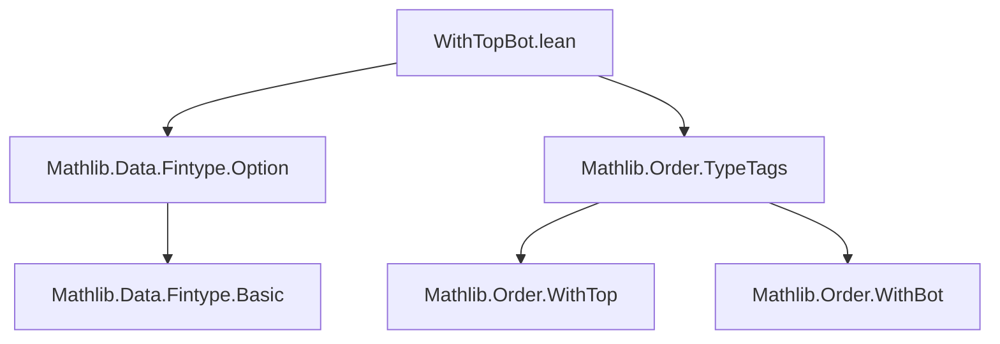

**Technical Brief: `WithTopBot.lean`**

---

### 1. **Key Definitions & Theorems**

| Name | Type / Declaration | Purpose |
|------|--------------------|---------|
| `instFintypeOption` | `instance [Fintype α] : Fintype (Option α)` | Provided by `Mathlib.Data.Fintype.Option`; gives a fintype structure on `Option α` when `α` is finite. |
| `Fintype.ofFinite` | `theorem` | Converts a `Finite α` to `Fintype α`. |
| `Finite.of_fintype` | `theorem` | Converts a `Fintype α` to `Finite α`. |
| `WithTop α`, `WithBot α` | `inductive` types (from `Mathlib.Order.TypeTags`) | One-point compactifications: `WithTop α = α ⊔ {⊤}`, `WithBot α = α ⊔ {⊥}`. In Lean, they are defined as `Option α` with different order interpretations. |

**Note**: In Mathlib, `WithTop α` and `WithBot α` are *definitionally equal* to `Option α` (up to type equivalence), which is why the fintype/finite instances follow directly from those for `Option α`.

---

### 2. **Naming Conventions**

- **Prefixes**:
  - `instFintypeOption`: follows the `inst[Typeclass]` convention for typeclass instances.
  - `ofFinite`, `of_fintype`: follow the `of_[class]` pattern for converting between related typeclasses.

- **Suffixes**:
  - `Fintype`, `Finite`: standard Mathlib suffixes for finiteness typeclasses.

- **No custom naming** beyond standard Mathlib conventions.

---

### 3. **Tactic Stack**

- `have := ...`: used to introduce intermediate facts.
- Implicit use of `exact`/`assumption` via typeclass resolution (e.g., `Fintype.ofFinite α` is inferred via `have` + typeclass search).
- No explicit tactics like `aesop`, `ring`, `simp`, or `rw` appear — the proofs are *typeclass-based* and rely on Lean’s typeclass inference system.

---

### 4. **Proof Logic**

- **Structure**: Short, direct typeclass proofs.
- **Pattern**:
  1. Assume `[Fintype α]` or `[Finite α]`.
  2. Use known instance (`instFintypeOption`) for `Option α`.
  3. Convert between `Fintype` and `Finite` using `Fintype.ofFinite` / `Finite.of_fintype`.
- **Key insight**: Since `WithTop α` and `WithBot α` are definitionally `Option α`, the instances transfer verbatim.

---

### 5. **Imports**

| Import | Role |
|--------|------|
| `Mathlib.Data.Fintype.Option` | Provides `instFintypeOption`, the core instance for `Option α`. |
| `Mathlib.Order.TypeTags` | Defines `WithTop`, `WithBot`, and their equivalence to `Option`. |

---

### 8. **Mermaid Diagrams**

#### Dependency Graph (Module-Level)



#### Overview of Theory Flow

```mermaid
flowchart LR
  subgraph Definitions
    α[Type α] --> WithTop[WithTop α]
    α --> WithBot[WithBot α]
    WithTop & WithBot --> Option[Option α]
  end

  subgraph Finiteness
    Fintypeα[Fintype α] --> FintypeOption[instFintypeOption]
    Finiteα[Finite α] -->|Fintype.ofFinite| Fintypeα
    FintypeOption --> FintypeWithTop[Fintype (WithTop α)]
    FintypeWithTop -->|Finite.of_fintype| FiniteWithTop[Finite (WithTop α)]
    same for WithBot
  end

  Fintypeα & Finiteα --> A[WithTopBot.lean]
  A -->|exposes| FintypeWithTop & FiniteWithTop
```

---

**Summary**: This module is a minimal but crucial bridge between finiteness on `α` and on its one-point extensions `WithTop α`, `WithBot α`. It leverages definitional equality with `Option α` and standard typeclass conversion lemmas, requiring no manual construction.
