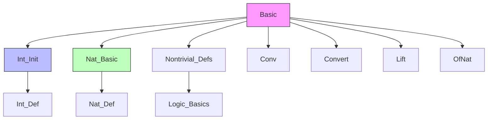
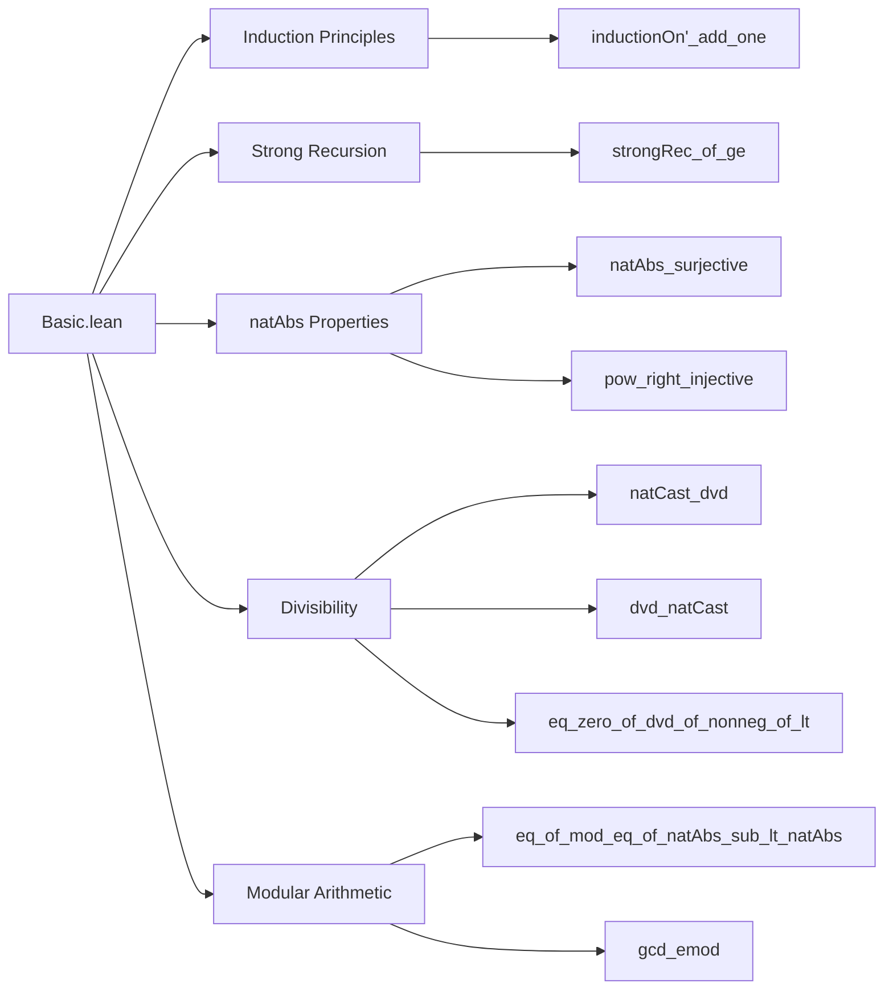

**Technical Brief: `Basic.lean` — Basic Integer Operations in Lean 4 / Mathlib**

---

### 1. **Key Definitions & Theorems**

| Name | Type / Signature | Purpose |
|------|------------------|---------|
| `instNontrivial` | `Nontrivial ℤ` | Proves ℤ has at least two distinct elements (0 ≠ 1). |
| `ofNat_injective` | `Function.Injective ofNat` | Injectivity of coercion from ℕ to ℤ. |
| `inductionOn'_add_one` | `b ≤ z → (z + 1).inductionOn' b H0 Hs Hp = Hs z hz (z.inductionOn' b H0 Hs Hp)` | Computes the step case for upward induction on ℤ from base `b`. |
| `strongRec_of_ge` | `m ≤ n → m.strongRec lt ge n = ge n hn fun k _ ↦ m.strongRec lt ge k` | Characterizes strong recursion on ℤ for arguments ≥ `m`. |
| `natAbs_surjective` | `natAbs.Surjective` | Surjectivity of `natAbs : ℤ → ℕ`. |
| `pow_right_injective` | `1 < a.natAbs → ((a ^ ·) : ℕ → ℤ).Injective` | If `|a| > 1`, then exponentiation by `a` is injective on ℕ. |
| `natCast_dvd` | `(m : ℤ) ∣ n ↔ m ∣ n.natAbs` | Divisibility of integer `m` into integer `n` reduces to divisibility into `|n|`. |
| `dvd_natCast` | `m ∣ (n : ℤ) ↔ m.natAbs ∣ n` | Divisibility of `m` into natural `n` reduces to `|m| ∣ n`. |
| `eq_zero_of_dvd_of_nonneg_of_lt` | `0 ≤ m → m < n → n ∣ m → m = 0` | If a nonnegative integer divides a strictly larger one, it must be zero. |
| `eq_of_mod_eq_of_natAbs_sub_lt_natAbs` | `a % b = c → |a - c| < |b| → a = c` | If `a ≡ c mod b` and the difference is smaller than `|b|`, then `a = c`. |
| `natAbs_le_of_dvd_ne_zero` | `m ∣ n → n ≠ 0 → |m| ≤ |n|` | Nonzero divisor has absolute value ≤ dividend’s. |
| `gcd_emod` | `(m % n).gcd n = m.gcd n` | Euclidean algorithm step: gcd is invariant under mod. |

---

### 2. **Naming Conventions**

- **Prefixes**:
  - `natAbs_`: Relating to absolute value on integers (`natAbs : ℤ → ℕ`).
  - `dvd_`: Divisibility lemmas.
  - `ofNat_`, `natCast_`: Coercion-related properties.
  - `inductionOn'_`, `strongRec_`: Induction/recursion principles on ℤ.

- **Suffixes**:
  - `_surjective`, `_injective`, `_ne_zero`, `_nonneg`: Logical properties.
  - `_of_`, `_from_`, `_with_`: Often used in helper lemmas or case analysis.

- **Pattern**:
  - `natAbs_le_of_dvd_ne_zero`: `property_of_condition_ne_zero` — standard Lean style.

---

### 3. **Tactic Stack**

Frequently used tactics in this file:

| Tactic | Role |
|--------|------|
| `lift` | Lifts integer subtraction to natural numbers via `Int.sub_nonneg`. |
| `lia` | Linear integer arithmetic (e.g., proving `b + zb = z`). |
| `rw` / `convert` / `congr` | Rewriting, congruence closure, and equality conversion. |
| `simp` / `simp_rw` | Simplification using `natAbs_natCast`, `Int.dvd_neg`, etc. |
| `obtain` / `cases` | Case analysis on `natAbs_eq n` (i.e., `n = |n|` or `n = -|n|`). |
| `ext` + `funext`-style reasoning | Extensionality for function equality in induction/recursion proofs. |
| `apply ... using` | Selective application with `using 2` for typeclass inference. |
| `split_ifs` | Splits `if ... then ... else ...` in proofs. |

---

### 4. **Proof Logic**

- **Induction on ℤ**:
  - Uses `inductionOn'` (a custom induction principle for ℤ with base `b`), with upward (`+1`) and downward (`-1`) steps.
  - Proofs often reduce to natural-number induction via `Int.sub_nonneg.mpr hz` to lift `z - b` to ℕ.

- **Strong recursion**:
  - Proves correctness of `strongRec` by unfolding definitions and using `inductionOn'` again.
  - Case analysis on `k < n` vs `k ≥ n`, with careful handling of induction hypotheses.

- **Divisibility & absolute value**:
  - Exploits `natAbs_eq n : n = |n| ∨ n = -|n|` to reduce to natural-number divisibility.
  - Uses `Int.dvd_neg`, `natCast_dvd_natCast`, and `natAbs_mul` to manipulate divisibility.

- **Modular arithmetic**:
  - Relies on `emod_add_mul_ediv` and `gcd_add_mul_left_left` to prove gcd invariance.

---

### 5. **Imports & Dependencies**

| Import | Purpose |
|--------|---------|
| `Mathlib.Data.Int.Init` | Core definition of ℤ (as `Int` type with `ofInt`, `ofNat`, `neg`, etc.). |
| `Mathlib.Data.Nat.Basic` | Natural number arithmetic and order. |
| `Mathlib.Logic.Nontrivial.Defs` | `Nontrivial` typeclass. |
| `Mathlib.Tactic.Conv`, `Convert`, `Lift`, `OfNat` | Tactics for rewriting, conversion, lifting, and `OfNat` coercion. |

---

### 6. **Mermaid Diagrams**

#### **Dependency Graph (Module-Level)**

#### **Overview of File Structure**

---

### 7. **Domain Scope**

This file provides foundational lemmas for integer arithmetic in Mathlib, especially:

- Induction and recursion on ℤ (beyond ℕ).
- Interaction between `natAbs`, divisibility, and coercion from ℕ.
- Tools for reasoning about modular arithmetic and gcd.

It serves as a **base layer** for higher-level number theory (e.g., `Mathlib.NumberTheory.Basic`, `GCDMonoid`, `EuclideanDomain`).

--- 

Let me know if you'd like a formalized dependency graph (e.g., for `leanproject`), or a summary of how this file interfaces with `Mathlib.NumberTheory.Basic`.
