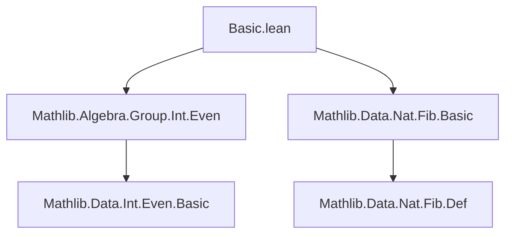

### Technical Brief: `Basic.lean` — Fibonacci Numbers Extended to ℤ

---

#### **1. Key Definitions & Theorems**

| Name | Type | Purpose |
|------|------|---------|
| `fib : ℤ → ℤ` | `def` | Extension of `Nat.fib` to integers via case analysis on sign and parity. |
| `fib_natCast` | `@[simp]` | Shows agreement with `Nat.fib` on natural numbers. |
| `fib_zero`, `fib_one`, `fib_two`, `fib_neg_one`, `fib_neg_two` | `@[simp]` | Base cases for proof automation. |
| `fib_of_nonneg` | `thm` | Simplifies `fib n` when `n ≥ 0`. |
| `fib_of_odd` | `thm` | Simplifies `fib n` for odd `n`. |
| `fib_neg_natCast` | `thm` | Closed form for `fib (-n)` in terms of `n.fib` and sign: $(-1)^{n+1} \cdot n.fib$. |
| `fib_neg` | `thm` | Parity-based sign rule: `fib (-n) = if Even n then -fib n else fib n`. |
| `fib_add_two` | `thm` | Recurrence holds for all integers: `fib (n+2) = fib n + fib (n+1)`. |
| `fib_add` | `thm` | General addition formula: $F_{m+n} = F_{m-1}F_n + F_m F_{n+1}$. |
| `fib_two_mul`, `fib_two_mul_add_one`, `fib_two_mul_add_two` | `thm` | Doubling identities (analogs of natural-number identities). |
| `gcd_fib` | `thm` | $\gcd(F_m, F_n) = F_{\gcd(m,n)}$ for all integers $m,n$. |
| `fib_dvd` | `thm` | Divisibility: $m \mid n \Rightarrow F_m \mid F_n$. |

---

#### **2. Naming Conventions**

- **Prefixes**:
  - `fib_`: All definitions and theorems about the integer Fibonacci function.
  - `natCast_`: Relating `fib` on ℤ to `Nat.fib` on ℕ.
  - `neg_`: Behavior on negative integers.
  - `two_mul_`: Identities involving `2 * n`.
- **Suffixes**:
  - `_eq_natFib_natAbs`: When `fib n` equals `Nat.fib (|n|)` (e.g., for odd `n`).
  - `_pos`, `_neg`: Sign-related properties.
  - `_add`, `_mul`: Structural identities (addition/multiplication).
- **Special**:
  - `coe_`: Cast to ℚ (e.g., `coe_fib_neg`).
  - ` dvd `: Divisibility lemmas.

---

#### **3. Tactic Stack**

Frequent tactics used:
- `simp` / `simp only`: For base cases and simplification using `@[simp]` lemmas.
- `grind`: Custom tactic (likely a wrapper for `ring`, `linarith`, `omega`, etc.) for arithmetic simplification.
- `rcases` / `obtain`: To split on `n.eq_nat_or_neg`, `even_or_odd`, etc.
- `aesop`: For automated reasoning with safe facts and rewriting.
- `conv_lhs`: For localized rewriting in complex expressions.
- `calc`: Stepwise equational reasoning.
- `rw`: Rewriting with known identities.

---

#### **4. Proof Logic**

- **Structure**: Most proofs follow a *case analysis* pattern:
  1. Split on `n.eq_nat_or_neg` (i.e., `n ≥ 0` or `n < 0`).
  2. Further split on parity (`even_or_odd`) when needed.
  3. Reduce to `Nat.fib` identities (via `fib_natCast`, `fib_neg_natCast`).
  4. Use induction or `grind` for arithmetic verification.
- **Inductive flavor**: For `fib_natCast_add`, `fib_add_natCast`, `fib_neg_natCast_add_neg_natCast`, proofs proceed by induction on `m` or `n` in ℕ, then combine cases.
- **Symmetry & sign handling**: Key lemmas like `fib_neg_natCast` and `fib_neg` are proven by parity case analysis and verified using `pow_add`, `fib_add_two`, and ring arithmetic.

---

#### **5. Imports**

- `Mathlib.Algebra.Group.Int.Even`: Provides `Even`, `Odd`, and parity reasoning on ℤ.
- `Mathlib.Data.Nat.Fib.Basic`: Defines `Nat.fib`, used as the base case for extension.

---

#### **6. Mermaid Diagrams**

##### **Dependency Graph (Module-Level)**



##### **Overview of Theory Flow**

```mermaid
flowchart LR
  NatFib[Nat.fib] -->|extension| IntFib[fib : ℤ → ℤ]
  IntFib --> Recurrence[Recurrence: fib(n+2) = fib(n+1) + fib(n)]
  IntFib --> SignRules[Sign rules: fib(-n) = ±fib(n)]
  IntFib --> Addition[Addition formula: fib(m+n)]
  IntFib --> Doubling[Doubling identities]
  IntFib --> GCD[GCD property: gcd(fib m, fib n) = fib(gcd m,n)]
  IntFib --> Divisibility[Divisibility: m ∣ n ⇒ fib m ∣ fib n]
```

---

#### **7. Summary**

This file extends the natural-number Fibonacci sequence to all integers, preserving the recurrence and key algebraic properties (addition, doubling, GCD, divisibility). It leverages parity and sign case analysis, with heavy use of `grind` and `simp` to automate arithmetic verification. The structure is modular and reusable for further Fibonacci identities over ℤ.

--- 

Let me know if you'd like a formalized dependency graph or a tactic trace for a specific proof (e.g., `fib_add`).
