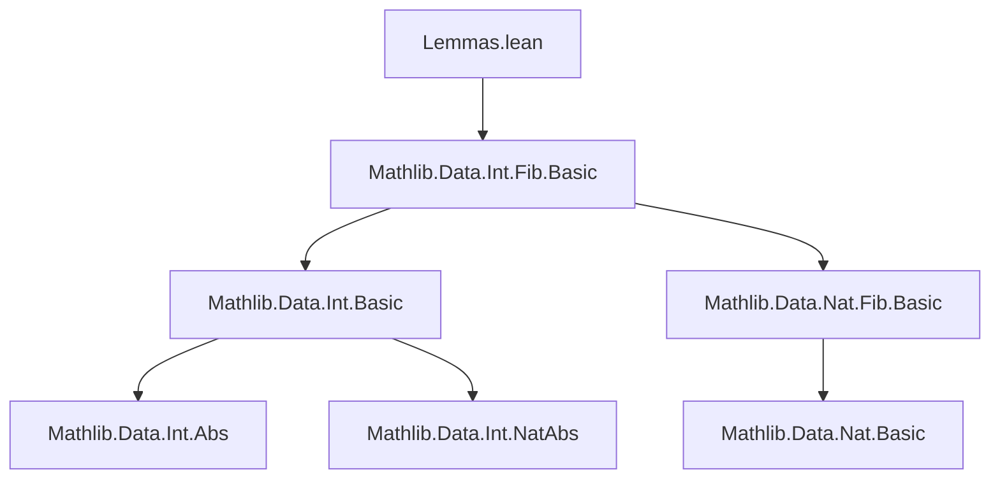

**Technical Brief: Cassini and Catalan Identities for Fibonacci Numbers over ℤ**

---

### 1. KEY DEFINITIONS & THEOREMS

| Name | Type | Purpose |
|------|------|---------|
| `fib_natCast_succ_mul_fib_natCast_pred_sub_fib_natCast_sq` | `∀ n : ℕ, fib (n + 1) * fib (n - 1) - fib n ^ 2 = (-1) ^ n` | Auxiliary lemma proving Cassini’s identity for natural numbers (via induction). |
| `fib_succ_mul_fib_pred_sub_fib_sq` *(Cassini)* | `∀ n : ℤ, fib (n + 1) * fib (n - 1) - fib n ^ 2 = (-1) ^ n.natAbs` | Main theorem: Cassini’s identity extended to all integers using `natAbs`. |
| `fib_add_sq_sub_fib_mul_fib_add_two_mul` *(Catalan)* | `∀ x a : ℤ, fib (x + a) ^ 2 - fib x * fib (x + 2 * a) = (-1) ^ x.natAbs * fib a ^ 2` | Main theorem: Catalan’s identity for integer arguments. |

---

### 2. NAMING CONVENTIONS

- **Prefixes**:
  - `fib_`: Indicates Fibonacci-related lemmas/theorems.
  - `natCast_`: Used for lemmas involving coercion from `ℕ` to `ℤ`.
- **Suffixes**:
  - `_succ_mul_fib_pred_sub_fib_sq`: Describes the expression `fib (n+1) * fib (n-1) - fib n ^ 2`.
  - `_add_sq_sub_fib_mul_fib_add_two_mul`: Describes `fib (x+a)^2 - fib x * fib (x + 2*a)`.
- **Structure**:
  - `public theorem` used for main results.
  - `lemma` for auxiliary steps.

---

### 3. TACTIC STACK

| Tactic | Usage Frequency | Role |
|--------|------------------|------|
| `induction` | High | Proving base-case + inductive step for natural-number version. |
| `simp` / `simp_rw` | High | Simplifying expressions using definitions (`fib_neg`, `natAbs_neg`, etc.). |
| `grind` | High | Automated solving using known Fibonacci identities (e.g., `fib_add`, `fib_add_two`). |
| `ring` | Medium | Simplifying polynomial expressions after rewriting. |
| `obtain` / `cases` | Medium | Decomposing integers via `eq_nat_or_neg`. |
| `if ... then ... else` | Medium | Handling special case `n = 0` in negative integer proof. |

---

### 4. PROOF LOGIC

- **Cassini’s identity**:
  1. Decompose integer `n` into `n : ℕ` or `-n` using `n.eq_nat_or_neg`.
  2. For `n : ℕ`, apply the auxiliary lemma (proved by induction).
  3. For `n = -m`, handle `m = 0` separately; otherwise write `m = i + 1`, rewrite using:
     - `fib_neg`, `natAbs_neg`, `natAbs_natCast`
     - algebraic simplifications (`sub_eq_add_neg`, `← neg_add`)
  4. Reduce to the natural-number case and conclude via `grind`.

- **Catalan’s identity**:
  1. Expand `fib (x + a)` and `fib (x + 2 * a)` using `fib_add`.
  2. Substitute into the left-hand side and simplify using `ring`.
  3. Expand and simplify the resulting expression.
  4. Apply Cassini’s identity (`fib_succ_mul_fib_pred_sub_fib_sq`) and `fib_add_two` to reduce to the desired form.
  5. Final simplification via `grind`.

---

### 5. IMPORTS

- `Mathlib.Data.Int.Fib.Basic`: Core definitions and basic properties of Fibonacci numbers over `ℤ`, including:
  - `fib : ℤ → ℤ`
  - `fib_neg`, `fib_add`, `fib_two`, `fib_one`, `fib_succ`, etc.

---

### 6. MERMAID DIAGRAMS

#### Dependency Graph (Module-Level)



#### Overview of Theoretical Flow

```mermaid
flowchart LR
  A[Fibonacci over ℤ] --> B[Basic properties: fib_neg, fib_add]
  B --> C[Inductive proof for ℕ]
  C --> D[Cassini for ℕ]
  D --> E[Cassini for ℤ via natAbs]
  B --> F[Expansion of fib(x+a), fib(x+2a)]
  E --> G[Catalan identity proof]
  F --> G
  G --> H[Final simplification using Cassini]
```

---

### 7. ADDITIONAL NOTES

- The proofs rely heavily on `grind`, a Lean 4 tactic (from `Mathlib.Tactic.Grind`) that applies a predefined set of rewrite rules and simplifications—especially useful for algebraic manipulations involving known identities like `fib_add`.
- The use of `natAbs` ensures the sign in Cassini and Catalan identities is consistent for negative indices, leveraging `fib_neg` and `natAbs_neg`.
- Catalan’s identity generalizes Cassini: setting $ a = 1 $ yields Cassini’s identity (up to sign conventions), as $ \text{fib}(1)^2 = 1 $.

--- 

Let me know if you'd like a formalized dependency graph or a proof-term extraction.
