**Technical Brief: `Init.lean` — Basic Integer Operations in Lean 4**

---

### 1. KEY DEFINITIONS & THEOREMS

| Name | Type / Signature | Purpose |
|------|------------------|---------|
| `succ` | `ℤ → ℤ` | Defines successor as `a + 1` |
| `pred` | `ℤ → ℤ` | Defines predecessor as `a - 1` |
| `neg_eq_neg` | `(-a = -b) → a = b` | Injectivity of negation |
| `induction_on` | `ℤ → Prop → Prop` | Standard induction on ℤ: base at 0, up on ℕ, down on -ℕ |
| `inductionOn'` | `ℤ → ℤ → motive b → … → motive z` | Generalized induction from a base point `b`, upward/downward |
| `negInduction` | `(∀ n, motive n) → ((∀ n, motive n) → ∀ n, motive (-n)) → ∀ n, motive n` | Induction extending from ℕ to ℤ via negation |
| `le_induction`, `le_induction_down` | Induction principles for ≥ and ≤ intervals |
| `strongRec` | Strong recursion with threshold: values below `m` given explicitly, above via induction |
| `sign_mul_self_eq_natAbs` | `sign a * a = natAbs a` | Relates sign and absolute value |
| `ext_ediv_emod` | `(a / n = b / n) → (a % n = b % n) → a = b` | Uniqueness of division with remainder |
| `ext_ediv_emod_iff` | `a = b ↔ a / n = b / n ∧ a % n = b % n` | Characterization of equality via division & mod |
| `dvd_mul_of_div_dvd`, `div_dvd_iff_dvd_mul`, etc. | Various divisibility lemmas involving `/` and `∣` |
| `natMod` | `ℤ → ℤ → ℕ` | Natural modulus: `(m % n).toNat` |
| `toNat_pred_coe_of_pos` | `0 < i → (i.toNat - 1 : ℤ) = i - 1` | Interaction of `toNat` and `pred` for positive integers |
| `gcd_*` lemmas | Simplify `gcd` on `negSucc` and `ofNat` | 

---

### 2. NAMING CONVENTIONS

- **Prefixes**:
  - `neg_`, `succ_`, `pred_`, `nat_`, `natCast_`, `sign_`, `toNat_`, `natMod_`, `gcd_`, `dvd_`, `div_`, `emod_`, `strongRec_`, `inductionOn'_`, `inductionOn_`
- **Suffixes**:
  - `_self`, `_of_pos`, `_of_neg`, `_of_dvd`, `_of_lt`, `_of_ge`, `_iff`, `_left`, `_right`
- **Pattern**:
  - `op_arg` or `arg_op` for operations (e.g., `succ_pred`, `pred_succ`)
  - `op_arg_of_cond` for conditional variants (e.g., `div_le_iff_of_dvd_of_pos`)
  - `op_arg_arg_of_cond1_of_cond2` for compound conditions (e.g., `div_le_div_iff_of_dvd_of_pos_of_neg`)

---

### 3. TACTIC STACK

Frequently used tactics in proofs:

| Tactic | Usage |
|--------|-------|
| `simp` / `simp only` | Simplification with `@[simp]` lemmas, especially for `natCast`, `toNat`, `gcd`, `sign`, `pred`, `succ` |
| `rw` / `rwa` | Rewriting using equalities, often with `Int.add_sub_cancel`, `Int.sub_add_cancel`, `Int.neg_add`, etc. |
| `grind` | Custom tactic (likely from Batteries) for routine algebraic reasoning |
| `lia` | Linear integer arithmetic (used heavily for ordering, positivity, inequalities) |
| `cast` / `cast_heq` | Transporting along equalities in dependent types (used in `inductionOn'`) |
| `congr` / `congr'` | Congruence closure for equality proofs |
| `obtain` / `cases` | Structural decomposition (e.g., `eq_negSucc_of_lt_zero`, `eq_succ_of_zero_lt`) |
| `refine` / `exact` | Proof construction with holes or direct application |
| `induction` | Induction on natural numbers or integers (via `induction_on`) |

---

### 4. PROOF LOGIC

- **Inductive structure** dominates:
  - Most proofs use `induction_on`, `inductionOn'`, or `strongRec`.
  - For `induction_on`: split into `ofNat` (non-negative) and `negSucc` (negative), then induct on the underlying `ℕ`.
  - For `inductionOn'`: reduce to `z - b` and split into non-negative/negative cases.
- **Case analysis** on sign or ordering:
  - `if h : n < m then … else …` patterns (e.g., `strongRec`)
  - `obtain ⟨n, rfl⟩ := eq_negSucc_of_lt_zero h` for sign-based decomposition.
- **Algebraic simplification**:
  - Rewriting using `Int`-specific lemmas (`Int.add_sub_cancel`, `Int.neg_add`, `Int.mul_assoc`, etc.)
  - `grind` for routine arithmetic reasoning.
- **Equational reasoning**:
  - `cast_heq`, `heq_of_eq`, `cast_eq_iff_heq` for handling dependent equality in induction principles.

---

### 5. IMPORTS & SCOPE

| Import | Role |
|--------|------|
| `Batteries.Logic` | Core logic utilities (e.g., `grind`, `heq` tools) |
| `Mathlib.Data.Int.Notation` | Notation for `ℤ`, `ofNat`, `negSucc`, `natCast`, etc. |
| `Mathlib.Data.Nat.Notation` | Natural number notation and casting |
| `Mathlib.Tactic.Lemma` | `lemma`/`theorem` syntax extensions |
| `Mathlib.Tactic.TypeStar` | Typeclass inference enhancements |

**Scope**: This file provides foundational integer arithmetic *without* dependencies on higher-level Mathlib structures (e.g., groups, rings), making it suitable for upstreaming to Batteries.

---

### 6. DEPENDENCY & OVERVIEW DIAGRAM

```mermaid
graph TD
  A[Init.lean] --> B[Batteries.Logic]
  A --> C[Mathlib.Data.Int.Notation]
  A --> D[Mathlib.Data.Nat.Notation]
  A --> E[Mathlib.Tactic.Lemma]
  A --> F[Mathlib.Tactic.TypeStar]

  subgraph Theory
    G[Int.succ / pred]
    H[Int.induction_on]
    I[Int.inductionOn']
    J[Int.negInduction]
    K[Int.le_induction]
    L[Int.strongRec]
    M[Int.div / mod lemmas]
    N[Int.dvd lemmas]
    O[Int.sign / natAbs]
    P[Int.toNat / natMod]
    Q[Int.gcd]
  end

  A --> G
  A --> H
  A --> I
  A --> J
  A --> K
  A --> L
  A --> M
  A --> N
  A --> O
  A --> P
  A --> Q

  style A fill:#f9f,stroke:#333
  style B fill:#bbf,stroke:#333
  style C fill:#bfb,stroke:#333
  style D fill:#bfb,stroke:#333
  style E fill:#fbb,stroke:#333
  style F fill:#fbb,stroke:#333
```

**Overview**:  
`Init.lean` serves as the *core integer theory* for Lean 4, providing:
- Basic operations (`succ`, `pred`, `sign`, `natAbs`)
- Induction/recursion principles (`induction_on`, `inductionOn'`, `strongRec`)
- Arithmetic properties of `/`, `%`, `∣`, `gcd`
- Interaction between `ℤ` and `ℕ` (`natCast`, `toNat`, `natMod`)

It is intentionally minimal and upstream-ready, avoiding dependencies on algebraic hierarchy or advanced structures.

--- 

Let me know if you'd like a formal dependency graph (e.g., `.dot` format) or a module map for integration into a larger project.
