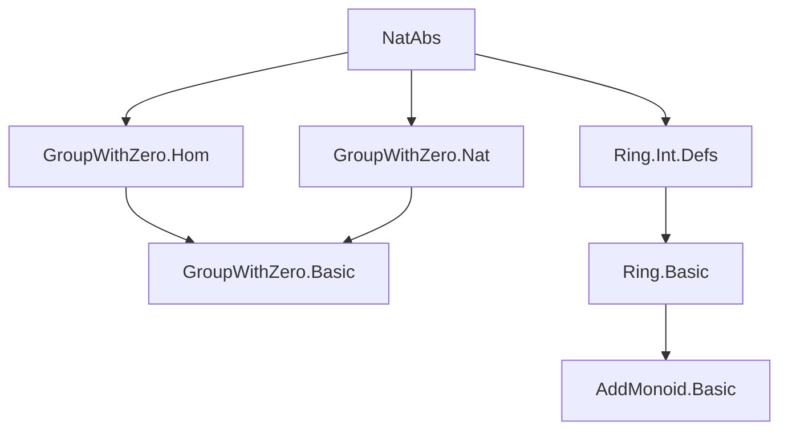
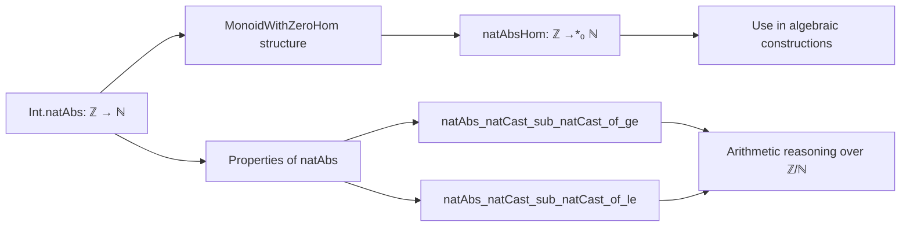

**Technical Brief: `NatAbs.lean` Module**

---

### 1. KEY DEFINITIONS & THEOREMS

| Name | Type | Purpose |
|------|------|---------|
| `Int.natAbsHom` | `ℤ →*₀ ℕ` | Bundled monoid-with-zero homomorphism version of `Int.natAbs`, mapping integers to their natural absolute value. |
| `Int.natAbs_natCast_sub_natCast_of_ge` | `∀ {a b : ℕ}, b ≤ a → Int.natAbs (↑a - ↑b) = a - b` | Relates `natAbs` of a difference of naturals (cast to integers) to the natural difference when $b \le a$. |
| `Int.natAbs_natCast_sub_natCast_of_le` | `∀ {a b : ℕ}, a ≤ b → Int.natAbs (↑a - ↑b) = b - a` | Same as above, but for $a \le b$, yielding the reversed natural difference. |

*Note:* `Int.natAbs_mul`, `Int.natAbs_one`, `Int.natAbs_zero` are used internally in the definition of `natAbsHom`, but are not defined in this file — they are assumed from prior imports.

---

### 2. NAMING CONVENTIONS

- **Prefixes**:
  - `natAbs_`: Used for lemmas about `Int.natAbs`.
  - `natCast_sub_natCast`: Indicates reasoning about subtraction of natural numbers after coercion to integers (`↑a - ↑b`).
- **Suffixes**:
  - `_of_ge`, `_of_le`: Distinguish cases based on ordering hypotheses (`b ≤ a`, `a ≤ b`).
- **Bundled morphism naming**:
  - `natAbsHom`: Follows Lean/Mathlib convention of appending `Hom` to denote bundled homomorphisms.

---

### 3. TACTIC STACK

- **`lia`**: Used in both lemmas — Linear Integer Arithmetic solver, appropriate for handling linear inequalities and equalities over `ℕ`/`ℤ`, especially with coercion (`↑`).

No other tactics appear explicitly in this file.

---

### 4. PROOF LOGIC

- **Structure**: Short, direct proofs.
- **Strategy**:
  - For each lemma, the proof reduces the goal to a linear arithmetic statement over `ℕ` and `ℤ`, leveraging coercion properties (`↑(a - b) = ↑a - ↑b` under the given ordering).
  - `lia` automatically discharges the resulting goals by reasoning about natural subtraction and integer absolute value definitions.

No induction, cases, or rewriting beyond what `lia` handles internally.

---

### 5. IMPORTS (PRIMARY DEPENDENCIES)

| Module | Role |
|--------|------|
| `Mathlib.Algebra.GroupWithZero.Hom` | Provides `MonoidWithZeroHom` typeclass and homomorphism infrastructure. |
| `Mathlib.Algebra.GroupWithZero.Nat` | Contains `Int.natAbs_mul`, `Int.natAbs_one`, `Int.natAbs_zero`, and related lemmas about `natAbs`. |
| `Mathlib.Algebra.Ring.Int.Defs` | Defines `ℤ`, coercion `↑: ℕ → ℤ`, subtraction, and basic arithmetic on integers. |

These imports collectively provide the algebraic and arithmetic foundation needed to define and reason about `Int.natAbs`.

---

### 6. DEPENDENCY & THEORY OVERVIEW (Mermaid Diagrams)

#### Module Dependency Graph

#### File-Level Theory Flow

#### Role in Mathlib

- `NatAbs.lean` serves as a **bridge** between integer arithmetic and natural-number-valued constructions.
- It enables *bundled* morphism usage (e.g., in universal property arguments, category-theoretic constructions).
- The lemmas support simplification of expressions involving `natAbs` of differences of naturals — common in formalizations of valuation theory, divisibility, and metric completions.

--- 

Let me know if you'd like a formalized dependency graph (e.g., `leanproject show-deps`) or expansion into related files (e.g., `Int.Abs`, `Int.natAbs_eq_natAbs`, `Int.natAbs_eq_iff`).
