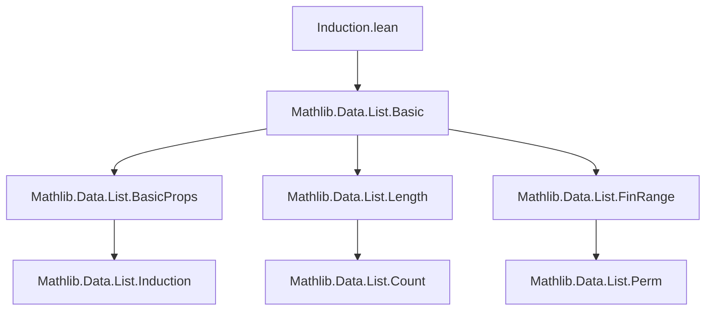

### Technical Brief: Induction Principles for Lists in Lean 4 (`Induction.lean`)

---

#### **1. Key Definitions & Theorems**

| Name | Type / Signature | Purpose |
|------|------------------|---------|
| `reverseRecOn` | `{motive : List α → Sort*} → List α → motive [] → (∀ l a, motive l → motive (l ++ [a])) → motive l` | Right-induction on lists: prove/construct for `l` by building up from `[]` via `l ++ [a]`. Uses `reverse` to reduce to standard left-recursion. |
| `reverseRecOn_nil` | `reverseRecOn [] nil append_singleton = nil` | Simplification lemma for base case. |
| `reverseRecOn_concat` | `reverseRecOn (xs ++ [x]) = append_singleton _ _ (reverseRecOn xs)` | Simplification lemma for concatenation with singleton. |
| `bidirectionalRec` | `{motive : List α → Sort*} → motive [] → (∀ a, motive [a]) → (∀ a l b, motive l → motive (a :: (l ++ [b]))) → ∀ l, motive l` | Bidirectional induction: handles palindromic structure via `a :: (l ++ [b])`. Base cases: `[]`, `[a]`. |
| `bidirectionalRec_nil` | `bidirectionalRec [] = nil` | Base case simplification. |
| `bidirectionalRec_singleton` | `bidirectionalRec [a] = singleton a` | Singleton case simplification. |
| `bidirectionalRec_cons_append` | `bidirectionalRec (a :: (l ++ [b])) = cons_append a l b (bidirectionalRec l)` | Recursive step simplification. |
| `bidirectionalRecOn` | `abbrev bidirectionalRecOn l H0 H1 Hn := bidirectionalRec H0 H1 Hn l` | Convenience variant with list argument first (for `elab_as_elim`). |
| `recNeNil` | `{motive : (l : List α) → l ≠ [] → Sort*} → (∀ x, motive [x] _) → (∀ x xs h, motive xs h → motive (x :: xs) _) → ∀ l h, motive l h` | Dependent recursion on *nonempty* lists, avoiding `[]`. Useful for partial ops like `head`. |
| `recNeNil_singleton` | `recNeNil ... [x] = singleton x` | Base case for nonempty recursion. |
| `recNeNil_cons` | `recNeNil ... (x :: xs) = cons ... (recNeNil ... xs)` | Recursive step for nonempty recursion. |
| `recOnNeNil` | `abbrev recOnNeNil l h ... := recNeNil ... l h` | Convenience variant with list first. |
| `twoStepInduction` | `{motive : List α → Sort*} → motive [] → (∀ x, motive [x]) → (∀ x y xs, motive xs → (∀ y, motive (y :: xs)) → motive (x :: y :: xs)) → ∀ l, motive l` | Two-step induction: handles lists of length ≥2 by assuming property for `xs` and all `y :: xs`. |
| `twoStepInduction_nil` | `twoStepInduction [] = nil` | Base case simplification. |
| `twoStepInduction_singleton` | `twoStepInduction [x] = singleton x` | Singleton case simplification. |
| `twoStepInduction_cons_cons` | `twoStepInduction (x :: y :: xs) = cons_cons ...` | Recursive step simplification. |

---

#### **2. Naming Conventions**

- **Prefixes**:
  - `reverseRecOn`: Combines `reverse` + `recOn` (recursion on reversed list).
  - `bidirectionalRec` / `bidirectionalRecOn`: Indicates *bidirectional* construction (both ends).
  - `recNeNil` / `recOnNeNil`: `NeNil` = *nonempty list* (≠ `[]`).
  - `twoStepInduction`: Indicates *two-step* (length ≥2) induction.

- **Suffixes**:
  - `On`: Variant where the list argument comes first (for `elab_as_elim`).
  - `nil`, `singleton`, `concat`, `cons_append`, `cons_cons`: Reflect the structural cases handled.

- **Pattern**:
  - `recOn` / `inductionOn` → `On` suffix for list-first argument order.
  - `recNeNil` → `recOnNeNil` for convenience.

---

#### **3. Tactic Stack**

Frequent tactics used in proofs and definitions:

| Tactic | Usage |
|--------|-------|
| `match` | Pattern-matching on lists (e.g., `reverse l`, `l`). |
| `cast` | Transport along propositional equalities (e.g., `reverse l = ...`). |
| `congr` + `congr_arg` | Build equality of types for casting. |
| `simpa using` | Simplify goal using an assumption. |
| `rw [← ...]` | Rewrite using reversed equalities (e.g., `← dropLast_append_getLast`). |
| `simp_wf` | Simplify well-foundedness obligations. |
| `grind` | Custom tactic (likely from Mathlib) for grinding through simplifications. |
| `conv_lhs => unfold ...` | Stepwise unfolding in convolution. |
| `cases l with grind` | Case analysis on list structure. |
| `rfl` | Reflexivity for definitional equalities. |

---

#### **4. Proof Logic**

- **Inductive structure**:
  - All principles follow *structural induction* over lists, but with *nonstandard base cases*:
    - `reverseRecOn`: Base `[]`, step `l → l ++ [a]`.
    - `bidirectionalRec`: Base `[]`, `[a]`, step `l → a :: (l ++ [b])`.
    - `recNeNil`: Only for `l ≠ []`, base `[x]`, step `x :: xs`.
    - `twoStepInduction`: Base `[]`, `[x]`, step `x :: y :: xs` (requires `motive xs` and `∀ y, motive (y :: xs)`).

- **Termination & correctness**:
  - `reverseRecOn` uses `l.length` as measure; decreasing proof uses `length_reverse`.
  - `bidirectionalRec` uses `l.length`; decreasing proof via `dropLast` reduces length.
  - `recNeNil` and `twoStepInduction` rely on structural recursion (Lean’s inductive type recursion).

- **Dependence**:
  - All principles support *dependent* predicates (`motive : List α → Sort*`), enabling data construction (e.g., extracting head/tail, building palindromes).

---

#### **5. Imports & Dependencies**

- **Core import**:
  ```lean
  import Mathlib.Data.List.Basic
  ```
  - Provides foundational list definitions: `[]`, `::`, `++`, `reverse`, `dropLast`, `getLast`, `length`, etc.

- **Assumed lemmas** (used implicitly):
  - `length_reverse`: `length (reverse l) = length l`
  - `dropLast_append_getLast`: For nonempty `l`, `dropLast l ++ [getLast l h] = l`
  - `cons_ne_nil`: `x :: xs ≠ []`

---

#### **6. Mermaid Diagrams**

##### **Dependency Graph (Module-Level)**



> *Note*: `Induction.lean` builds on basic list infrastructure and may depend on lemmas from `List.BasicProps`, `Length`, etc., though only `List.Basic` is explicitly imported.

##### **Overview of List Induction Principles**

```mermaid
graph LR
  ListInduction --> ReverseRecOn
  ListInduction --> BidirectionalRec
  ListInduction --> RecNeNil
  ListInduction --> TwoStepInduction

  ReverseRecOn -->|uses| Reverse
  BidirectionalRec -->|uses| DropLast, GetLast
  RecNeNil -->|avoids| EmptyList
  TwoStepInduction -->|handles| Length≥2

  BidirectionalRec --> Palindromes
  RecNeNil --> HeadTailOps
```

> **Use cases**:
> - `reverseRecOn`: When it’s easier to build lists from the *right* (`l ++ [a]`).
> - `bidirectionalRec`: For *symmetric* list properties (e.g., palindromes: `a :: l ++ [b]`).
> - `recNeNil`: For *partial* operations (e.g., `head`, `last`) where `[]` is excluded.
> - `twoStepInduction`: When inductive step requires *two prior elements* (e.g., Fibonacci-like list functions).

---

### Summary

This module provides **four specialized induction/recursion principles** for lists, each tailored to structural patterns beyond standard left-recursion. They enable clean formalization of:
- Right-associative list constructions (`reverseRecOn`),
- Palindromic or symmetric properties (`bidirectionalRec`),
- Nonempty-list operations (`recNeNil`),
- Two-step structural dependencies (`twoStepInduction`).

All are *dependent*, *data-construction-capable*, and leverage Lean’s `elab_as_elim` for seamless use in `match`-style proofs.
