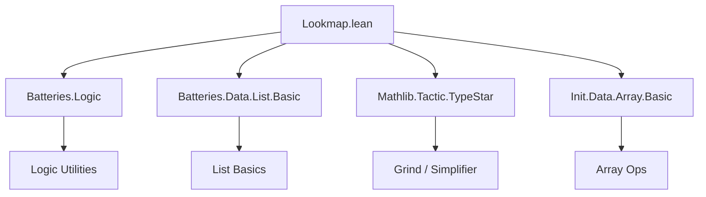
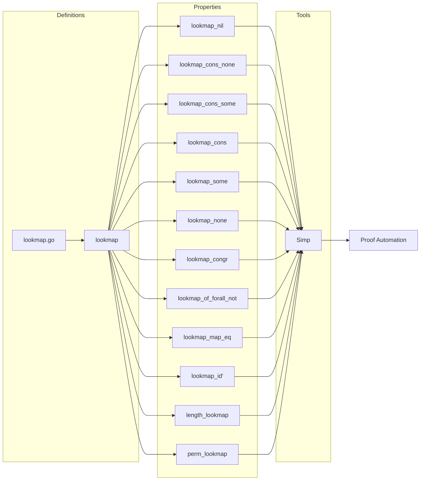
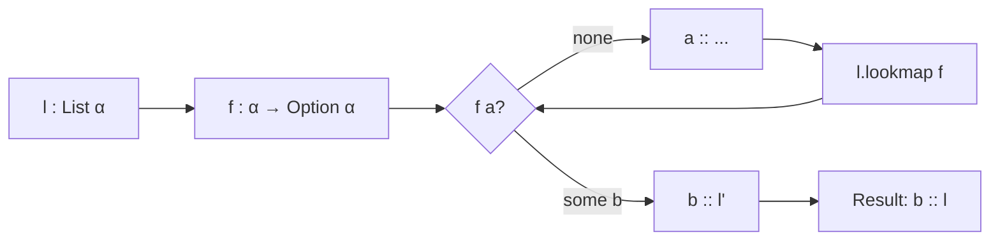

### Technical Brief: `Lookmap.lean`

---

#### **1. Key Definitions & Theorems**

| Name | Type / Signature | Purpose |
|------|------------------|---------|
| `lookmap.go` | `f : α → Option α → Array α → Array α` | Internal accumulator-based helper for `lookmap`, defined recursively over list and array. |
| `lookmap` | `f : α → Option α → List α → List α` | Applies `f` to each element in order; if `f a = some b`, replaces `a` with `b` and stops processing rest of list; if `f a = none`, keeps `a` and continues. |
| `lookmap_nil` | `[] .lookmap f = []` | Base case simplification. |
| `lookmap_cons_none` | `f a = none ⇒ (a :: l).lookmap f = a :: l.lookmap f` | When `f` returns `none`, keep element and recurse. |
| `lookmap_cons_some` | `f a = some b ⇒ (a :: l).lookmap f = b :: l` | When `f` returns `some b`, replace `a` with `b` and *stop* recursing (i.e., do not process `l`). |
| `lookmap_cons` | General case: `(a :: l).lookmap f = match f a with ...` | Unifies `none`/`some` cases via pattern matching. |
| `lookmap_some` | `l.lookmap some = l` | Applying `some` everywhere leaves list unchanged. |
| `lookmap_none` | `l.lookmap (fun _ ↦ none) = l` | Applying `none` everywhere keeps all elements. |
| `lookmap_congr` | `(∀ a ∈ l, f a = g a) ⇒ l.lookmap f = l.lookmap g` | Extensionality: if `f` and `g` agree on elements of `l`, results are equal. |
| `lookmap_of_forall_not` | `(∀ a ∈ l, f a = none) ⇒ l.lookmap f = l` | Special case of `lookmap_congr` + `lookmap_none`. |
| `lookmap_map_eq` | `(∀ a b, b ∈ f a → g a = g b) ⇒ map g (l.lookmap f) = map g l` | If `g` is constant on `f`-images, mapping after `lookmap` equals mapping before. |
| `lookmap_id'` | `(∀ a b, b ∈ f a → a = b) ⇒ l.lookmap f = l` | If `f` only returns equal or same element, `lookmap` is identity. |
| `length_lookmap` | `length (l.lookmap f) = length l` | `lookmap` preserves list length (even though it may replace elements, it never drops or adds). |
| `perm_lookmap` | Under pairwise uniqueness condition on `f`-images, `l₁ ~ l₂ ⇒ lookmap f l₁ ~ lookmap f l₂` | `lookmap` respects permutation equivalence under injectivity-like constraints on `f`. |

---

#### **2. Naming Conventions**

- **Prefixes**:
  - `lookmap_`: main operation prefix.
  - `go_`: internal accumulator-based helper (`lookmap.go`).
- **Suffixes**:
  - `_nil`, `_cons_none`, `_cons_some`, `_cons`: case analysis patterns.
  - `_some`, `_none`: constant function variants.
  - `_congr`, `_id'`, `_map_eq`: structural properties (equality, identity, mapping).
  - `_length`, `_perm`: measure/structure preservation.

---

#### **3. Tactic Stack**

Frequent tactics used:
- `simp` / `simp only` / `simp_all`: for simplifying `lookmap`, `Array.toListAppend`, `append`, etc.
- `rw`: rewriting using lemmas like `lookmap.go_append`, `h`, etc.
- `cases`: destructing `f a`, `l`, or `h : f a = ...`.
- `rfl`: reflexivity for definitional equalities.
- `congr_arg`: for congruence of function application.
- `induction`: on permutations (`Perm`) or lists.
- `grind =`: custom simplifier hint (likely from `grind` tactic in Batteries).
- `obtain`, `rcases`, `exact`, `refine`: for structured proof construction.
- `pairwise_cons`, `mem_cons`, `swap`, `trans`: for permutation reasoning.

---

#### **4. Proof Logic**

- **Inductive structure**: Proofs often proceed by:
  1. **List induction** (e.g., `lookmap_some`, `lookmap_none`, `lookmap_congr`, `lookmap_map_eq`, `length_lookmap`).
  2. **Case analysis on `f a`** (`none` vs `some b`) to split behavior.
  3. **Permutation induction** for `perm_lookmap`, using `Perm` constructors (`nil`, `cons`, `swap`, `trans`).
- **Key logical pattern**:
  - Prove base case (`[]`) trivially.
  - For `a :: l`, decompose using `lookmap_cons` or `lookmap_cons_*`.
  - Use `lookmap.go_append` to relate accumulator-based definition to final list.
  - For permutation invariance, enforce injectivity via `Pairwise` condition to avoid collisions in replacements.

---

#### **5. Imports**

| Module | Role |
|--------|------|
| `Batteries.Logic` | Logical utilities (e.g., `forall_mem_cons`, `Pairwise`). |
| `Batteries.Data.List.Basic` | Core list operations and lemmas. |
| `Mathlib.Tactic.TypeStar` | Possibly for `grind` or advanced simplification. |
| `Init.Data.Array.Basic` | Array operations (`Array.toListAppend`, `push`, etc.) used in `lookmap.go`. |

---

#### **6. Mermaid Diagrams**

##### **Dependency Graph (Module-Level)**

##### **Theoretical Overview (Data Flow)**

##### **Operational Semantics (High-Level)**

---

#### **7. Summary**

`Lookmap.lean` formalizes a *partial map* operation over lists: for each element, apply a function `f : α → Option α`; if `f a = some b`, replace `a` with `b` and *terminate* processing; if `f a = none`, keep `a` and continue. This is distinct from standard `map`, which processes all elements.

The theory emphasizes:
- **Deterministic behavior** (left-to-right, early termination on `some`).
- **Preservation properties** (length, permutation, mapping).
- **Equational reasoning** with `simp`-friendly lemmas (`@[simp]`, `@[grind =]`).
- **Formal correctness** via lemmas like `lookmap_congr`, `lookmap_id'`, and `perm_lookmap`.

It serves as a foundational utility for list transformations where element replacement may short-circuit evaluation — useful in symbolic computation, program transformation, or verification of stateful list algorithms.
