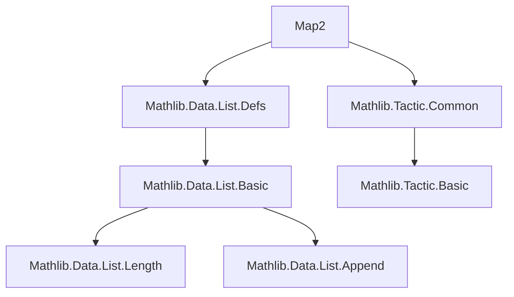
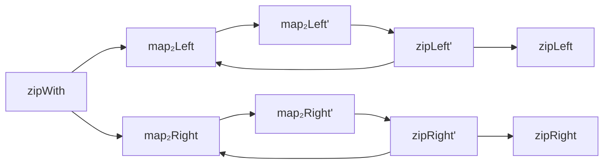

**Technical Brief: `Map2.lean` — List Zipping and Mapping Lemmas**

---

### **1. Key Definitions & Theorems**

| Name | Type / Signature | Purpose |
|------|------------------|---------|
| `map₂Left'` | `(α → Option β → γ) → List α → List β → (List γ × List β)` | Partial binary map: consumes left list fully; right list may be exhausted early. Returns pair of output list and *remaining* right list. |
| `map₂Right'` | `(Option α → β → γ) → List α → List β → (List γ × List α)` | Dual of `map₂Left'`: consumes right list fully; returns pair of output list and *remaining* left list. |
| `zipWith` | `(α → β → γ) → List α → List β → List γ` | Standard zipping with function: stops at shorter list. |
| `zipLeft'` | `List α → List β → (List (α × Option β) × List β)` | Zips left list fully; right list may be exhausted. Returns list of `(a, some b)` or `(a, none)` and remaining right list. |
| `zipRight'` | `List α → List β → (List (Option α × β) × List α)` | Dual of `zipLeft'`: zips right list fully; returns list of `(some a, b)` and remaining left list. |
| `map₂Left` | `(α → Option β → γ) → List α → List β → List γ` | Total version of `map₂Left'`: discards remaining right list. |
| `map₂Right` | `(Option α → β → γ) → List α → List β → List γ` | Total version of `map₂Right'`: discards remaining left list. |
| `zipLeft` | `List α → List β → List (α × Option β)` | Zips left list fully; pads missing right elements with `none`. |
| `zipRight` | `List α → List β → List (Option α × β)` | Zips right list fully; pads missing left elements with `none`. |

**Key Theorems (selected):**

- `map₂Left'_nil_right`: `map₂Left' f as [] = (as.map (λ a => f a none), [])`
- `map₂Right'_cons_cons`: `map₂Right' f (a::as) (b::bs) = (f (some a) b :: r.fst, r.snd)` where `r := map₂Right' f as bs`
- `zipWith_flip`: `zipWith (flip f) bs as = zipWith f as bs`
- `map₂Left_eq_zipWith`: If `length as ≤ length bs`, then `map₂Left f as bs = zipWith (λ a b => f a (some b)) as bs`
- `map₂Right_eq_zipWith`: If `length bs ≤ length as`, then `map₂Right f as bs = zipWith (λ a b => f (some a) b) as bs`
- `zipLeft_eq_zipLeft'`: `zipLeft as bs = (zipLeft' as bs).fst`
- `zipRight_eq_zipRight'`: `zipRight as bs = (zipRight' as bs).fst`

---

### **2. Naming Conventions**

- **Prefixes**:
  - `map₂Left'`, `map₂Right'`: *prime* variants return *pair* (output + remainder).
  - `map₂Left`, `map₂Right`: *non-prime* variants return only output list.
  - `zipLeft'`, `zipRight'`: *prime* variants return pair (zipped list + remainder).
  - `zipLeft`, `zipRight`: *non-prime* variants return only zipped list.

- **Suffixes**:
  - `_nil_left`, `_nil_right`, `_nil_cons`, `_cons_cons`: pattern-matching cases on list structure.

- **Functional naming**:
  - `flip`, `some`, `none`: standard `Option` and function combinators.
  - `eq_*`: theorems linking variants (e.g., `map₂Left_eq_map₂Left'`).

---

### **3. Tactic Stack**

- **`rfl`**: Dominant tactic — most theorems are definitional equalities.
- **`cases`**: Used to destruct lists (`as`, `bs`) or naturals.
- **`simp` / `simp!`**: Heavily used, especially with `@[simp]` lemmas.
- **`induction`**: Used in `zipRight_eq_zipRight'` and `zipLeft_eq_zipLeft'`.
- **`rw`**: For rewriting using equalities like `zipLeft_eq_zipLeft'`.
- **`cons_inj_right`**: Used to simplify equality of cons-lists.

No heavy automation (e.g., `linarith`, `omega`, `ring`) — proofs are mostly structural.

---

### **4. Proof Logic**

- **Inductive structure**: All proofs follow the recursive structure of the functions.
- **Pattern-matching on lists**: Most proofs split into cases:
  - `[]`, `b :: bs`
  - `[]`, `a :: as`
  - `a :: as`, `b :: bs`
- **Definitional reasoning**: Most equalities hold *by definition* (`rfl`), especially for `@[simp]` lemmas.
- **Inductive lemmas**: For non-definitional links (e.g., `zipLeft_eq_zipLeft'`), induction on one list with case analysis on the other is used.
- **Length-based reasoning**: In `map₂Left_eq_zipWith` and `map₂Right_eq_zipWith`, length inequalities are used to ensure the zipping function behaves like `zipWith`.

---

### **5. Imports**

- `Mathlib.Data.List.Defs`: Core list definitions (`map`, `zipWith`, `zipLeft'`, etc.)
- `Mathlib.Tactic.Common`: Standard tactics (`simp`, `rfl`, `cases`, etc.)

No algebraic or order-theoretic imports — purely list-theoretic.

---

### **6. Theory Overview & Dependencies**

#### **Mermaid Diagram: Module Dependencies**

#### **Mermaid Diagram: Conceptual Dependency of `Map2`**

#### **Scope of Theory**

- **Purpose**: Provide foundational lemmas for *asymmetric* list zipping and mapping, especially when one list may be longer than the other.
- **Use Cases**:
  - Partial binary operations on lists (e.g., `Option`-valued results).
  - Padding or truncating behavior in zipping.
  - Linking `map₂*` and `zip*` families via definitional or length-constrained equalities.
- **Notable Absences**:
  - No commutativity/associativity of `zipWith` (handled elsewhere).
  - No monadic or categorical generalizations (e.g., `Traversable`).
  - No interaction with `foldl`/`foldr` or `filter`.

---

### **7. Summary**

`Map2.lean` is a *lean*, *definitional*, and *case-analytic* theory of list zipping and mapping variants. It formalizes the relationship between *partial* (`map₂*'`) and *total* (`map₂*`) zippers, and between *remainder-returning* (`*'`) and *remainder-discarding* (`*`) versions. The file is a foundational building block for higher-level list transformations in `Mathlib`, especially where list length mismatches matter.

--- 

*End of Technical Brief.*
