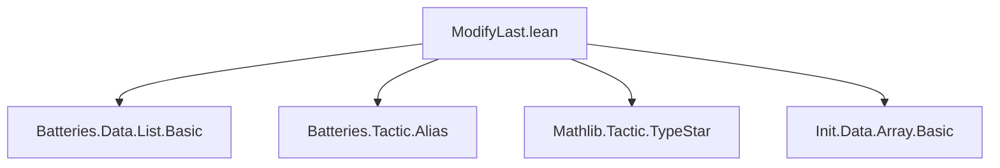
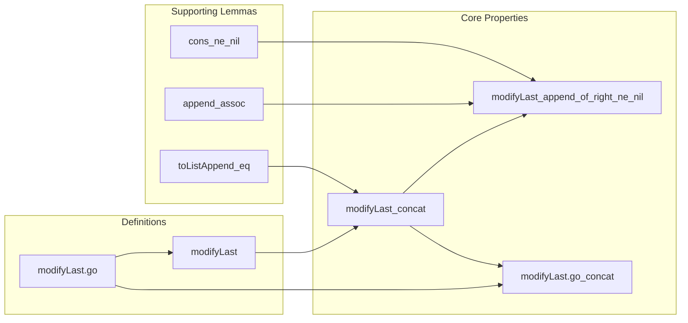
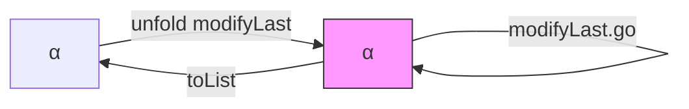

**Technical Brief: `List.modifyLast` in Lean 4 (Source: `ModifyLast.lean`)**

---

### 1. **Key Definitions & Theorems**

| Name | Type | Purpose |
|------|------|---------|
| `modifyLast.go` | `List α → Array α → Array α` | Internal accumulator-based helper for `modifyLast`, traversing the list and updating only the last element via `f`. |
| `modifyLast` | `(α → α) → List α → List α` | Applies `f` to the *last* element of a non-empty list; leaves empty list unchanged. Defined via `modifyLast.go` and conversion between `List` and `Array`. |
| `modifyLast.go_concat` | `∀ f a tl r, modifyLast.go f (tl ++ [a]) r = r.toListAppend <| modifyLast.go f (tl ++ [a]) #[]` | Technical lemma showing how `modifyLast.go` behaves on a list appended with a singleton; key for reasoning about concatenation. |
| `modifyLast_concat` | `∀ f a l, modifyLast f (l ++ [a]) = l ++ [f a]` | Core correctness property: applying `modifyLast f` to a list ending in `a` yields the original prefix `l` plus `f a` at the end. |
| `modifyLast_append_of_right_ne_nil` | `∀ f l₁ l₂, l₂ ≠ [] → modifyLast f (l₁ ++ l₂) = l₁ ++ modifyLast f l₂` | Generalizes `modifyLast_concat`: when the suffix `l₂` is non-empty, `modifyLast` distributes over `++` with the transformation only on the suffix. |

> Note: `modifyLast` is *partial* in practice (only meaningful on non-empty lists), but the definition handles `[]` trivially (returns `[]`).

---

### 2. **Naming Conventions**

- **Prefixes**:
  - `modifyLast.go_`: internal helper lemmas (e.g., `modifyLast.go_concat`).
  - `modifyLast_`: main properties of `modifyLast` (e.g., `modifyLast_concat`, `modifyLast_append_of_right_ne_nil`).
- **Suffixes**:
  - `_concat`: for lemmas involving `++ [a]` (singleton concatenation).
  - `_append_of_right_ne_nil`: for lemmas about appending with a non-empty right argument.

---

### 3. **Tactic Stack**

Frequent tactics used in proofs:
- `cases`: structural induction on lists (`l`, `tl`, `hd`, etc.).
- `simp only [...]`: targeted simplification using `modifyLast`, `modifyLast.go`, `Array.toListAppend_eq`, `Array.toList_push`, `nil_append`, `cons_append`, etc.
- `rw [...]`: rewriting using previously proven lemmas (e.g., `modifyLast.go_concat`, `modifyLast_concat`).
- `exact`: closing goals with direct evidence (e.g., `cons_ne_nil _ _`).
- `all_goals { ... }`: uniform tactic application across multiple subgoals.

No heavy automation (e.g., `ring`, `linarith`, `aesop`) — proofs are mostly *manual structural reasoning*.

---

### 4. **Proof Logic**

- **Induction pattern**: Structural induction on lists (typically on `l` or `tl`).
- **Case splitting**:
  - On `l = []` vs `l = h :: t`.
  - On `l₂ = []` (contradiction via `l₂ ≠ []`) vs `l₂ = h :: t`.
  - Further on `t = []` vs `t = h' :: t'` (for `modifyLast_append_of_right_ne_nil`).
- **Key reasoning steps**:
  1. Unfold `modifyLast` and `modifyLast.go`.
  2. Use `modifyLast.go_concat` to reduce to `Array` operations.
  3. Simplify using `Array.toListAppend_eq`, `Array.toList_push`, and list identities (`nil_append`, `cons_append`, `append_assoc`).
  4. Apply injectivity (`cons_inj_right`) or non-emptiness lemmas (`cons_ne_nil`).

---

### 5. **Imports & Dependencies**

| Import | Role |
|--------|------|
| `Batteries.Data.List.Basic` | Core list operations and lemmas (e.g., `append`, `nil`, `cons`, `++`). |
| `Batteries.Tactic.Alias` | Tactical utilities (e.g., `all_goals`). |
| `Mathlib.Tactic.TypeStar` | For `Type*` universe polymorphism. |
| `Init.Data.Array.Basic` | `Array`, `push`, `toListAppend`, `toList`, etc. — essential for the implementation of `modifyLast.go`. |

> The module is self-contained: no external mathlib-specific data structures beyond `Array`.

---

### 6. **Mermaid Diagrams**

#### **Dependency Graph (File-Level)**

#### **Theoretical Overview (Module Scope)**

#### **Data Flow (Implementation)**

> `modifyLast` = `modifyLast.go` (on `Array`) + `toList` conversion.

---

### 7. **Domain-Specific AI Agent Notes**

- **Focus area**: Functional list transformations with *stateful* semantics (last-element update).
- **Typical queries**: 
  - “How does `modifyLast` behave on `l₁ ++ l₂`?” → cite `modifyLast_append_of_right_ne_nil`.
  - “Prove `modifyLast f (xs ++ [x]) = xs ++ [f x]`” → cite `modifyLast_concat`.
- **Proof strategy hint**: “Induct on the list, use `modifyLast.go_concat` to bridge `Array` and `List`.”

--- 

*End of Technical Brief.*
