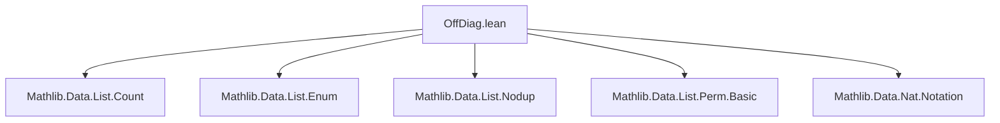
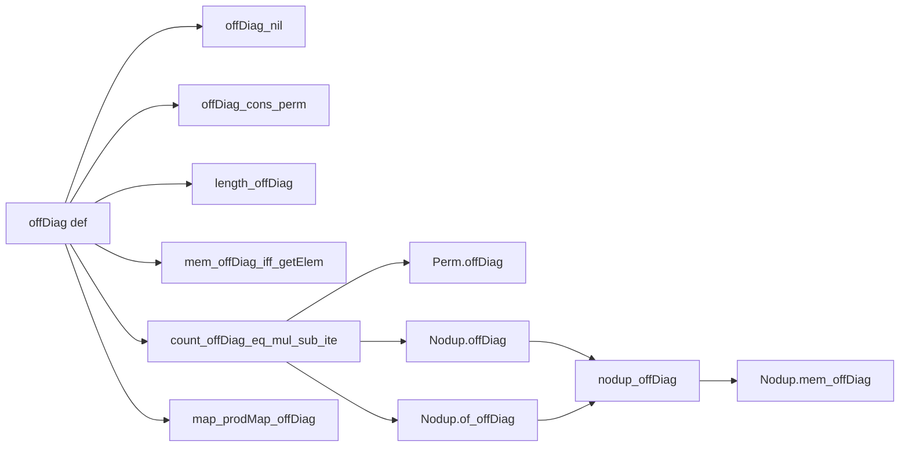
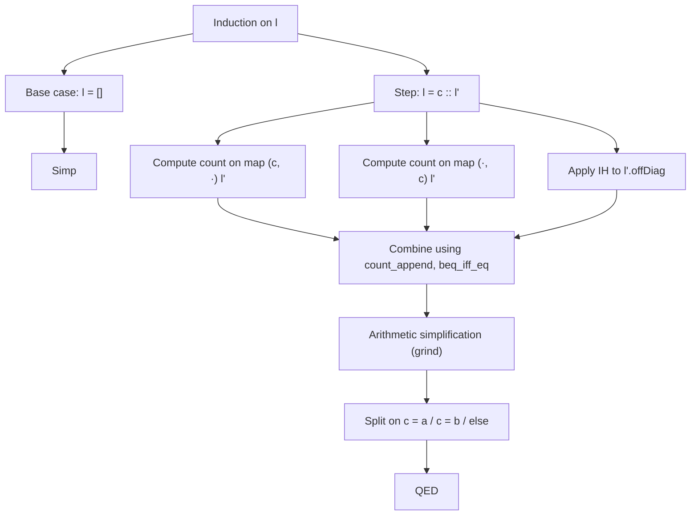

**Technical Brief: `List.offDiag` in Lean 4 (OffDiag.lean)**  
*Based on the formalization in `OffDiag.lean` (2026, Yury Kudryashov)*

---

### 1. Key Definitions & Theorems

| Name | Type / Statement | Purpose |
|------|------------------|---------|
| `offDiag` | `def offDiag (l : List α) : List (α × α)` | Constructs the *off-diagonal* of a list: all ordered pairs `(x, y)` where `x` and `y` appear in `l` at *distinct positions*. Avoids assuming decidable equality via `zipIdx` + `eraseIdx`. |
| `offDiag_nil` | `offDiag [] = []` | Base case: empty list has empty off-diagonal. |
| `offDiag_cons_perm` | `offDiag (a :: l) ~ map (a, ·) l ++ map (·, a) l ++ l.offDiag` | Structural decomposition up to permutation: off-diagonal of `a :: l` is permuted concatenation of pairs with `a` in first/second slot and the off-diagonal of `l`. |
| `length_offDiag'` | `length l.offDiag = length l * (length l - 1)` | Exact count of off-diagonal elements (before simplification). |
| `length_offDiag` | `length l.offDiag = length l ^ 2 - length l` | Simplified length formula: $|l|^2 - |l| = |l|(|l|-1)$. |
| `mem_offDiag_iff_getElem` | `x ∈ l.offDiag ↔ ∃ i < |l|, j < |l|, i ≠ j ∧ l[i] = x.1 ∧ l[j] = x.2` | Membership characterization via indices (no need for decidable equality). |
| `count_offDiag_eq_mul_sub_ite` | `count (a, b) l.offDiag = count a l * count b l - if a = b then count a l else 0` | Counts occurrences of a pair `(a, b)` in off-diagonal: product of counts minus correction if $a = b$. |
| `Perm.offDiag` | `l₁ ~ l₂ → l₁.offDiag ~ l₂.offDiag` | Off-diagonal respects list permutation. |
| `Nodup.offDiag` | `l.Nodup → l.offDiag.Nodup` | If `l` has no duplicates, then `offDiag l` has no duplicates. |
| `Nodup.of_offDiag` | `l.offDiag.Nodup → l.Nodup` | Converse: if off-diagonal is duplicate-free, then `l` is. |
| `nodup_offDiag` | `l.offDiag.Nodup ↔ l.Nodup` | Equivalence: off-diagonal is duplicate-free iff original list is. |
| `Nodup.mem_offDiag` | `l.Nodup → (x ∈ l.offDiag ↔ x.1 ∈ l ∧ x.2 ∈ l ∧ x.1 ≠ x.2)` | Simplified membership when `l` has no duplicates: pairs of distinct elements from `l`. |
| `map_prodMap_offDiag` | `map (Prod.map f f) l.offDiag = (map f l).offDiag` | Functoriality: applying `f` componentwise commutes with `offDiag`. |

---

### 2. Naming Conventions

- **`offDiag`**: Core definition; no prefix/suffix beyond descriptive name.
- **`_nil`, `_singleton`, `_cons_perm`**: Standard pattern for list structural lemmas.
- **`_iff_getElem`**: Characterization via indexed access (`getElem`).
- **`_eq_mul_sub_ite`**: Formula involves multiplication, subtraction, and an `if-then-else` (`ite`) term.
- **`_offDiag` suffix**: Used for properties of `offDiag` (e.g., `nodup_offDiag`, `Nodup.offDiag`).
- **`_prodMap_`**: For lemmas involving `Prod.map`.

---

### 3. Tactic Stack

Frequently used tactics in proofs:

| Tactic | Role |
|--------|------|
| `simp` / `simp_rw` | Simplification using `@[simp]` lemmas and definitional equalities. |
| `induction` | Structural induction on lists (e.g., for `count_offDiag_eq_mul_sub_ite`). |
| `have` / `suffices` | Intermediate lemma introduction. |
| `split_ifs` | Case analysis on `if-then-else` expressions. |
| `congr_left`, `congr_right` | Congruence for `map`, `append`, etc. |
| `perm_iff_count`, `nodup_iff_count_le_one` | Use counting-based characterizations of permutation and nodup. |
| `grind` | Custom tactic (likely from Mathlib’s `Grind` module) for automated arithmetic and simplification. |
| `rw`, `apply`, `exact` | Basic rewriting and proof steps. |
| `classical` | To enable classical reasoning (e.g., decidability assumptions via `Classical.decEq`). |

---

### 4. Proof Logic

- **Inductive structure**: Proofs often proceed by induction on `l`, especially when dealing with `count` or `nodup`.
- **Permutation-based reasoning**: Many properties (e.g., `offDiag_cons_perm`) are proven up to permutation (`~`), leveraging `perm_iff_count`.
- **Counting arguments**: Central to `count_offDiag_eq_mul_sub_ite`, `Nodup.offDiag`, and `Nodup.of_offDiag`. Uses:
  - `count_append`, `count_map_of_injective`, `count_cons`
  - Arithmetic lemmas like `Nat.mul_sub`, `Nat.two_mul`, `Nat.le_mul_self`
- **Index-based reasoning**: `mem_offDiag_iff_getElem` uses `zipIdx`, `eraseIdx`, and `getElem` to avoid decidability assumptions.
- **Equivalence via double implication**: For `nodup_offDiag`, both directions are proven separately (`offDiag` and `of_offDiag`).

---

### 5. Imports & Scope

**Core imports** (define the logical and data-theoretic context):

- `Mathlib.Data.List.Count` — Counting elements in lists, `count`, `nodup_iff_count_le_one`.
- `Mathlib.Data.List.Enum` — `zipIdx`, indexing utilities.
- `Mathlib.Data.List.Nodup` — Duplicate-freeness, `Nodup`, `nodup_iff_count_le_one`.
- `Mathlib.Data.List.Perm.Basic` — Permutation theory (`~`, `perm_iff_count`).
- `Mathlib.Data.Nat.Notation` — Natural number notations (e.g., `^2`, `*`, `-`).

**Scope**:  
This module formalizes *combinatorial properties* of the off-diagonal construction on lists, primarily in the context of finite lists over arbitrary types (no decidability assumed in the definition, but used in some proofs). It sits at the intersection of list combinatorics, permutation theory, and counting.

---

### 6. Mermaid Diagrams

#### Dependency Graph (Module-Level)

#### Overview of `offDiag` Theory

#### Proof Strategy Flow (for `count_offDiag_eq_mul_sub_ite`)

--- 

*End of Technical Brief.*
