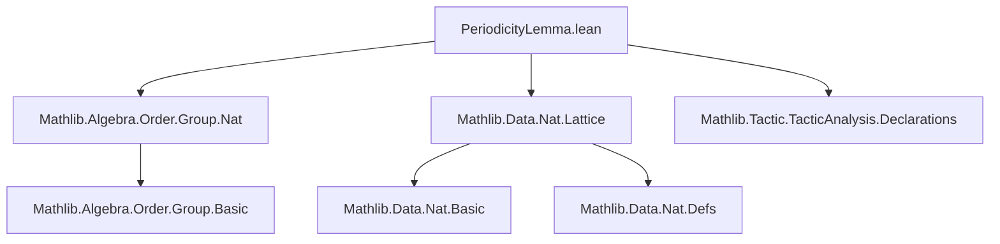
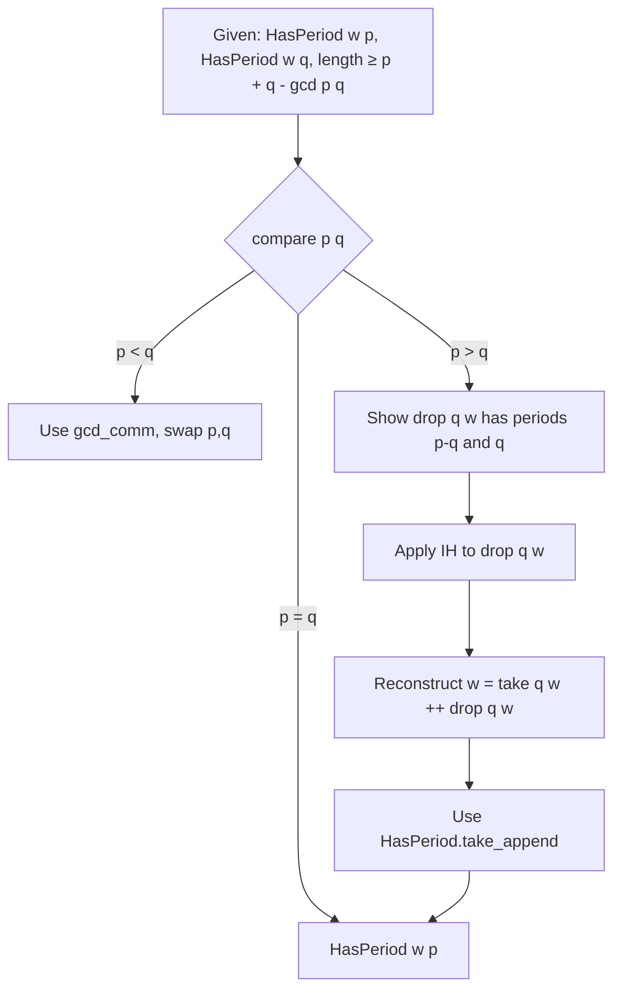

**Technical Brief: `PeriodicityLemma.lean`**

---

### 1. **Key Definitions & Theorems**

| Name | Type / Signature | Purpose |
|------|------------------|---------|
| `HasPeriod w p` | `List α → ℕ → Prop` | Defines that list `w` has period `p`, via self-overlap: `w <+: take p w ++ w`. |
| `hasPeriod_iff_getElem?` | `HasPeriod w p ↔ ∀ i < w.length - p, w[i]? = w[i + p]?` | Equivalent index-based characterization of periodicity. |
| `hasPeriod_iff_forall_getElem?_mod` | `HasPeriod w p ↔ ∀ i < w.length, w[i]? = w[i % p]?` | Modular arithmetic characterization of periodicity. |
| `HasPeriod.getElem?_mod` | `HasPeriod w p → i < w.length → w[i % p]? = w[i]?` | Key lemma: elements repeat modulo `p`. |
| `HasPeriod.factor` | `HasPeriod (u ++ v ++ w) p → HasPeriod v p` | Periods are inherited by factors (subwords). |
| `HasPeriod.infix` | `HasPeriod w p → u <:+: w → HasPeriod u p` | Periods are inherited by infixes (contiguous subwords). |
| `HasPeriod.drop_prefix` | `HasPeriod w p → drop p w <+: w` | Shows that dropping the first `p` elements yields a prefix of `w`. |
| `HasPeriod.take_append` | `p ∣ n → n ≤ w.length → HasPeriod w p → HasPeriod (take n w ++ w) p` | Extends a word leftward by a multiple of `p` while preserving period `p`. |
| `HasPeriod.drop_of_hasPeriod_add` | `HasPeriod w q → HasPeriod w (k + q) → HasPeriod (drop q w) k` | Reduction step: if `w` has periods `q` and `q + k`, then `drop q w` has period `k`. |
| `HasPeriod.gcd` (**Periodicity Lemma**) | `HasPeriod w p → HasPeriod w q → p + q - gcd p q ≤ w.length → HasPeriod w (gcd p q)` | Main theorem: if a long enough word has periods `p` and `q`, it has period `gcd(p, q)`. |

---

### 2. **Naming Conventions**

- **Prefixes**:
  - `hasPeriod_`: lemmas about `HasPeriod`.
  - `HasPeriod.`: methods/lemmas defined *within* the `HasPeriod` namespace (e.g., `HasPeriod.factor`, `HasPeriod.drop_prefix`).
- **Suffixes**:
  - `_iff_`: biconditional characterizations.
  - `_mod`: modular arithmetic versions.
  - `_drop`, `_take`, `_append`: structural operations used in the lemma.
- **Variables**:
  - `w`, `u`, `v`: lists (words).
  - `p`, `q`, `k`, `n`: natural numbers (periods, lengths).
  - `α`: type of alphabet elements.

---

### 3. **Tactic Stack**

Frequently used tactics in proofs:

| Tactic | Usage |
|--------|-------|
| `simp_all` | Simplify all hypotheses and goals using known lemmas (especially `hasPeriod_iff_*`, `getElem?_*`, `take_*`, `drop_*`). |
| `aesop` | Automated reasoning for arithmetic and prefix/order goals. |
| `rw` | Rewrite using equivalences (`hasPeriod_iff_*`, `gcd_*`, `mod_*`). |
| `congrArg` | Congruence for function application (e.g., to shift indices). |
| `calc` | Chain equalities (especially in `getElem?_mod`, `gcd` proof). |
| `by_cases` / `cases` | Split on `p = 0`, `q = 0`, `p < q`, `p = q`, `p > q`, `j < n`, etc. |
| `lia` | Linear integer arithmetic (index bounds, divisibility, inequalities). |
| `grind` | Termination checker for recursive definitions (used in `HasPeriod.gcd`). |
| `convert_to` | Adjust goal to match inductive hypothesis (used in `gcd` proof). |

---

### 4. **Proof Logic**

The core proof of `HasPeriod.gcd` proceeds by **structural induction on `(q, p)`**, mimicking the Euclidean algorithm:

1. **Base cases**: `p = 0` or `q = 0` are trivial (`HasPeriod w 0` always holds).
2. **Compare `p` and `q`**:
   - If `p = q`, done.
   - If `p < q`, swap using `gcd_comm`.
   - If `p > q`, reduce to smaller case:
     - Show `drop q w` has periods `p - q` and `q`.
     - Apply induction hypothesis to `drop q w`.
     - Reconstruct `w = take q w ++ drop q w`, and use `take_append` to lift the period back.
3. **Termination**: `(q, p)` strictly decreases in the `p > q` case (since `p - q < p`).

Key ideas:
- Use of modular arithmetic (`mod`), prefix/suffix decomposition (`take`, `drop`), and factor closure.
- Heavy reliance on `hasPeriod_iff_forall_getElem?_mod` to reduce to element-wise equality.

---

### 5. **Imports & Dependencies**

| Import | Purpose |
|--------|---------|
| `Mathlib.Algebra.Order.Group.Nat` | Ordered additive monoid structure on `ℕ`, used for arithmetic and order reasoning. |
| `Mathlib.Data.Nat.Lattice` | Lattice structure on `ℕ`, especially `gcd`, `dvd`, `min`, `max`. |
| `Mathlib.Tactic.TacticAnalysis.Declarations` | For `termination_by`, `decreasing_by`, and introspection. |

Also uses:
- `List` namespace (standard library).
- `getElem?`, `take`, `drop`, `prefix`, `infix`, `append` operations.

---

### 6. **Mermaid Diagrams**

#### **Dependency Graph (Module-Level)**



#### **Conceptual Overview (Theory Flow)**

```mermaid
flowchart LR
  A[Word = List α] --> B[HasPeriod w p]
  B --> C[Self-overlap: w <+: take p w ++ w]
  B --> D[Index equality: w[i]? = w[i + p]?]
  B --> E[Modular equality: w[i]? = w[i % p]?]
  C --> F[Prefix/drop lemmas]
  D --> G[Factor & infix closure]
  E --> H[Periodicity Lemma: gcd period]
  H --> I[Fine–Wilf theorem]
```

#### **Proof Strategy (for `HasPeriod.gcd`)**



---

### 7. **Tags & Context**

- **Tags**: `periodicity lemma`, `Fine-Wilf theorem`, `period`, `periodicity`
- **Mathlib context**: Part of formalized combinatorics on words; closely related to:
  - `FineWilf.lean` (if exists; may be a more general or alternative formalization).
  - `WordPeriods.lean` (hypothetical companion file).
- **Applications**: Formal verification of string algorithms, automata theory, formal languages.

--- 

Let me know if you'd like a formalized dependency graph (e.g., `.dot`), or a pretty-printed proof script outline.
