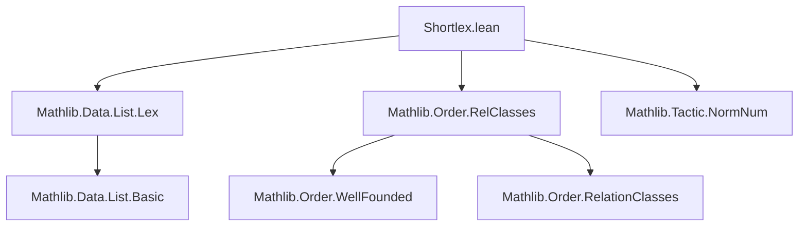

### Technical Brief: `Shortlex.lean`

---

#### **1. Key Definitions & Theorems**

| Name | Type / Signature | Purpose |
|------|------------------|---------|
| `Shortlex {α : Type*} (r : α → α → Prop)` | `List α → List α → Prop` | Defines the *shortlex order* over a relation `r`: `L < M` iff `|L| < |M|` or `|L| = |M| ∧ L <_lex M` under `r`. |
| `Shortlex.of_length_lt` | `s.length < t.length → Shortlex r s t` | If `s` is strictly shorter than `t`, then `s < t` in shortlex order. |
| `Shortlex.of_lex` | `s.length = t.length → List.Lex r s t → Shortlex r s t` | If `s` and `t` have equal length and `s <_lex t`, then `s < t` in shortlex order. |
| `shortlex_def` | `Shortlex r s t ↔ s.length < t.length ∨ s.length = t.length ∧ List.Lex r s t` | Characterization of shortlex order in terms of length and lexicographic order. |
| `shortlex_iff_lex` | `s.length = t.length → (Shortlex r s t ↔ List.Lex r s t)` | Equivalence of shortlex and lexicographic order on equal-length lists. |
| `shortlex_cons_iff` | `[Std.Irrefl r] ⇒ Shortlex r (a :: s) (a :: t) ↔ Shortlex r s t` | Shortlex order is preserved under common cons when the heads are equal (requires irreflexivity). |
| `not_shortlex_nil_right` | `¬ Shortlex r s []` | No list is strictly less than the empty list in shortlex order. |
| `shortlex_nil_or_eq_nil` | `∀ s, Shortlex r [] s ∨ s = []` | Either a list is empty or the empty list is strictly less than it. |
| `shortlex_singleton_iff` | `Shortlex r [a] [b] ↔ r a b` | Shortlex order on singletons reduces to the base relation `r`. |
| `Shortlex.trichotomous` | `[Std.Trichotomous r] ⇒ Std.Trichotomous (Shortlex r)` | Shortlex inherits trichotomy from `r`. |
| `Shortlex.asymm` | `[Std.Asymm r] ⇒ Std.Asymm (Shortlex r)` | Shortlex inherits asymmetry from `r`. |
| `append_right` | `Shortlex r s₁ s₂ → Shortlex r s₁ (s₂ ++ t)` | Appending the same suffix preserves shortlex order. |
| `append_left` | `Shortlex r t₁ t₂ → Shortlex r (s ++ t₁) (s ++ t₂)` | Appending the same prefix preserves shortlex order. |
| `Acc.shortlex` | Helper lemma for well-foundedness proof (inductive step). | Constructs accessibility for `a :: b` assuming accessibility of `a` (under `r`) and `b` (under `Shortlex r`). |
| `wf` | `WellFounded r → WellFounded (Shortlex r)` | Main theorem: shortlex order is well-founded if `r` is. |

---

#### **2. Naming Conventions**

- **Prefixes**:
  - `Shortlex.`: Module namespace for definitions and theorems about the shortlex order.
  - `shortlex_`: Lowercase variants for lemmas (e.g., `shortlex_def`, `shortlex_cons_iff`).
- **Suffixes**:
  - `_of_length_lt`, `_of_lex`: Indicate how the result is derived (by length or lex comparison).
  - `_iff_`: Equivalence lemmas.
  - `_nil_right`, `_nil_or_eq_nil`, `_singleton_iff`: Special cases involving `[]` or singletons.
  - `_append_left`, `_append_right`: Behavior under list concatenation.

---

#### **3. Tactic Stack**

Frequently used tactics in proofs:

| Tactic | Usage |
|--------|-------|
| `simp` / `simp only` | Simplifying definitions (`shortlex_def`, `length_cons`, `lex_singleton_iff`, etc.). |
| `rw` | Rewriting using lemmas (e.g., `length_append`, `add_left_inj`). |
| `rcases` / `cases` | Decomposing existential/disjunction hypotheses (`shortlex_def.mp h`). |
| `apply` / `exact` | Applying accessibility or order lemmas. |
| `induction` | Structural induction on lists or strong induction on natural numbers (`len_a : a.length`). |
| `lia` / `linarith` | Solving linear arithmetic goals (e.g., length inequalities). |
| `intro` | Introducing hypotheses in induction steps. |
| `refine` | Constructing proofs with holes (e.g., `Acc.intro ... fun p lt => ?_`). |
| `have` / `obtain` | Intermediate lemma extraction (e.g., `obtain ⟨head, tail, rfl⟩`). |

---

#### **4. Proof Logic**

The central proof (`wf`) proceeds as follows:

1. **Induction on list length** using `Nat.caseStrongRecOn` (strong induction on `a.length`).
2. **Base case (`length = 0`)**:
   - List is empty: `[]`.
   - Show `Acc (Shortlex r) []` by contradiction: `not_shortlex_nil_right` rules out any `y < []`.
3. **Inductive step (`length = n + 1`)**:
   - Decompose list: `a = head :: tail`.
   - Use `Acc.shortlex` lemma:
     - Induct on accessibility of `head` under `r` (via `WellFounded.apply h head`).
     - Induct on accessibility of `tail` under `Shortlex r` (IH gives `Acc (Shortlex r) tail`).
     - For any `p < a` in shortlex order:
       - Either `|p| < |a|`: handled by strong induction hypothesis (`ih`).
       - Or `|p| = |a|` and `p <_lex a`: decompose lexicographic step (`cons`, `rel`) and apply induction hypotheses (`iha`, `ihb`).
4. **Key insight**: The shortlex order is an *inverse image* of a *lexicographic product* of `<` on `ℕ` and `List.Lex r`, both well-founded under assumptions.

---

#### **5. Imports**

| Import | Purpose |
|--------|---------|
| `Mathlib.Data.List.Lex` | Defines `List.Lex r`, the lexicographic order on lists. |
| `Mathlib.Order.RelClasses` | Provides classes like `WellFounded`, `Std.Trichotomous`, `Std.Asymm`, and tools like `InvImage`. |
| `Mathlib.Tactic.NormNum` | For numeric normalization (used in `lia`/`norm_num`-style reasoning). |

---

#### **6. Mermaid Diagrams**

##### **Dependency Graph (Module-Level)**



##### **Theoretical Overview (Shortlex Construction)**

```mermaid
graph LR
  r[Relation r on α] --> List.Lex r[List.Lex r on List α]
  (< on ℕ) --> Prod.Lex(<, List.Lex r)[Prod.Lex(<, List.Lex r) on ℕ × List α]
  List α -- InvImage (length, id) --> ℕ × List α
  Prod.Lex(<, List.Lex r) -- InvImage --> Shortlex r[Shortlex r on List α]
```

##### **Well-Foundedness Proof Strategy**

```mermaid
graph TD
  wf[WellFounded r] --> Acc_head[Acc r a]
  Acc_head --> Acc_cons[Acc (Shortlex r) (a :: b)]
  Acc_b[Acc (Shortlex r) b] --> Acc_cons
  StrongInduction[Strong induction on length] --> Acc_cons
  shortlex_def[shortlex_def] --> Cases[Case split: length < or =]
  Cases --> IH_len_lt[Use strong IH if shorter]
  Cases --> IH_lex[Use Acc_b / Acc_head if equal length]
```

---

#### **7. Theory Context**

- **Goal**: Prove that *shortlex* extends *well-foundedness* from a base relation `r` to lists.
- **Relation to existing work**:
  - Builds on `List.Lex`, which already handles lexicographic order on lists.
  - Analogous to `DFinsupp.WellFounded`, where lexicographic orders on dependent functions are shown well-founded.
- **Novelty**: Shortlex combines *length-based* and *lexicographic* comparisons — a natural order for term rewriting, Gröbner basis theory, and termination proofs.

--- 

Let me know if you'd like a formalized summary in Lean or a visualization of the `Acc.shortlex` proof tree.
