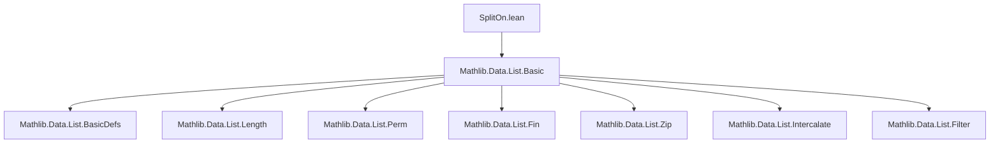
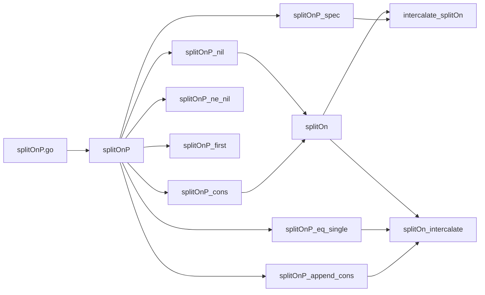

### Technical Brief: `List.splitOn` and `List.splitOnP` in Lean 4

---

#### **1. Key Definitions & Theorems**

| Name | Type / Signature | Purpose |
|------|------------------|---------|
| `splitOnP.go` | `α → List α → List α → List (List α)` | Helper function for `splitOnP`, accumulating reversed prefixes. |
| `splitOnP` | `(p : α → Bool) → List α → List (List α)` | Splits a list at positions where predicate `p` holds (`true`). Returns list of *maximal* contiguous segments *between* satisfying elements. |
| `splitOn` | `[BEq α] → α → List α → List (List α)` | Special case of `splitOnP` for equality with a fixed element `a`: `splitOn a := splitOnP (· == a)` |
| `splitOnP_nil` | `[] . splitOnP p = [[]]` | Base case: empty list splits into one empty segment. |
| `splitOnP_cons` | `(x :: xs).splitOnP p = if p x then [] :: xs.splitOnP p else (xs.splitOnP p).modifyHead (cons x)` | Recursive step: if `p x`, start new segment; else prepend `x` to first segment. |
| `splitOnP_ne_nil` | `xs.splitOnP p ≠ []` | Result of `splitOnP` is never empty. |
| `splitOnP_spec` | `flatten (zipWith (· ++ ·) (splitOnP p as) (((as.filter p).map fun x => [x]) ++ [[]])) = as` | Reconstruction theorem: `as` can be recovered by interleaving segments and separators. |
| `splitOnP_eq_single` | `∀ x ∈ xs, ¬p x → xs.splitOnP p = [xs]` | If no element satisfies `p`, result is singleton list `[xs]`. |
| `splitOnP_append_cons` | `(xs ++ sep :: as).splitOnP p = xs.splitOnP p ++ as.splitOnP p` (if `p sep`) | Splitting over concatenation with separator `sep` splits accordingly. |
| `splitOnP_first` | `∀ x ∈ xs, ¬p x → p sep → (xs ++ sep :: as).splitOnP p = xs :: as.splitOnP p` | First segment is exactly `xs` when `xs` has no `p`-satisfying elements and `sep` does. |
| `intercalate_splitOn` | `[x].intercalate (xs.splitOn x) = xs` | `intercalate [x]` is left inverse of `splitOn x`. |
| `splitOn_intercalate` | `[x].intercalate ls . splitOn x = ls` (under conditions) | `splitOn x` is left inverse of `intercalate [x]` on lists of sublists not containing `x`. |

---

#### **2. Naming Conventions**

- **Predicate-based variants**: `splitOnP` (P for *predicate*), `splitOn` (specialized to equality).
- **Helper functions**: `splitOnP.go` — internal accumulator-based recursion.
- **Properties**: `*_ne_nil`, `*_eq_single`, `*_append_cons`, `*_first`, `*_spec`, `*_intercalate`, `*_splitOn`.
- **Simplification lemmas**: marked with `@[simp]`.
- **Prefixes**: `splitOnP_`, `splitOn_`, `go_`, `modifyHead_`, `flatten_`, `zipWith_`.

---

#### **3. Tactic Stack**

Frequently used tactics in proofs:
- `induction` (with `generalizing`, `with` branches)
- `simp` / `simp only` (with `*`, `h'`, `h`, etc.)
- `split` / `split_ifs` (for `if`-expressions and `Decidable` cases)
- `rw` (with lemmas like `ih`, `hsep`, `h`)
- `congr` (for extensionality)
- `grind` (custom simplifier for equality reasoning, likely from Mathlib’s `grind` tactic)
- `cases` (on lists, `⟨hd, tl⟩`, or `h' : ...`)
- `exact`, `intro`, `intro h`, `by_cases h : ...`
- `have := ...; rw [...]` (local lemma introduction)

---

#### **4. Proof Logic**

- **Inductive structure**: Most proofs proceed by **list induction** on `xs` or `as`.
- **Case analysis**: On `p x` (via `by_cases h : p a`) or `splitOnP`’s internal `if` (via `split`).
- **Accumulator reasoning**: For `splitOnP.go`, use induction with `generalizing acc` and manipulate `modifyHead`, `reverse`, and `append`.
- **Reconstruction proofs**: Use `flatten_zipWith` helper lemma to relate `flatten` and `zipWith`.
- **Inverse properties**: Prove two-sided inverse relationships using:
  - `splitOnP_spec` for full reconstruction,
  - `splitOnP_eq_single` and `splitOnP_first` for boundary cases,
  - `splitOnP_append_cons` for decomposition over concatenation.
- **Decidable equality**: Required for `splitOn` (via `[BEq α]` and `[DecidableEq α]`), used via `beq_iff_eq`, `beq_self_eq_true`.

---

#### **5. Imports**

- `Mathlib.Data.List.Basic` — provides core list operations: `splitOnP`, `intercalate`, `flatten`, `zipWith`, `filter`, `modifyHead`, `BEq`, `DecidableEq`, `append`, `reverse`, etc.

---

#### **6. Mermaid Diagrams**

##### **Dependency Graph (Module-Level)**



##### **Overview of `splitOnP` Theory Flow**



##### **Inverse Relationship Diagram**

```mermaid
graph LR
  X[List α] -- splitOn x --> Y[List (List α)]
  Y -- intercalate [x] --> X
  Y -- splitOn x --> Z[List (List α)]
  Z -- intercalate [x] --> Y
  X -.->|injective| Y
  Y -.->|surjective onto domain| X
  style X fill:#f9f,stroke:#333
  style Y fill:#bbf,stroke:#333
  style Z fill:#bfb,stroke:#333
```

---

#### **7. Summary**

This module formalizes `splitOn` and `splitOnP`, two list-splitting operations:
- `splitOnP p` splits at elements satisfying predicate `p`, returning segments *between* separators.
- `splitOn a` is the special case where `p := (· == a)`.
- Key properties include:
  - **Reconstruction**: `flatten` + `zipWith` recovers original list.
  - **Inverse laws**: `intercalate [x]` and `splitOn x` are mutual inverses on appropriate domains.
- Proofs rely heavily on list induction, case analysis on predicates, and accumulator reasoning.

The formalization is typical of Mathlib style: precise, modular, and heavily annotated with simplification lemmas and specification theorems.
