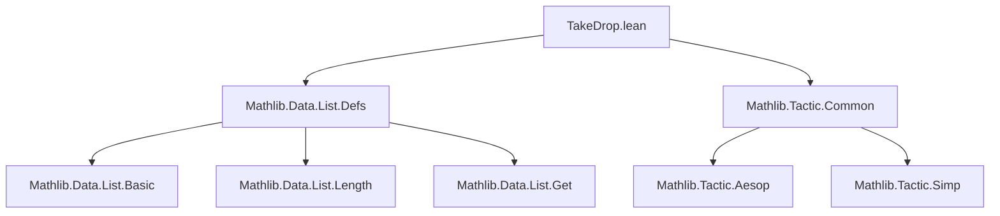

**Technical Brief: `TakeDrop.lean` — Lean 4 Formalization of List `take`, `drop`, and Related Functions**

---

### 1. **Key Definitions & Theorems**

| Name | Type / Signature | Purpose |
|------|------------------|---------|
| `take` | `List α → ℕ → List α` | Returns the first `n` elements of a list (or entire list if `n ≥ length`). |
| `drop` | `List α → ℕ → List α` | Removes the first `n` elements of a list. |
| `takeI` | `ℕ → List α → List α` *(with `[Inhabited α]`)* | Total variant of `take`: pads with default element if list too short. |
| `takeD` | `ℕ → List α → α → List α` | Total variant of `take`: uses explicit default `a` if list too short. |
| `takeWhile` / `dropWhile` | `α → Bool → List α → List α` | Splits list at first element failing predicate `p`. |
| `span` | `(α → Bool) → List α → List α × List α` | Returns `(takeWhile p l, dropWhile p l)`. |
| `dropSlice` | `ℕ → ℕ → List α → List α` | `dropSlice i j xs = xs.take i ++ xs.drop (i + j)` — extracts slice `[i, i+j)` (if available). |
| `getElem` / `get` | `List α → ℕ → α` | Retrieves element at index (with proof of bounds). |
| `getLast` | `l ≠ [] → α` | Returns last element of non-empty list. |

#### Selected Theorems

| Name | Statement | Purpose |
|------|-----------|---------|
| `take_one_drop_eq_of_lt_length` | `n < l.length → (l.drop n).take 1 = [l.get ⟨n, h⟩]` | `drop n` then `take 1` yields singleton of `n`-th element. |
| `take_eq_self_iff` | `x.take n = x ↔ x.length ≤ n` | Characterizes when `take` is identity. |
| `drop_take_append_drop` | `(x.drop m).take n ++ x.drop (m + n) = x.drop m` | Decomposes `drop m` into first `n` and rest. |
| `span_eq_takeWhile_dropWhile` | `span p l = (takeWhile p l, dropWhile p l)` | `span` is definitionally equivalent to splitting via `takeWhile`/`dropWhile`. |
| `takeI_left` | `takeI (length l₁) (l₁ ++ l₂) = l₁` | `takeI` of full length of prefix returns prefix. |
| `takeD_left` | `takeD (length l₁) (l₁ ++ l₂) a = l₁` | Same for `takeD`. |
| `drop_length_sub_one` | `l ≠ [] → l.drop (l.length - 1) = [l.getLast h]` | Final `drop` yields singleton of last element. |
| `length_dropSlice` | `(dropSlice i j xs).length = xs.length - min j (xs.length - i)` | Exact length of slice extraction. |

---

### 2. **Naming Conventions**

- **Prefixes**:
  - `take`, `drop`, `takeI`, `takeD`, `takeWhile`, `dropWhile`, `dropSlice`, `span`, `getLast`, `getElem`, `get`.
- **Suffixes**:
  - `'` (prime): alternate or simplified version (e.g., `drop_take_append_drop'`).
  - `eq` / `left` / `right`: direction of equality (e.g., `take_eq_left_iff`, `left_eq_take_iff`).
  - `_iff`: equivalence (↔) version of a condition.
  - `self`: identity case (e.g., `take_eq_self_iff`, `take_self_eq_iff`).
  - `length`: relates to list length (e.g., `takeI_length`, `length_dropSlice`).
- **`_cons` / `_succ`**: often used when reasoning about cons or successor indices (e.g., `cons_getElem_drop_succ`).

---

### 3. **Tactic Stack**

Frequently used tactics in proofs:

| Tactic | Usage |
|--------|-------|
| `simp` / `simp only` | Simplify using lemmas, especially `@[simp]` lemmas. |
| `rw` / `rwa` | Rewrite using equalities or equivalences. |
| `induction` | Structural induction on lists or natural numbers. |
| `congr_arg` | Apply congruence to function arguments (e.g., `cons _`). |
| `aesop` | Automated reasoning for simple goals (e.g., base cases, contradictions). |
| `grind` | Custom tactic (likely from `Mathlib.Tactic`) for automated simplification + induction. |
| `by_cases` | Case split on boolean or decidable propositions. |
| `exact` / `assumption` | Immediate proof completion. |
| `symm` | Flip equality. |

---

### 4. **Proof Logic**

- **Induction-heavy**: Most proofs proceed by:
  1. Induction on `l : List α` or `n : ℕ`.
  2. Case analysis on `p a` (for `takeWhile`/`dropWhile`/`span`).
  3. Use of `simp` with `@[simp]` lemmas (e.g., `take_append`, `drop_drop`, `takeI_length`).
  4. Rewriting with definitions (`drop_eq_getElem_cons`, `take`, `span.loop`) and algebraic simplifications (`Nat.add_comm`, `Nat.sub_eq_zero_iff_le`).
- **Equivalence proofs** (`_iff` lemmas) often use `simp` + `Or.comm`/`Eq.comm`.
- **Totality variants** (`takeI`, `takeD`) rely on `Inhabited α` and induction to match partial `take`.

---

### 5. **Imports & Dependencies**

| Import | Role |
|--------|------|
| `Mathlib.Data.List.Defs` | Core list definitions (`take`, `drop`, `takeWhile`, `dropWhile`, `span`, `get`, `getLast`, etc.). |
| `Mathlib.Tactic.Common` | Provides common tactics (`grind`, `aesop`, etc.). |
| `Function`, `Nat` | Standard utilities (`Function`, `Nat` arithmetic, `one_pos`, etc.). |

> **Note**: Explicit `assert_not_exists` declarations prevent accidental use of unrelated typeclasses (`GroupWithZero`, `Ring`, etc.), indicating this file is intentionally low-dependence.

---

### 6. **Mermaid Diagrams**

#### Dependency Graph (Module-Level)



#### Overview of Theoretical Scope

```mermaid
flowchart LR
  subgraph Core
    L[List α]
    N[ℕ]
  end

  subgraph Operations
    take["take : List α → ℕ → List α"]
    drop["drop : List α → ℕ → List α"]
    takeI["takeI : ℕ → List α → List α"]
    takeD["takeD : ℕ → List α → α → List α"]
    takeWhile["takeWhile : (α → Bool) → List α → List α"]
    dropWhile["dropWhile : (α → Bool) → List α → List α"]
    span["span : (α → Bool) → List α → List α × List α"]
    dropSlice["dropSlice : ℕ → ℕ → List α → List α"]
  end

  subgraph Helpers
    get["get : l[i]"]
    getLast["getLast : l ≠ [] → α"]
  end

  L --> take
  L --> drop
  L --> takeWhile
  L --> dropWhile
  L --> span
  L --> dropSlice
  L --> get
  L --> getLast
  N --> take
  N --> drop
  N --> takeI
  N --> takeD
  N --> dropSlice
  (α → Bool) --> takeWhile
  (α → Bool) --> dropWhile
  (α → Bool) --> span
```

---

### Summary

`TakeDrop.lean` is a **lean, foundational module** focused on equational reasoning about list slicing operations (`take`, `drop`, `takeWhile`, `dropWhile`, `span`, `dropSlice`) and their total variants (`takeI`, `takeD`). It emphasizes **simplicity**, **modularity**, and **automation-friendly lemmas** (`@[simp]`, `grind`), with minimal dependencies and no high-level algebraic structures. Proofs are largely inductive, leveraging `simp` and structural decomposition. Ideal for use as a dependency in higher-level list reasoning (e.g., streams, sequences, verification of list algorithms).
