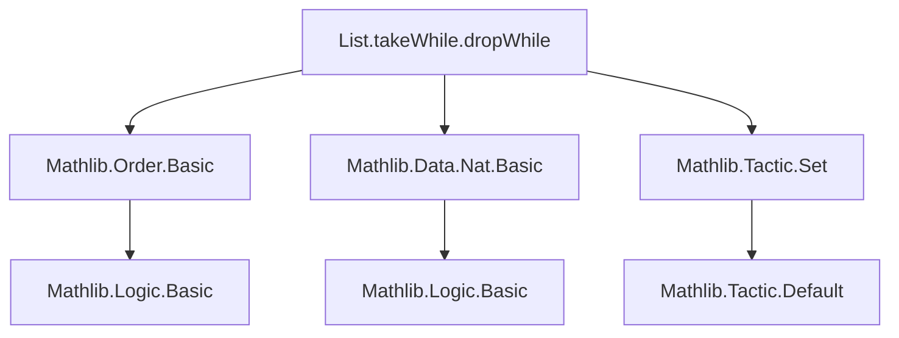
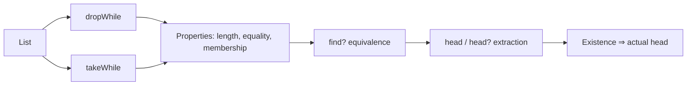

### Technical Brief: `List.takeWhile` and `List.dropWhile` in Lean 4 (Mathlib)

---

#### **1. Key Definitions & Theorems**

| Name | Type / Signature | Purpose |
|------|------------------|---------|
| `dropWhile` | `List α → (α → Bool) → List α` | Drops initial elements satisfying predicate `p`. |
| `takeWhile` | `List α → (α → Bool) → List α` | Takes maximal initial segment where `p` holds. |
| `dropWhile_get_zero_not` | `0 < (dropWhile p l).length → ¬p ((dropWhile p l).get ⟨0, _⟩)` | First element of non-empty `dropWhile p l` does **not** satisfy `p`. |
| `length_dropWhile_le` | `(dropWhile p l).length ≤ l.length` | `dropWhile` never increases list length. |
| `dropWhile_eq_nil_iff` | `dropWhile p l = [] ↔ ∀ x ∈ l, p x` | `dropWhile` yields `[]` iff all elements satisfy `p`. |
| `dropWhile_eq_self_iff` | `dropWhile p l = l ↔ ∀ hl : 0 < l.length, ¬p (l[0]'hl)` | `dropWhile` fixes `l` iff first element fails `p` (and thus all are dropped). |
| `takeWhile_eq_self_iff` | `takeWhile p l = l ↔ ∀ x ∈ l, p x` | `takeWhile` fixes `l` iff all elements satisfy `p`. |
| `takeWhile_eq_nil_iff` | `takeWhile p l = [] ↔ ∀ hl : 0 < l.length, ¬p (l.get ⟨0, hl⟩)` | `takeWhile` yields `[]` iff first element fails `p`. |
| `mem_takeWhile_imp` | `x ∈ takeWhile p l → p x` | Every element in `takeWhile p l` satisfies `p`. |
| `takeWhile_takeWhile` | `takeWhile p (takeWhile q l) = takeWhile (fun a ↦ p a ∧ q a) l` | Nested `takeWhile`s combine via conjunction. |
| `takeWhile_idem` | `takeWhile p (takeWhile p l) = takeWhile p l` | `takeWhile` is idempotent. |
| `find?_eq_head?_dropWhile_not` | `l.find? p = (l.dropWhile (fun x ↦ !p x)).head?` | `find? p` = first element satisfying `p` = head of `dropWhile` over `¬p`. |
| `find?_not_eq_head?_dropWhile` | `l.find? (fun x ↦ !p x) = (l.dropWhile p).head?` | `find? (¬p)` = first element violating `p` = head of `dropWhile p`. |
| `find?_eq_head_dropWhile_not` | `∃ x ∈ l, p x ⇒ l.find? p = some ((l.dropWhile (¬p)).head _)` | If `p` is satisfied somewhere, `find? p` equals actual head (not `head?`) of relevant `dropWhile`. |
| `find?_not_eq_head_dropWhile` | `∃ x ∈ l, ¬p x ⇒ l.find? (¬p) = some ((l.dropWhile p).head _)` | Dual of above for `¬p`. |

---

#### **2. Naming Conventions**

- **Predicates**: `p`, `q` (functions `α → Bool`)
- **Lists**: `l`, `xs`, `tl`, `hd`
- **Properties**:
  - `is_`-style naming avoided; instead, `takeWhile`, `dropWhile`, `find?` used directly.
  - `eq_nil_iff`, `eq_self_iff`, `imp`, `idem`, `not`, `head?`, `head` suffixes indicate logical flavor.
  - `dropWhile_cons_of_pos/neg`, `takeWhile_cons_of_pos/neg` (used implicitly in `simp` lemmas) follow pattern: `dropWhile_cons_of_{pos,neg}` (not explicitly defined here but used in proofs).
- **Proof helpers**: `hl`, `hp`, `hq`, `h_p_hd`, `ph`, `phh`, `phh'` — standard local hypothesis naming.

---

#### **3. Tactic Stack**

- **Core tactics**: `induction`, `simp`, `by_cases`, `rw`, `rcases`, `cases`
- **Arithmetic/Order**: `lia`, `have`, `replace`, `exact`, `convert`
- **Rewriting & simplification**: `simp_rw`, `congrArg`, `simp at *`
- **Logical reasoning**: `intro`, `exact`, `rcases`, `rfl`, `symm`, `apply`, `assumption`
- **Set theory / membership**: `mem_cons`, `mem_takeWhile_imp` (via induction)
- **Boolean simplification**: `Bool.decide_coe`, `not_true_eq_false`, `iff_false`, `true_iff`

> **Dominant pattern**: Induction on list structure, case-split on `p hd`, then `simp` + `lia` for arithmetic.

---

#### **4. Proof Logic**

- **Inductive structure**: All proofs proceed by **list induction** (`induction l with | nil | cons`).
- **Case analysis**: On truth value of `p hd` (`by_cases hp : p hd`).
- **Simplification**: `simp only [dropWhile]`, `simp [takeWhile]`, `simp [hp, IH]` to reduce to base or inductive cases.
- **Equivalence proofs** (`↔`): Prove both directions separately, often via induction + `simp`.
- **Implication proofs** (`→`): Use induction + destructuring of membership (`mem_cons`, `mem_takeWhile_imp`).
- **Equality of `find?` and `head?`/`head`**: Use `find?` definition + `dropWhile` recursion + `head?_eq_some`/`head_eq_iff_head?_eq_some`.

> **Typical flow**:  
> `induction l` → `simp [dropWhile]` → `by_cases p hd` → `simp [hp, IH]` → `lia` or `exact`.

---

#### **5. Imports**

| Module | Purpose |
|--------|---------|
| `Mathlib.Order.Basic` | For `≤`, `0 < n`, `length` order reasoning, `lia` support. |
| `Mathlib.Data.Nat.Basic` | Natural numbers, `length`, `0 < n`, arithmetic. |
| `Mathlib.Tactic.Set` | For `set ... with ...` (used in `find?_eq_head?_dropWhile_not`). |

> **No custom imports** — relies on core Mathlib infrastructure.

---

#### **6. Mermaid Diagrams**

##### **Dependency Graph (Module-Level)**



##### **Overview of Theoretical Flow**



##### **Proof Strategy Dependency**

```mermaid
graph LR
  I[Induction on l] --> C1[Nil case]
  I --> C2[Cons case]
  C2 --> B1[by_cases p hd]
  B1 --> S1[simp [dropWhile/takeWhile]]
  S1 --> R1[apply IH]
  R1 --> A1[lia / exact]
  B1 --> S2[simp [hp, IH]]
  S2 --> A2[lia / exact]
```

---

#### **7. Summary**

This module formalizes foundational properties of `takeWhile` and `dropWhile` for lists, with emphasis on:
- **Characterization lemmas** (`eq_nil_iff`, `eq_self_iff`)
- **Membership & predicate preservation** (`mem_takeWhile_imp`)
- **Idempotence & composition** (`takeWhile_idem`, `takeWhile_takeWhile`)
- **Connection to `find?`** (search via `dropWhile` + `head?`)

All proofs are elementary, using only list induction and Boolean case analysis — no advanced machinery required. The structure reflects standard functional programming semantics of these combinators.

--- 

Let me know if you'd like a formalized dependency graph (e.g., `.lean`-level import tree) or a tactic trace for a specific theorem.
