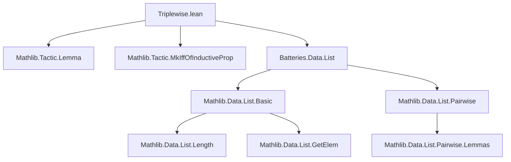
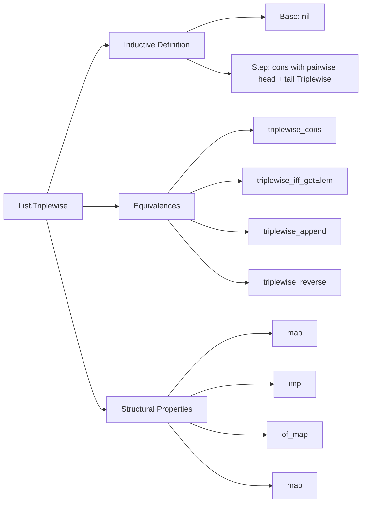

### Technical Brief: `Triplewise.lean`

---

#### **1. Key Definitions & Theorems**

| Name | Type | Purpose |
|------|------|---------|
| `Triplewise p l` | `p : α → α → α → Prop → List α → Prop` | Inductive predicate stating that `p` holds for **all ordered triples** of elements in list `l`. |
| `triplewise_cons` | `(a :: l).Triplewise p ↔ l.Pairwise (p a) ∧ l.Triplewise p` | Characterizes `Triplewise` for cons-lists via pairwise condition on new head with existing list. |
| `triplewise_singleton` | `[a].Triplewise p` | Any singleton list trivially satisfies `Triplewise p`. |
| `triplewise_pair` | `[a, b].Triplewise p` | Any pair list trivially satisfies `Triplewise p`. |
| `triplewise_triple` | `[a, b, c].Triplewise p ↔ p a b c` | A triple list satisfies `Triplewise p` iff `p` holds for its elements. |
| `Triplewise.imp` | `(∀ {a b c}, p a b c → q a b c) → l.Triplewise p → l.Triplewise q` | Monotonicity: if `p ⇒ q`, then `Triplewise p ⇒ Triplewise q`. |
| `triplewise_map` | `(l.map f).Triplewise p' ↔ l.Triplewise (fun a b c ↦ p' (f a) (f b) (f c))` | `Triplewise` commutes with list mapping. |
| `Triplewise.of_map` | `(∀ {a b c}, p' (f a) (f b) (f c) → p a b c) → (l.map f).Triplewise p' → l.Triplewise p` | Pullback of `Triplewise` along a map. |
| `Triplewise.map` | `(∀ {a b c}, p a b c → p' (f a) (f b) (f c)) → l.Triplewise p → (l.map f).Triplewise p'` | Pushforward of `Triplewise` along a map. |
| `triplewise_iff_getElem` | `l.Triplewise p ↔ ∀ i < j < k, p l[i] l[j] l[k]` | Equivalence between inductive definition and pointwise condition on indexed elements. |
| `triplewise_append` | `(l₁ ++ l₂).Triplewise p ↔ ...` | Characterizes `Triplewise` over concatenation: internal consistency + cross-pairwise conditions. |
| `triplewise_reverse` | `l.reverse.Triplewise p ↔ l.Triplewise fun a b c ↦ p c b a` | Reversing a list flips argument order of `p`. |

---

#### **2. Naming Conventions**

- **Prefixes**:
  - `triplewise_`: for lemmas about `Triplewise`.
  - `Triplewise.`: for lemmas defined in the `Triplewise` namespace (e.g., `Triplewise.imp`, `Triplewise.map`).
- **Suffixes**:
  - `_cons`: for lemmas describing behavior on cons-lists.
  - `_singleton`, `_pair`, `_triple`: for small-list special cases.
  - `_map`, `_append`, `_reverse`: for structural operations.
- **Predicate variables**:
  - `p`, `q`: general ternary predicates.
  - `p'`: predicate on codomain in mapping contexts.

---

#### **3. Tactic Stack**

- **Core tactics**:
  - `induction`: structural induction on lists.
  - `simp`: heavily used, especially with `triplewise_cons`, `pairwise_*`, `getElem_*`.
  - `grind`: custom tactic (likely from `Mathlib.Tactic.Grind`) for automated simplification and rewriting.
  - `refine`: for constructing proofs with holes filled later.
  - `lia`: for linear arithmetic in index reasoning (e.g., `i + 1 < j + 1`).
  - `simpa`: simplification with discharge of goals.

---

#### **4. Proof Logic**

- **Inductive structure**: Proofs proceed by induction on the list `l`, leveraging the inductive definition of `Triplewise`.
- **Base case**: `[]` handled by `Triplewise.nil`.
- **Inductive step**: For `a :: l`, split into:
  - `l.Pairwise (p a)` (pairwise condition on new head),
  - `l.Triplewise p` (inductive hypothesis).
- **Equivalence proofs** (`↔`):
  - Use `induction` + `simp` + `refine` to construct both directions.
  - For `triplewise_iff_getElem`, index arithmetic is used to shift indices after cons.
- **Cross-list reasoning** (e.g., `triplewise_append`):
  - Induct on `l₁`, use `pairwise_cons` to handle cross terms between `l₁` and `l₂`.
- **Mapping & reversal**:
  - Use `map`/`reverse` lemmas for `Pairwise` and `Triplewise`, often with `simp` + `ih`.

---

#### **5. Imports**

| Module | Purpose |
|--------|---------|
| `Mathlib.Tactic.Lemma` | Provides `@[mk_iff]`, `@[grind]`, and lemma automation. |
| `Mathlib.Tactic.MkIffOfInductiveProp` | Enables automatic generation of `↔` lemmas from inductive definitions (e.g., `triplewise_iff`). |
| `Batteries.Data.List` | Extended list utilities (e.g., `pairwise`, `getElem`, `reverse`, `map`, `append`). |

---

#### **6. Mermaid Diagrams**

##### **Dependency Graph**

##### **Overview of Theory**

---

#### **7. Summary**

This module formalizes `Triplewise`, a higher-order predicate on lists requiring a ternary relation `p` to hold for **every ordered triple** of elements. It extends `Pairwise` (binary) to ternary, enabling reasoning about local triple interactions in lists (e.g., associativity, transitivity of 3-ary relations). The design mirrors `Pairwise` but with increased combinatorial complexity, especially in `triplewise_append`, which requires cross-list pairwise conditions. The proofs rely heavily on Lean’s `induction`, `simp`, and `grind` tactics, with heavy use of index arithmetic and list operations (`map`, `reverse`, `getElem`).
